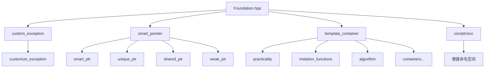

# Foundation 基础库文档

[](https://en.cppreference.com/w/cpp/17)
[](LICENSE)

## 📚 目录

- [📖 文件说明](#-文件说明)
- [🏗️ 命名空间与整体结构](#️-命名空间与整体结构)
- [⚠️ 异常处理](#️-异常处理-custom_exception)
- [🧠 智能指针](#-智能指针-smart_pointer)
- [📦 模板容器](#-模板容器-template_container)
  - [🔧 仿函数](#-仿函数-imitation_functions)
  - [⚙️ 算法](#️-算法-algorithm)
  - [🛠️ 基础工具](#️-基础工具-practicality)
  - [📝 字符数组](#-字符数组-string_container)
  - [📊 动态数组](#-动态数组-vector_container)
  - [🔗 链表容器](#-链表容器-list_container)
  - [📚 栈适配器](#-栈适配器-stack_adapter)
  - [🚶 队列适配器](#-队列适配器-queue_adapter)
  - [🌳 树形容器](#-树形容器-tree_container)
  - [🏛️ 基类容器](#️-基类容器-base_class_container)
  - [🗂️ 关联式容器](#️-关联式容器-map_container-set_container)
  - [🎯 布隆过滤器](#-布隆过滤器-bloom_filter_container)
- [📈 算法细节与性能分析](#-算法细节与性能分析)
- [🆕 新命名空间](#-新命名空间)

---

## 📖 文件说明

本文档基于 `Foundation.hpp` 头文件内容的详细技术文档。每个模块按照以下思路进行说明：

### 📋 文档结构

| 章节 | 内容 | 说明 |
|------|------|------|
| **函数签名与声明** | 直接引用头文件中签名，并标注出处 | 提供准确的API接口 |
| **作用描述** | 从使用者和实现者角度双重解释函数用途 | 帮助理解功能和设计意图 |
| **返回值说明** | 返回类型、语义含义、可能的错误或异常情况 | 确保正确使用API |
| **使用示例** | 提供调用示例，演示典型用法 | 快速上手和参考 |
| **内部原理剖析** | 解析底层数据结构、算法流程、关键步骤 | 深入理解实现细节 |
| **复杂度分析** | 时间复杂度、空间复杂度的详尽分析 | 性能评估和优化参考 |
| **边界条件和错误处理** | 空容器、极限值、异常抛出或安全检查 | 确保代码健壮性 |
| **注意事项** | 多线程安全、异常安全、迭代器失效规则等 | 避免常见陷阱 |

---

## 🏗️ 命名空间与整体结构

`Foundation.hpp` 中，整体内容分布在以下主要命名空间：

### 📊 命名空间概览



### 🔧 核心命名空间

| 命名空间 | 功能 | 主要组件 |
|----------|------|----------|
| `custom_exception` | 自定义异常处理 | `customize_exception` |
| `smart_pointer` | 智能指针管理 | `shared_ptr`, `unique_ptr`, `weak_ptr`, `smart_ptr` |
| `practicality` | 基础工具类型 | `pair`, `make_pair` |
| `imitation_functions` | 仿函数集合 | `less`, `greater`, `hash_imitation_functions` |
| `algorithm` | 基础算法工具 | `copy`, `swap`, `find`, `hash_function` |
| `string_container` | 字符串容器 | `string` |
| `vector_container` | 动态数组 | `vector` |
| `list_container` | 双向链表 | `list` |
| `stack_adapter` | 栈适配器 | `stack` |
| `queue_adapter` | 队列适配器 | `queue`, `priority_queue` |
| `tree_container` | 树形容器 | `binary_search_tree`, `avl_tree` |
| `base_class_container` | 基类容器 | `rb_tree`, `hash_table`, `bit_set` |
| `map_container` | 映射容器 | `tree_map`, `hash_map` |
| `set_container` | 集合容器 | `tree_set`, `hash_set` |
| `bloom_filter_container` | 布隆过滤器 | `bloom_filter` |

### 🎯 便捷命名空间

```cpp
namespace con {
    // 引入所有容器类型，减少命名长度
    using namespace template_container;
}

namespace ptr {
    // 引入所有智能指针类型
    using namespace smart_pointer;
}

namespace exc {
    // 引入异常处理类型
    using namespace custom_exception;
}
```

> 各模块实现互相调用，结构清晰。对于 map 和 set 部分比较复杂，会在相应章节详细介绍。

---

## ⚠️ 异常处理 `custom_exception`
### 🔧 `customize_exception` 类

**定义位置**：`custom_exception` 命名空间

```cpp
namespace custom_exception
{
    class customize_exception final : public std::exception
    {
    private:
        char* _message;        // 错误消息
        char* _function_name;  // 函数名称
        size_t _line_number;   // 行号
        
    public:
        customize_exception(const char* message_target, 
                          const char* function_name_target, 
                          const size_t& line_number_target) noexcept;
        
        [[nodiscard]] const char* what() const noexcept override;
        [[nodiscard]] const char* function_name_get() const noexcept;
        [[nodiscard]] size_t line_number_get() const noexcept;
        
        ~customize_exception() noexcept override;
    };
}
```

> ⚠️ **注意**：该类不能被继承（`final` 关键字）

### 📋 功能特性

| 特性 | 说明 | 优势 |
|------|------|------|
| **详细错误信息** | 包含错误消息、函数名、行号 | 便于调试和错误定位 |
| **异常安全** | 构造和析构都是 `noexcept` | 避免异常传播问题 |
| **内存管理** | 自动管理字符串内存 | 防止内存泄漏 |
| **标准兼容** | 继承自 `std::exception` | 与标准异常处理兼容 |

### 🛠️ 构造函数

```cpp
customize_exception(const char* message_target, 
                   const char* function_name_target, 
                   const size_t& line_number_target) noexcept
```

#### 参数说明
- `message_target`：错误消息字符串
- `function_name_target`：抛出异常的函数名称
- `line_number_target`：抛出异常的代码行号

#### 实现细节
- 通过 `new char[]` 复制字符串到内部缓冲区
- 保存行号信息
- 构造过程保证 `noexcept`

> ⚠️ **边界检查**：头文件实现未对空指针进行检查，调用者需确保传入非空合法指针

### 🔍 成员方法

#### 1. `what()` - 获取错误消息
```cpp
[[nodiscard]] const char* what() const noexcept override
```
- **作用**：返回异常消息，覆写 `std::exception::what()`
- **返回值**：指向内部存储的消息字符串
- **生命周期**：与异常对象相同

#### 2. `function_name_get()` - 获取函数名
```cpp
[[nodiscard]] const char* function_name_get() const noexcept
```
- **作用**：返回抛出异常时的函数名字符串
- **返回值**：指向内部存储的函数名

#### 3. `line_number_get()` - 获取行号
```cpp
[[nodiscard]] size_t line_number_get() const noexcept
```
- **作用**：获取抛出异常的行号
- **返回值**：行号信息

#### 4. 析构函数
```cpp
~customize_exception() noexcept override
```
- **作用**：释放内部分配的内存，避免内存泄漏
- **异常规范**：`noexcept`，析构时不会抛出异常

### 💡 使用示例

```cpp
#include "Foundation.hpp"

void some_function()
{
    if (error_condition) 
    {
        throw custom_exception::customize_exception(
            "错误信息", 
            __func__, 
            __LINE__
        );
    }
}

int main()
{
    try 
    {
        some_function();
    }
    catch (const custom_exception::customize_exception& e) 
    {
        std::cerr << "Exception: " << e.what() 
                  << " in function " << e.function_name_get() 
                  << " at line " << e.line_number_get() << std::endl;
    }
    
    return 0;
}
```

### ⚡ 性能与安全特性

#### 复杂度分析
- **构造时间**：O(n)，n 为消息长度（字符串复制）
- **析构时间**：O(1)，固定释放开销
- **访问时间**：O(1)，直接返回指针

#### 安全特性
- ✅ **异常安全**：构造和析构都是 `noexcept`
- ✅ **内存安全**：自动管理内存，防止泄漏
- ❌ **拷贝限制**：不支持拷贝构造、移动构造、赋值操作
- ❌ **线程安全**：非线程安全，多线程环境需外部同步

### 🚨 注意事项

| 注意点 | 说明 | 建议 |
|--------|------|------|
| **空指针检查** | 未对传入参数进行空指针检查 | 调用者确保参数有效性 |
| **字符串生命周期** | 返回值生命周期与异常对象相同 | 不要在异常对象销毁后访问 |
| **多线程使用** | 非线程安全 | 根据环境重载标准异常 |
| **拷贝限制** | 不支持拷贝和赋值操作 | 使用引用传递异常对象 |

---

## 🧠 智能指针 `smart_pointer`

> ⚠️ **开发状态**：当前未处理个别错误，及涉及到指针管理权转移等，还未完全测试

### 📊 模块概览

`smart_pointer` 命名空间提供了 4 种智能指针的实现，用于自动内存管理，避免手动 `delete` 操作：

| 智能指针类型 | 所有权模型 | 线程安全 | 主要用途 |
|-------------|-----------|----------|----------|
| `smart_ptr` | 转移所有权 | ✅ | 简单的所有权转移 |
| `unique_ptr` | 独占所有权 | ✅ | 独占资源管理 |
| `shared_ptr` | 共享所有权 | ✅ | 多对象共享资源 |
| `weak_ptr` | 弱引用观察 | ✅ | 解决循环引用 |

### 🔧 `smart_ptr<T>` - 转移所有权指针

#### 类特性
```cpp
template<typename smart_ptr_type>
class smart_ptr 
{
private:
    smart_ptr_type* _ptr;  // 裸指针，指向托管对象
    
public:
    explicit smart_ptr(smart_ptr_type* p);
    smart_ptr(const smart_ptr& other);      // 转移所有权
    smart_ptr& operator=(const smart_ptr& other);  // 转移所有权
    ~smart_ptr();
    
    smart_ptr_type& operator*() const;
    smart_ptr_type* operator->() const;
};
```

#### 🔄 所有权转移机制
- **拷贝构造**：指针管理权转移，原智能指针变为空
- **拷贝赋值**：指针管理权转移，原智能指针变为空
- **析构**：作用域结束时自动释放资源

#### ⚠️ 使用注意
```cpp
template_container::smart_pointer::smart_ptr<MyClass> sp1(new MyClass());
{
    auto sp2 = sp1;  // ⚠️ 管理权转移，sp1 变为空
    // sp1 现在是空指针，访问会出错！
} // sp2 离开作用域，对象被删除
```

#### 📈 性能特点
- **时间复杂度**：拷贝构造/赋值 O(1)，访问 O(1)
- **空间开销**：仅一个指针的存储开销
- **适用场景**：简单的所有权转移，类似 `std::auto_ptr`

---

### 🔒 `unique_ptr<T>` - 独占所有权指针

#### 类特性
```cpp
template<typename unique_ptr_type>
class unique_ptr 
{
private:
    unique_ptr_type* _ptr;  // 裸指针，指向托管对象
    
public:
    explicit unique_ptr(unique_ptr_type* p);
    unique_ptr(const unique_ptr&) = delete;           // 禁用拷贝
    unique_ptr& operator=(const unique_ptr&) = delete; // 禁用赋值
    unique_ptr(unique_ptr&& other) noexcept;          // 移动构造
    unique_ptr& operator=(unique_ptr&& other) noexcept; // 移动赋值
    ~unique_ptr();
    
    unique_ptr_type& operator*() const;
    unique_ptr_type* operator->() const;
    unique_ptr_type* get_ptr() const noexcept;
};
```

#### 🛡️ 独占特性
- **拷贝禁用**：不允许拷贝构造和拷贝赋值
- **移动语义**：支持移动构造和移动赋值
- **独占管理**：确保资源只有一个所有者

#### 💡 使用示例
```cpp
template_container::smart_pointer::unique_ptr<MyClass> up1(new MyClass());
// auto up2 = up1;  // ❌ 编译错误：拷贝被禁用
auto up2 = std::move(up1);  // ✅ 移动语义，up1 变为空
```

#### 📈 性能特点
- **时间复杂度**：移动操作 O(1)，访问 O(1)
- **空间开销**：仅一个指针的存储开销
- **适用场景**：独占资源管理，类似 `std::unique_ptr`

---

### 🤝 `shared_ptr<T>` - 共享所有权指针

#### 类特性
```cpp
template<typename shared_ptr_type>
class shared_ptr 
{
private:
    shared_ptr_type* _ptr;        // 裸指针，指向托管对象
    size_t* _shared_pcount;       // 引用计数指针
    std::mutex* _pmutex;          // 线程安全互斥锁
    
public:
    shared_ptr();
    explicit shared_ptr(shared_ptr_type* p);
    shared_ptr(const shared_ptr& other);
    shared_ptr(shared_ptr&& other) noexcept;
    ~shared_ptr();
    
    shared_ptr_type* get_ptr() const noexcept;
    shared_ptr_type& operator*() const;
    shared_ptr_type* operator->() const;
    int get_sharedp_count() const noexcept;
    void release() noexcept;
};
```

#### 🔢 引用计数机制
- **构造时**：引用计数初始化为 1
- **拷贝时**：引用计数递增
- **析构时**：引用计数递减，为 0 时删除对象
- **线程安全**：通过互斥锁保护引用计数操作

#### 💡 使用示例
```cpp
template_container::smart_pointer::shared_ptr<MyClass> sp1(new MyClass());
{
    auto sp2 = sp1;  // 引用计数从 1 增到 2
    std::cout << sp1.get_sharedp_count();  // 输出: 2
} // sp2 离开作用域，引用计数减为 1
sp1.release();  // 引用计数减为 0，对象被删除
```

#### 📈 性能特点
- **时间复杂度**：拷贝/赋值/析构 O(1)（含锁开销）
- **空间开销**：指针 + 引用计数 + 互斥锁
- **适用场景**：多对象共享资源，类似 `std::shared_ptr`

---

### 👁️ `weak_ptr<T>` - 弱引用观察指针

#### 类特性
```cpp
template<typename weak_ptr_type>
class weak_ptr 
{
private:
    size_t* _weak_pcount;  // 弱引用计数指针
    std::mutex* _pmutex;   // 共享互斥锁
    
public:
    weak_ptr();
    weak_ptr(const shared_ptr<weak_ptr_type>& sp);
    weak_ptr(const weak_ptr& other);
    ~weak_ptr();
    
    int get_sharedp_count() const noexcept;
    void release() noexcept;
    shared_ptr<weak_ptr_type> lock() const;  // 尝试获取 shared_ptr
};
```

#### 🔗 弱引用特性
- **不影响生命周期**：不增加强引用计数
- **循环引用解决**：打破 `shared_ptr` 循环引用
- **安全访问**：通过 `lock()` 安全获取 `shared_ptr`

#### 💡 使用示例
```cpp
auto sp = template_container::smart_pointer::shared_ptr<MyClass>(new MyClass);
template_container::smart_pointer::weak_ptr<MyClass> wp = sp;

if (auto locked = wp.lock()) 
{
    // 对象仍然存在，可以安全使用 locked
    locked->do_something();
}
sp.release();  // 对象被删除
// wp.lock() 现在返回空的 shared_ptr
```

#### 📈 性能特点
- **时间复杂度**：`lock()` 操作 O(1)（含锁开销）
- **空间开销**：弱引用计数 + 共享互斥锁
- **适用场景**：观察者模式、缓存、父子关系等

### 🎯 智能指针选择指南

| 使用场景 | 推荐类型 | 原因 |
|----------|----------|------|
| 独占资源管理 | `unique_ptr` | 性能最优，语义清晰 |
| 多对象共享资源 | `shared_ptr` | 自动引用计数管理 |
| 观察共享资源 | `weak_ptr` | 避免循环引用 |
| 简单所有权转移 | `smart_ptr` | 轻量级转移语义 |

### ⚠️ 注意事项

| 注意点 | 说明 | 建议 |
|--------|------|------|
| **循环引用** | `shared_ptr` 可能造成内存泄漏 | 使用 `weak_ptr` 打破循环 |
| **线程安全** | 引用计数操作是线程安全的 | 对象本身访问需要额外同步 |
| **性能开销** | `shared_ptr` 有锁和计数开销 | 性能敏感场景考虑 `unique_ptr` |
| **所有权转移** | `smart_ptr` 转移后原指针失效 | 转移后不要访问原指针 |

---

## 📦 模板容器 `template_container`

### 🛠️ 基础工具 `practicality`

#### 🔗 `pair<K, V>` - 键值对容器

**定义**：类似于 `std::pair`，用于键值对存储，广泛应用于 map/set 等关联容器中。

```cpp
template<typename K, typename V>
class pair 
{
public:
    K first;   // 键类型或第一个元素
    V second;  // 值类型或第二个元素
    
    // 构造函数
    pair();
    pair(const K& key, const V& value);
    pair(const pair& other);
    pair(pair&& other) noexcept;
    
    // 运算符重载
    pair& operator=(const pair& other);
    pair& operator=(pair&& other) noexcept;
    bool operator==(const pair& other) const;
    bool operator!=(const pair& other) const;
    pair* operator->() noexcept;
    
    // 流输出支持
    friend std::ostream& operator<<(std::ostream& os, const pair& p);
};
```

#### 📋 功能特性

| 特性 | 说明 | 用途 |
|------|------|------|
| **键值存储** | 存储两个相关联的值 | 关联容器的基础元素 |
| **类型安全** | 编译时类型检查 | 避免类型错误 |
| **流输出** | 支持直接输出到流 | 调试和显示 |
| **比较操作** | 支持相等性比较 | 容器查找和排序 |

#### 💡 使用示例

```cpp
#include "Foundation.hpp"
using namespace template_container;

// 创建键值对
practicality::pair<int, std::string> p(1, "one");
std::cout << p.first << ": " << p.second << std::endl;  // 输出: 1: one

// 直接输出
std::cout << p << std::endl;  // 使用重载的 << 运算符

// 在关联容器中使用
// tree_map 内部使用 pair<key, value> 存储元素
```

#### 🏭 `make_pair` 工厂函数

**功能**：自动类型推导的工厂函数，返回 `pair` 类实例。

```cpp
template<typename T1, typename T2>
auto make_pair(T1&& first, T2&& second) -> pair<T1, T2>;
```

**优势**：
- ✅ **自动推导**：无需显式指定模板参数
- ✅ **简洁语法**：减少代码冗余
- ✅ **完美转发**：支持移动语义

```cpp
// 使用 make_pair 简化创建
auto p1 = make_pair(42, "answer");           // 自动推导类型
auto p2 = make_pair(std::string("key"), 100); // 支持复杂类型
```

---

### 🔧 仿函数 `imitation_functions`

#### 📊 仿函数概览

仿函数（Function Objects）提供了可调用对象，用于自定义比较、哈希等操作：

| 仿函数类型 | 功能 | 用途 |
|------------|------|------|
| `less<T>` | 小于比较 | 排序、有序容器 |
| `greater<T>` | 大于比较 | 逆序排序 |
| `hash_imitation_functions` | 哈希计算 | 哈希表、无序容器 |

#### 🔍 比较仿函数

```cpp
template<typename T>
struct less 
{
    bool operator()(const T& lhs, const T& rhs) const 
    {
        return lhs < rhs;
    }
};

template<typename T>
struct greater 
{
    bool operator()(const T& lhs, const T& rhs) const 
    {
        return lhs > rhs;
    }
};
```

#### 🎯 哈希仿函数

```cpp
struct hash_imitation_functions 
{
    template<typename T>
    size_t operator()(const T& value) const 
    {
        // 为内置类型提供哈希值计算
        return std::hash<T>{}(value);
    }
};
```

#### 💡 使用示例

```cpp
using namespace template_container::imitation_functions;

// 比较仿函数
less<int> cmp;
bool result = cmp(3, 5);  // true

// 哈希仿函数
hash_imitation_functions hasher;
size_t hash_value = hasher(42);

// 在容器中使用
// tree_map<int, string, less<int>> ordered_map;  // 使用 less 排序
// hash_map<int, string, hash_imitation_functions> unordered_map;  // 使用哈希
```

#### 🔧 自定义仿函数

```cpp
// 自定义类型的哈希仿函数
struct MyClass 
{
    int _id;
    std::string _name;
};

struct MyClassHasher 
{
    size_t operator()(const MyClass& obj) const 
    {
        return std::hash<int>{}(obj._id) ^ 
               (std::hash<std::string>{}(obj._name) << 1);
    }
};

// 使用自定义哈希仿函数
hash_map<MyClass, int, MyClassHasher> custom_map;
```

---

### ⚙️ 算法 `algorithm`

#### 📋 算法工具概览

| 算法 | 功能 | 时间复杂度 | 用途 |
|------|------|------------|------|
| `copy` | 线性拷贝 | O(n) | 数据复制 |
| `swap` | 交换数据 | O(1) | 数据交换 |
| `find` | 查找元素 | O(n) | 元素查找 |
| `hash_function` | 哈希计算 | O(k) | 哈希表支持 |

#### 📋 `copy` - 数据拷贝算法

**功能**：将源序列的元素拷贝到目标序列。

```cpp
template<typename InputIt, typename OutputIt>
OutputIt copy(InputIt first, InputIt last, OutputIt d_first);
```

**参数说明**：
- `first`：源序列起始迭代器
- `last`：源序列结束迭代器  
- `d_first`：目标序列起始迭代器

**返回值**：目标序列的结束迭代器

#### 💡 使用示例

```cpp
using namespace template_container::algorithm;

int source[] = {1, 2, 3, 4, 5};
int target[5];

// 拷贝数组
auto end_it = copy(source, source + 5, target);

// 验证拷贝结果
for (int i = 0; i < 5; ++i) 
{
    std::cout << target[i] << " ";  // 输出: 1 2 3 4 5
}
```

#### 🔄 `swap` - 数据交换算法

**功能**：交换两个对象的值，支持深拷贝交换。

```cpp
template<typename T>
void swap(T& a, T& b) noexcept;
```

**特点**：
- ✅ **异常安全**：`noexcept` 保证
- ✅ **深拷贝**：需要类型支持拷贝构造
- ✅ **高效**：O(1) 时间复杂度

#### 💡 使用示例

```cpp
using namespace template_container::algorithm;

int a = 10, b = 20;
swap(a, b);
std::cout << "a = " << a << ", b = " << b << std::endl;  // 输出: a = 20, b = 10

// 在容器中使用
list_container::list<int> list1, list2;
// ... 填充数据
list1.swap(list2);  // 内部调用 algorithm::swap
```

#### 🔍 `find` - 元素查找算法

**功能**：在指定范围内查找特定值的元素。

```cpp
template<typename InputIt, typename T>
InputIt find(InputIt first, InputIt last, const T& value);
```

**参数说明**：
- `first`：搜索范围起始迭代器
- `last`：搜索范围结束迭代器
- `value`：要查找的值

**返回值**：
- 找到：指向该元素的迭代器
- 未找到：返回 `last` 迭代器

#### 💡 使用示例

```cpp
using namespace template_container::algorithm;

vector_container::vector<int> vec = {1, 2, 3, 4, 5};

// 查找元素
auto it = find(vec.begin(), vec.end(), 3);
if (it != vec.end()) 
{
    std::cout << "找到元素: " << *it << std::endl;
}
else 
{
    std::cout << "未找到元素" << std::endl;
}
```

#### 🎯 `hash_function` - 哈希算法

**功能**：提供多种哈希函数实现，减少哈希冲突。

```cpp
namespace hash_algorithm 
{
    template<typename T, typename Hasher = std::hash<T>>
    class hash_function 
    {
    public:
        size_t hash_sdmmhash(const T& value);   // SDBM 哈希
        size_t hash_djbhash(const T& value);    // DJB 哈希  
        size_t hash_pjwhash(const T& value);    // PJW 哈希
    };
}
```

#### 🔧 哈希算法特点

| 算法 | 特点 | 适用场景 |
|------|------|----------|
| **SDBM** | 分布均匀，速度快 | 一般用途哈希表 |
| **DJB** | 简单高效 | 字符串哈希 |
| **PJW** | 冲突率低 | 高质量哈希需求 |

#### 💡 使用示例

```cpp
using namespace template_container::algorithm::hash_algorithm;

// 自定义哈希器
struct StringHasher 
{
    size_t operator()(const std::string& str) const 
    {
        size_t hash = 0;
        for (char c : str) 
        {
            hash = hash * 131 + static_cast<size_t>(c);
        }
        return hash;
    }
};

// 使用多种哈希函数
hash_function<std::string, StringHasher> hasher;
std::string test = "hello world";

size_t h1 = hasher.hash_sdmmhash(test);
size_t h2 = hasher.hash_djbhash(test);
size_t h3 = hasher.hash_pjwhash(test);

std::cout << "SDBM: " << h1 << std::endl;
std::cout << "DJB:  " << h2 << std::endl;
std::cout << "PJW:  " << h3 << std::endl;
```

#### ⚡ 性能特点

- **时间复杂度**：O(k)，k 为输入数据长度
- **空间复杂度**：O(1)，常量空间
- **适用性**：支持布隆过滤器、哈希表等数据结构

---

## 📝 字符数组 `string_container`
* **内容**：基本算法工具 `swap`
* **用途**：数据类型深拷贝交换（需要提前重载数据类型的拷贝构造）
* **示例**

## 📝 字符数组 `string_container`

### 🎯 `string` 类概览

`string` 类是一个自定义实现的字符串容器，模拟了标准库 `std::string` 的核心功能，同时提供了额外的字符串操作方法。该类使用动态内存分配管理字符数据，支持迭代器遍历、字符串修改、子串操作等功能。

### 🏗️ 类定义与结构

```cpp
namespace string_container 
{
    class string 
    {
    private:
        char* _data;      // 指向已分配内存区域的首地址
        size_t _size;     // 当前字符串长度
        size_t _capacity; // 当前分配的内存容量
        
    public:
        // 迭代器类型定义
        using iterator = char*;
        using const_iterator = const char*;
        using reverse_iterator = iterator;
        using const_reverse_iterator = const_iterator;
        constexpr static const size_t nops = -1;
        
        // 构造函数、析构函数及赋值运算符
        string(const char* str_data = " ");
        string(char*&& str_data) noexcept;
        string(const string& str_data);
        string(string&& str_data) noexcept;
        string(const std::initializer_list<char> str_data);
        ~string() noexcept;
        
        // 迭代器相关方法
        [[nodiscard]] iterator begin() const noexcept;
        [[nodiscard]] iterator end() const noexcept;
        [[nodiscard]] const_iterator cbegin() const noexcept;
        [[nodiscard]] const_iterator cend() const noexcept;
        [[nodiscard]] reverse_iterator rbegin() const noexcept;
        [[nodiscard]] reverse_iterator rend() const noexcept;
        
        // 容量相关方法
        [[nodiscard]] bool empty() const noexcept;
        [[nodiscard]] size_t size() const noexcept;
        [[nodiscard]] size_t capacity() const noexcept;
        
        // 元素访问方法
        [[nodiscard]] char* c_str() const noexcept;
        [[nodiscard]] char back() const noexcept;
        [[nodiscard]] char front() const noexcept;
        char& operator[](const size_t& access_location);
        const char& operator[](const size_t& access_location) const;
        
        // 字符串修改方法
        string& uppercase() noexcept;
        string& lowercase() noexcept;
        string& prepend(const char*& sub_string);
        string& insert_sub_string(const char*& sub_string, const size_t& start_position);
        string sub_string(const size_t& start_position) const;
        string sub_string_from(const size_t& start_position) const;
        string sub_string(const size_t& start_position, const size_t& terminate_position) const;
        void allocate_resources(const size_t& new_inaugurate_capacity);
        string& push_back(const char& temporary_str_data);
        string& push_back(const string& temporary_string_data);
        string& push_back(const char* temporary_str_ptr_data);
        string& resize(const size_t& inaugurate_size, const char& default_data = '\0');
        iterator reserve(const size_t& new_container_capacity);
        string& swap(string& str_data) noexcept;
        [[nodiscard]] string reverse() const;
        [[nodiscard]] string reverse_sub_string(const size_t& start_position, const size_t& terminate_position) const;
        
        // 输出方法
        void string_print() const noexcept;
        void string_reverse_print() const noexcept;
        
        // 运算符重载
        friend std::ostream& operator<<(std::ostream& string_ostream, const string& str_data);
        friend std::istream& operator>>(std::istream& string_istream, string& str_data);
        string& operator=(const string& str_data);
        string& operator=(const char* str_data);
        string& operator=(string&& str_data) noexcept;
        string& operator+=(const string& str_data);
        bool operator==(const string& str_data) const noexcept;
        bool operator<(const string& str_data) const noexcept;
        bool operator>(const string& str_data) const noexcept;
        [[nodiscard]] string operator+(const string& string_array) const;
    };
}
```

### 🧱 内部数据结构

#### 📊 成员变量

| 成员变量 | 类型 | 作用 |
|----------|------|------|
| `_data` | `char*` | 指向已分配内存区域的首地址 |
| `_size` | `size_t` | 当前字符串长度 |
| `_capacity` | `size_t` | 当前分配的内存容量 |

#### 🏗️ 内存布局
- **底层实现**：基于动态内存的连续字符数组
- **内存布局**：位置连续，以 `\0` 结尾，符合 C 风格字符串要求
- **扩容策略**：空间不足时 2 倍增容

### 🔧 构造与析构

#### 构造函数类型

| 构造函数 | 功能 | 特点 |
|----------|------|------|
| **默认构造** | `string(const char* str_data = " ")` | 初始化为输入字符串的副本 |
| **移动构造** | `string(char*&& str_data) noexcept` | 接管右值指针，避免复制 |
| **拷贝构造** | `string(const string& str_data)` | 深拷贝所有字符 |
| **移动构造** | `string(string&& str_data) noexcept` | 接管右值资源 |
| **初始化列表** | `string(const std::initializer_list<char>)` | 从字符列表构造 |

#### 💡 构造示例

```cpp
using namespace template_container::string_container;

// 默认构造
string s1;                              // 空字符串
string s2("Hello");                     // C风格字符串构造

// 拷贝构造
string s3(s2);                          // 深拷贝

// 移动构造
string s4(std::move(s2));               // s2 变为空

// 初始化列表构造
string s5({'H', 'e', 'l', 'l', 'o'});  // 从字符列表构造
```

### 🔄 迭代器支持

#### 迭代器类型

| 迭代器类型 | 定义 | 用途 |
|------------|------|------|
| `iterator` | `char*` | 可修改的正向迭代器 |
| `const_iterator` | `const char*` | 只读的正向迭代器 |
| `reverse_iterator` | `iterator` | 反向迭代器 |
| `const_reverse_iterator` | `const_iterator` | 只读反向迭代器 |

#### 💡 迭代器使用

```cpp
string s("Hello");

// 正向遍历
for (auto it = s.begin(); it != s.end(); ++it) 
{
    std::cout << *it;  // 输出: Hello
}

// 反向遍历
for (auto it = s.rbegin(); it != s.rend(); --it) 
{
    std::cout << *it;  // 输出: olleH
}

// 范围for循环
for (char c : s) 
{
    std::cout << c;    // 输出: Hello
}
```

### 🎯 元素访问

#### 访问方法

| 方法 | 功能 | 返回值 | 注意事项 |
|------|------|--------|----------|
| `operator[]` | 下标访问 | `char&` / `const char&` | 边界检查，越界抛异常 |
| `front()` | 首字符 | `char` | 须保证 `_size > 0` |
| `back()` | 尾字符 | `char` | 须保证 `_size > 0` |
| `c_str()` | C风格字符串 | `char*` | 以 `\0` 结尾 |

#### 💡 访问示例

```cpp
string s("Hello");

std::cout << s[0];        // 输出: H
std::cout << s.front();   // 输出: H
std::cout << s.back();    // 输出: o
std::cout << s.c_str();   // 输出: Hello
```

### ✏️ 字符串修改

#### 🔤 追加操作

| 方法 | 功能 | 扩容策略 |
|------|------|----------|
| `push_back(char)` | 追加单个字符 | 容量不足时 2 倍扩容 |
| `push_back(string)` | 追加字符串 | 自动扩容并深拷贝 |
| `push_back(const char*)` | 追加 C 字符串 | 自动扩容 |

#### 🔧 插入操作

| 方法 | 功能 | 时间复杂度 |
|------|------|------------|
| `prepend(const char*)` | 头部插入 | O(n) - 需移动原数据 |
| `insert_sub_string(const char*, pos)` | 指定位置插入 | O(n) - 移动后续数据 |

#### 📏 大小调整

| 方法 | 功能 | 行为 |
|------|------|------|
| `resize(size, char)` | 调整长度 | 扩容时用指定字符填充，缩容时截断 |
| `reserve(size)` | 预分配内存 | 返回首地址迭代器 |

#### 🔄 其他修改

| 方法 | 功能 | 特点 |
|------|------|------|
| `uppercase()` | 转大写 | 原地修改，遍历调整 ASCII 码 |
| `lowercase()` | 转小写 | 原地修改 |
| `swap(string&)` | 交换内容 | O(1) 时间复杂度 |

### 📄 子串操作

#### 子串提取

| 方法 | 功能 | 参数 | 返回值 |
|------|------|------|--------|
| `sub_string(start)` | 从指定位置到末尾 | 起始位置 | 新字符串 |
| `sub_string_from(start)` | 同上 | 起始位置 | 新字符串 |
| `sub_string(start, end)` | 指定范围子串 | 起始和结束位置 | 新字符串 |

#### 反转操作

| 方法 | 功能 | 返回值 |
|------|------|--------|
| `reverse()` | 整个字符串反转 | 新的反转字符串 |
| `reverse_sub_string(start, end)` | 指定范围反转 | 新的反转子串 |

### 🔧 运算符重载

#### 赋值运算符

| 运算符 | 功能 | 特点 |
|--------|------|------|
| `operator=(const string&)` | 拷贝赋值 | 深拷贝，先释放原内存 |
| `operator=(const char*)` | C字符串赋值 | 重新分配内存 |
| `operator=(string&&)` | 移动赋值 | 接管右值资源 |

#### 拼接运算符

| 运算符 | 功能 | 返回值 |
|--------|------|--------|
| `operator+=(const string&)` | 原地拼接 | `string&` |
| `operator+(const string&)` | 创建新字符串 | 新的拼接字符串 |

#### 比较运算符

| 运算符 | 功能 | 比较方式 |
|--------|------|----------|
| `operator==(const string&)` | 相等比较 | 字典序比较 |
| `operator<(const string&)` | 小于比较 | 字典序比较 |
| `operator>(const string&)` | 大于比较 | 字典序比较 |

#### 输入输出运算符

| 运算符 | 功能 | 实现方式 |
|--------|------|----------|
| `operator<<` | 流输出 | 遍历字符输出 |
| `operator>>` | 流输入 | 逐字符读取直至换行或 EOF |

### ⚡ 性能特点

#### 时间复杂度

| 操作类型 | 时间复杂度 | 说明 |
|----------|------------|------|
| **随机访问** | O(1) | 直接索引访问 |
| **插入/删除中间** | O(n) | 需移动后续元素 |
| **扩容** | O(n) | 复制数据，摊销后均摊 O(1) |
| **子串操作** | O(k) | k 为子串长度 |

#### 空间复杂度

- **存储空间**：O(n)，n 为字符串长度 + `\0`
- **扩容策略**：2 倍增长，减少重分配次数

### 🚨 异常安全与注意事项

#### 异常处理

| 异常类型 | 触发条件 | 处理建议 |
|----------|----------|----------|
| `std::bad_alloc` | 内存分配失败 | 使用 try-catch 处理 |
| `custom_exception` | 越界操作 | 检查索引有效性 |

#### 迭代器失效

- **扩容操作**：所有迭代器和引用失效
- **修改操作**：可能导致迭代器失效
- **建议**：修改后重新获取迭代器

#### 最佳实践

| 建议 | 说明 | 原因 |
|------|------|------|
| **预分配空间** | 频繁拼接前使用 `reserve()` | 减少重分配开销 |
| **移动语义** | 优先使用移动构造/赋值 | 避免深拷贝性能损耗 |
| **异常安全** | 使用 try-catch 处理异常 | 确保程序健壮性 |
| **边界检查** | 访问前检查字符串长度 | 避免越界访问 |

### 💡 完整使用示例

```cpp
using namespace template_container::string_container;

int main() 
{
    // 1. 构造函数示例
    string s1;                              // 默认构造
    string s2("Hello");                     // C风格字符串构造
    string s3(s2);                          // 拷贝构造
    string s4({'W', 'o', 'r', 'l', 'd'});   // 初始化列表构造
    
    // 2. 字符串修改
    s2.push_back(' ');                      // 追加字符
    s2.push_back(s4);                       // 追加字符串
    s2.uppercase();                         // 转大写
    
    // 3. 子串操作
    string sub = s2.sub_string(0, 5);       // 提取子串
    string rev = s2.reverse();              // 反转字符串
    
    // 4. 运算符使用
    string result = s2 + " C++";            // 拼接
    if (s2 == "HELLO WORLD") 
    {
        std::cout << "字符串匹配" << std::endl;
    }
    
    // 5. 迭代器遍历
    for (char c : s2) 
    {
        std::cout << c;
    }
    
    return 0;
}
```

---

## 📊 动态数组 `vector_container`
## 📊 动态数组 `vector_container`

### 🎯 `vector` 类概览

`vector` 类是一个模板化的动态数组容器，模拟了标准库 `std::vector` 的核心功能。该容器使用连续内存存储元素，支持动态扩容、随机访问和各种容器操作。通过模板参数 `vector_type` 支持任意数据类型，并提供了完整的迭代器系统和异常处理机制。

### 🏗️ 类定义与结构

```cpp
namespace vector_container 
{
    template <typename vector_type>
    class vector 
    {
    public:
        using iterator = vector_type*;
        using const_iterator = const vector_type*;
        using reverse_iterator = iterator;
        using const_reverse_iterator = const_iterator;
    
    private:
        iterator _data_pointer;     // 指向数据起始位置
        iterator _size_pointer;     // 指向数据结束位置（最后一个元素的下一个位置）
        iterator _capacity_pointer; // 指向容量结束位置
    
    public:
        // 构造函数
        vector() noexcept;
        explicit vector(const size_t& container_capacity, const vector_type& vector_data = vector_type());
        vector(std::initializer_list<vector_type> lightweight_container);
        vector(const vector<vector_type>& vector_data);
        vector(vector<vector_type>&& vector_data) noexcept;
        ~vector() noexcept;
        
        // 迭代器方法
        [[nodiscard]] iterator begin() noexcept;
        [[nodiscard]] iterator end() noexcept;
        
        // 容量方法
        [[nodiscard]] size_t size() const noexcept;
        [[nodiscard]] size_t capacity() const noexcept;
        [[nodiscard]] bool empty() const noexcept;
        
        // 元素访问
        [[nodiscard]] vector_type& front() const noexcept;
        [[nodiscard]] vector_type& back() const noexcept;
        [[nodiscard]] vector_type& head() const noexcept;
        [[nodiscard]] vector_type& tail() const noexcept;
        vector_type& find(const size_t& find_size);
        vector_type& operator[](const size_t& access_location);
        const vector_type& operator[](const size_t& access_location) const;
        
        // 修改方法
        void swap(vector<vector_type>& vector_data) noexcept;
        iterator erase(iterator delete_position) noexcept;
        vector<vector_type>& resize(const size_t& new_container_capacity, const vector_type& vector_data = vector_type());
        vector<vector_type>& push_back(const vector_type& vector_type_data);
        vector<vector_type>& push_back(vector_type&& vector_type_data);
        vector<vector_type>& pop_back();
        vector<vector_type>& push_front(const vector_type& vector_type_data);
        vector<vector_type>& pop_front();
        vector<vector_type>& size_adjust(const size_t& data_size, const vector_type& padding_temp_data = vector_type());
        
        // 赋值运算符
        vector<vector_type>& operator=(const vector<vector_type>& vector_data);
        vector<vector_type>& operator=(vector<vector_type>&& vector_mobile_data) noexcept;
        vector<vector_type>& operator+=(const vector<vector_type>& vector_data);
        
        // 友元运算符
        template <typename const_vector_output_templates>
        friend std::ostream& operator<<(std::ostream& vector_ostream, const vector<const_vector_output_templates>& dynamic_arrays_data);
    };
}
```

### 🧱 内部数据结构

#### 📊 成员变量

| 成员变量 | 类型 | 作用 |
|----------|------|------|
| `_data_pointer` | `iterator` | 指向已分配内存区域的首地址 |
| `_size_pointer` | `iterator` | 指向当前数据末尾的下一个位置 |
| `_capacity_pointer` | `iterator` | 指向已分配内存容量的末尾 |

#### 🏗️ 内存布局
- **底层实现**：基于动态内存的连续数组，使用原生指针管理
- **内存布局**：位置连续，存储任意自定义类型的 `vector_type` 对象
- **扩容策略**：初始容量 10，不足时翻倍扩容

### 🔧 构造与析构

#### 构造函数类型

| 构造函数 | 功能 | 特点 |
|----------|------|------|
| **默认构造** | `vector() noexcept` | 初始化空向量，所有指针为 `nullptr` |
| **容量构造** | `vector(size_t, const T&)` | 分配指定容量并初始化所有元素 |
| **初始化列表** | `vector(std::initializer_list<T>)` | 使用初始化列表元素初始化向量 |
| **拷贝构造** | `vector(const vector&)` | 深拷贝另一个向量的所有元素 |
| **移动构造** | `vector(vector&&) noexcept` | 接管右值资源，避免深拷贝 |

#### 💡 构造示例

```cpp
using namespace template_container::vector_container;

// 默认构造
vector<int> v1;                         // 空向量

// 容量构造
vector<double> v2(5, 3.14);             // 5个元素，都是3.14

// 初始化列表构造
vector<std::string> v3 = {"hello", "world", "!"};

// 拷贝构造
vector<double> v4(v2);                  // 深拷贝

// 移动构造
vector<double> v5(std::move(v1));       // v1 变为空
```

### 🔄 迭代器支持

#### 迭代器类型

| 迭代器类型 | 定义 | 用途 |
|------------|------|------|
| `iterator` | `vector_type*` | 可修改的正向迭代器 |
| `const_iterator` | `const vector_type*` | 只读的正向迭代器 |
| `reverse_iterator` | `iterator` | 反向迭代器 |
| `const_reverse_iterator` | `const_iterator` | 只读反向迭代器 |

#### 💡 迭代器使用

```cpp
vector<int> v = {1, 2, 3, 4, 5};

// 正向遍历
for (auto it = v.begin(); it != v.end(); ++it) 
{
    std::cout << *it << " ";  // 输出: 1 2 3 4 5
}

// 范围for循环
for (int val : v) 
{
    std::cout << val << " ";  // 输出: 1 2 3 4 5
}
```

> ⚠️ **注意**：当前反向迭代器未实现封装，如需使用可参考链表迭代器类进行封装

### 🎯 元素访问

#### 访问方法

| 方法 | 功能 | 返回值 | 注意事项 |
|------|------|--------|----------|
| `operator[]` | 下标访问 | `vector_type&` | 边界检查，越界抛异常 |
| `front()` / `head()` | 首元素 | `vector_type&` | 容器非空时有效 |
| `back()` / `tail()` | 尾元素 | `vector_type&` | 容器非空时有效 |
| `find(size_t)` | 位置查找 | `vector_type&` | 越界时抛异常 |

#### 💡 访问示例

```cpp
vector<std::string> v = {"hello", "world", "!"};

std::cout << v[0];        // 输出: hello
std::cout << v.front();   // 输出: hello
std::cout << v.back();    // 输出: !
std::cout << v.find(1);   // 输出: world
```

### ✏️ 容器修改

#### 🔤 追加操作

| 方法 | 功能 | 扩容策略 | 时间复杂度 |
|------|------|----------|------------|
| `push_back(const T&)` | 末尾添加元素 | 容量不足时翻倍 | 均摊 O(1) |
| `push_back(T&&)` | 移动语义版本 | 避免不必要拷贝 | 均摊 O(1) |
| `push_front(const T&)` | 头部插入元素 | 需移动所有现有元素 | O(n) |

#### 🗑️ 删除操作

| 方法 | 功能 | 时间复杂度 |
|------|------|------------|
| `pop_back()` | 移除最后元素 | O(1) |
| `pop_front()` | 移除第一元素 | O(n) - 移动剩余元素 |
| `erase(iterator)` | 删除指定位置 | O(n) - 移动后续元素 |

#### 📏 内存管理

| 方法 | 功能 | 行为 |
|------|------|------|
| `resize(size, T)` | 调整容量 | 扩容时用指定值填充新增空间 |
| `size_adjust(size, T)` | 调整大小 | 支持扩容和缩容 |
| `swap(vector&)` | 交换内容 | O(1) 时间复杂度 |

### 📊 容量与工具方法

#### 容量查询

| 方法 | 功能 | 返回值 |
|------|------|--------|
| `empty()` | 判断是否为空 | `bool` |
| `size()` | 当前元素数量 | `size_t` |
| `capacity()` | 当前分配容量 | `size_t` |

### 🔧 运算符重载

#### 赋值运算符

| 运算符 | 功能 | 特点 |
|--------|------|------|
| `operator=(const vector&)` | 拷贝赋值 | 深拷贝赋值 |
| `operator=(vector&&)` | 移动赋值 | 接管右值资源 |
| `operator+=(const vector&)` | 拼接运算符 | 将另一个向量元素追加到末尾 |

#### 输出运算符

| 运算符 | 功能 | 实现方式 |
|--------|------|----------|
| `operator<<` | 流输出 | 遍历所有元素并输出 |

### ⚡ 性能特点

#### 时间复杂度

| 操作类型 | 时间复杂度 | 说明 |
|----------|------------|------|
| **随机访问** | O(1) | 直接索引访问 |
| **末尾插入/删除** | 均摊 O(1) | 扩容时 O(n) |
| **头部/中间插入/删除** | O(n) | 需移动元素 |
| **扩容** | O(n) | 复制所有元素 |

#### 空间复杂度

- **存储空间**：O(n)，n 为元素数量 + 额外容量
- **扩容策略**：翻倍增长，减少重分配次数

### 🚨 异常安全与注意事项

#### 异常处理

| 异常类型 | 触发条件 | 处理建议 |
|----------|----------|----------|
| `std::bad_alloc` | 内存分配失败 | 使用 try-catch 处理 |
| `custom_exception` | 越界操作 | 检查索引有效性 |

#### 迭代器失效

- **扩容操作**：所有迭代器和引用失效
- **修改操作**：可能导致迭代器失效
- **建议**：修改后重新获取迭代器

#### 最佳实践

| 建议 | 说明 | 原因 |
|------|------|------|
| **预分配空间** | 频繁插入前使用 `reserve()` | 减少重分配开销 |
| **移动语义** | 优先使用移动构造/赋值 | 避免不必要的深拷贝 |
| **异常安全** | 使用 try-catch 处理异常 | 确保程序健壮性 |
| **避免头部操作** | 尽量避免 `push_front` | O(n) 时间复杂度 |

### 💡 完整使用示例

```cpp
using namespace template_container::vector_container;

int main()
{
    // 1. 构造函数示例
    vector<double> v1;                      // 默认构造
    vector<double> v2(5, 3.14);             // 指定容量构造
    vector<std::string> v3 = {"hello", "world", "!"};  // 初始化列表
    
    // 2. 容器修改
    v3.push_back("new");                    // 末尾添加
    v3.push_front("start");                 // 头部插入
    v3.pop_back();                          // 删除末尾
    
    // 3. 元素访问
    std::cout << v3[0] << std::endl;        // 下标访问
    std::cout << v3.front() << std::endl;   // 首元素
    std::cout << v3.back() << std::endl;    // 尾元素
    
    // 4. 迭代器遍历
    for (auto it = v3.begin(); it != v3.end(); ++it) 
    {
        std::cout << *it << " ";
    }
    
    // 5. 容量管理
    std::cout << "Size: " << v3.size() << std::endl;
    std::cout << "Capacity: " << v3.capacity() << std::endl;
    
    // 6. 运算符使用
    v1 += v2;                               // 拼接
    std::cout << v1 << std::endl;           // 流输出
    
    return 0;
}
```

---

## 🔗 链表容器 `list_container`
    
    // += 运算符
### 🎯 `list` 类概览

`list` 类是一个模板化的双向链表容器，模拟标准库 `std::list` 的核心功能，通过哨兵节点实现统一边界处理，支持常量时间的任意位置插入与删除。

### 🏗️ 类定义与结构

```cpp
namespace list_container 
{
    template <typename list_type>
    class list 
    {
    public:
        // 嵌套节点与迭代器
        template<typename list_type_function_node>
        struct list_container_node;
        template<typename listNodeTypeIterator, typename Ref, typename Ptr>
        class list_iterator;
        template<typename iterator>
        class reverse_list_iterator;

        using container_node = list_container_node<list_type>;
        using iterator = list_iterator<list_type, list_type&, list_type*>;
        using const_iterator = list_iterator<list_type, const list_type&, const list_type*>;
        using reverse_iterator = reverse_list_iterator<iterator>;
        using reverse_const_iterator = reverse_list_iterator<const_iterator>;

        // 构造与析构
        list();
        ~list() noexcept;
        list(iterator first, iterator last);
        list(const_iterator first, const_iterator last);
        list(std::initializer_list<list_type> lightweight_container);
        list(const list<list_type>& list_data);
        list(list<list_type>&& list_data) noexcept;

        // 迭代器接口
        iterator begin() noexcept;
        iterator end() noexcept;
        const_iterator cbegin() const noexcept;
        const_iterator cend() const noexcept;
        reverse_iterator rbegin() noexcept;
        reverse_iterator rend() noexcept;
        reverse_const_iterator rcbegin() const noexcept;
        reverse_const_iterator rcend() const noexcept;

        // 容量与访问
        bool empty() const noexcept;
        size_t size() const noexcept;
        list_type& front() noexcept;
        const list_type& front() const noexcept;
        list_type& back() noexcept;
        const list_type& back() const noexcept;

        // 插入/删除操作
        void push_back(const list_type& data);
        void push_back(list_type&& data);
        void push_front(const list_type& data);
        void push_front(list_type&& data);
        void pop_back();
        iterator pop_front();
        iterator insert(iterator pos, const list_type& data);
        iterator insert(iterator pos, list_type&& data);
        iterator erase(iterator pos);

        // 调整与管理
        void resize(const size_t new_container_size, const list_type& data = list_type());
        void clear() noexcept;
        void swap(list<list_type>& swap_target) noexcept;

        // 运算符重载
        list<list_type>& operator=(list<list_type> list_data) noexcept;
        list<list_type>& operator=(std::initializer_list<list_type> lightweight_container);
        list<list_type>& operator=(list<list_type>&& list_data) noexcept;
        list<list_type> operator+(const list<list_type>& list_data);
        list<list_type>& operator+=(const list<list_type>& list_data);

        template <typename const_list_output_templates>
        friend std::ostream& operator<< (std::ostream& os, const list<const_list_output_templates>& lst);
    };
}
```

### 🧱 内部数据结构

#### 📊 节点结构

```cpp
template<typename list_type_function_node>
struct list_container_node 
{
    list_type_function_node _data;                    // 存储用户数据
    list_container_node* _prev;                       // 指向前驱节点
    list_container_node* _next;                       // 指向后继节点
    
    explicit list_container_node(const list_type_function_node& val = list_type_function_node());
    ~list_container_node();
};
```

#### 🏗️ 哨兵节点设计

| 组件 | 作用 | 特点 |
|------|------|------|
| **哨兵节点 (`_head`)** | 统一边界处理 | 不存储有效数据，简化插入删除逻辑 |
| **循环结构** | `_head->_prev` 和 `_head->_next` 指向自身 | 初始状态形成循环 |
| **动态分配** | 通过 `new/delete` 管理节点 | 支持任意大小的链表 |

### 🔧 构造与析构

#### 构造函数类型

| 构造函数 | 功能 | 特点 |
|----------|------|------|
| **默认构造** | `list()` | 创建哨兵节点，初始化空表状态 |
| **范围构造** | `list(iterator, iterator)` | 从区间复制或移动元素 |
| **初始化列表** | `list(std::initializer_list<T>)` | 按顺序插入列表元素 |
| **拷贝构造** | `list(const list&)` | 深拷贝所有节点数据 |
| **移动构造** | `list(list&&) noexcept` | 接管原链表头指针，置空源对象 |

#### 💡 构造示例

```cpp
using namespace template_container::list_container;

// 默认构造
list<int> l1;                           // 空链表

// 初始化列表构造
list<std::string> l2 = {"hello", "world", "!"};

// 拷贝构造
list<std::string> l3(l2);               // 深拷贝

// 移动构造
list<std::string> l4(std::move(l2));    // l2 变为空
```

### 🔄 迭代器系统

#### 迭代器类型

| 迭代器类型 | 定义 | 用途 |
|------------|------|------|
| `iterator` | `list_iterator<T, T&, T*>` | 可修改的双向迭代器 |
| `const_iterator` | `list_iterator<T, const T&, const T*>` | 只读的双向迭代器 |
| `reverse_iterator` | `reverse_list_iterator<iterator>` | 反向遍历迭代器 |
| `reverse_const_iterator` | `reverse_list_iterator<const_iterator>` | 只读反向迭代器 |

#### 🎯 迭代器特性

- **双向访问**：支持 `++` 和 `--` 操作
- **解引用**：支持 `*` 和 `->` 操作
- **比较操作**：支持 `==` 和 `!=` 比较
- **边界处理**：通过哨兵节点统一处理边界情况

#### 💡 迭代器使用

```cpp
list<int> l = {1, 2, 3, 4, 5};

// 正向遍历
for (auto it = l.begin(); it != l.end(); ++it) 
{
    std::cout << *it << " ";  // 输出: 1 2 3 4 5
}

// 反向遍历
for (auto it = l.rbegin(); it != l.rend(); ++it) 
{
    std::cout << *it << " ";  // 输出: 5 4 3 2 1
}

// 范围for循环
for (const auto& val : l) 
{
    std::cout << val << " ";  // 输出: 1 2 3 4 5
}
```

### 🎯 元素访问

#### 访问方法

| 方法 | 功能 | 返回值 | 注意事项 |
|------|------|--------|----------|
| `front()` | 访问首元素 | `list_type&` | 须保证链表非空 |
| `back()` | 访问尾元素 | `list_type&` | 须保证链表非空 |
| `empty()` | 检查是否为空 | `bool` | O(1) 时间复杂度 |
| `size()` | 获取元素数量 | `size_t` | O(n) 时间复杂度 |

#### 💡 访问示例

```cpp
list<std::string> l = {"hello", "world"};

if (!l.empty()) 
{
    std::cout << l.front();  // 输出: hello
    std::cout << l.back();   // 输出: world
}

std::cout << "Size: " << l.size() << std::endl;  // 输出: Size: 2
```

### ✏️ 修改操作

#### 🔤 插入操作

| 方法 | 功能 | 时间复杂度 | 特点 |
|------|------|------------|------|
| `push_back(const T&)` | 尾部插入 | O(1) | 在哨兵前插入节点 |
| `push_back(T&&)` | 尾部插入（移动） | O(1) | 避免不必要拷贝 |
| `push_front(const T&)` | 头部插入 | O(1) | 在哨兵后插入节点 |
| `push_front(T&&)` | 头部插入（移动） | O(1) | 移动语义版本 |
| `insert(iterator, const T&)` | 指定位置插入 | O(1) | 在指定位置前插入 |
| `insert(iterator, T&&)` | 指定位置插入（移动） | O(1) | 移动语义版本 |

#### 🗑️ 删除操作

| 方法 | 功能 | 时间复杂度 | 返回值 |
|------|------|------------|--------|
| `pop_back()` | 删除尾节点 | O(1) | `void` |
| `pop_front()` | 删除头节点 | O(1) | 下一个位置迭代器 |
| `erase(iterator)` | 删除指定位置 | O(1) | 下一个节点迭代器 |
| `clear()` | 清空所有节点 | O(n) | 保留哨兵节点 |

#### 📏 调整与管理

| 方法 | 功能 | 行为 |
|------|------|------|
| `resize(size_t, const T&)` | 调整大小 | 根据目标大小增删节点 |
| `swap(list&)` | 交换内容 | O(1) 交换哨兵指针 |

### ⚡ 性能特点

#### 时间复杂度

| 操作类型 | 时间复杂度 | 说明 |
|----------|------------|------|
| **插入/删除（任意位置）** | O(1) | 无需移动其他节点 |
| **访问首尾元素** | O(1) | 直接通过哨兵访问 |
| **查找元素** | O(n) | 需要遍历链表 |
| **获取大小** | O(n) | 遍历统计（可优化为 O(1)） |

#### 空间复杂度

- **存储空间**：O(n)，每个节点存储数据 + 两个指针
- **额外开销**：一个哨兵节点的固定开销

### 🚨 异常安全与注意事项

#### 异常处理

| 异常类型 | 触发条件 | 处理建议 |
|----------|----------|----------|
| `std::bad_alloc` | 节点分配失败 | 使用 try-catch 处理 |
| `custom_exception` | 空链表访问 `front()/back()` | 先检查 `empty()` |
| `custom_exception` | 无效迭代器操作 | 确保迭代器有效性 |

#### 迭代器失效规则

- **插入操作**：不影响现有迭代器
- **删除操作**：仅失效被删除节点的迭代器
- **其他迭代器**：保持有效

#### 最佳实践

| 建议 | 说明 | 原因 |
|------|------|------|
| **优先使用链表** | 频繁插入删除场景 | O(1) 插入删除性能 |
| **避免随机访问** | 不支持下标操作 | 需要 O(n) 遍历 |
| **异常安全** | 访问前检查 `empty()` | 避免空链表访问 |
| **移动语义** | 优先使用移动版本 | 减少不必要拷贝 |

### 💡 完整使用示例

```cpp
using namespace template_container::list_container;

int main()
{
    // 1. 构造函数示例
    list<int> l1;                           // 默认构造
    list<std::string> l2 = {"hello", "world", "!"};  // 初始化列表
    list<std::string> l3(l2);               // 拷贝构造
    
    // 2. 插入操作
    l1.push_back(10);
    l1.push_back(20);
    l1.push_front(5);
    
    // 指定位置插入
    auto it = l1.begin();
    ++it;  // 指向第二个元素
    l1.insert(it, 15);
    
    // 3. 删除操作
    l1.pop_back();                          // 删除尾部
    l1.pop_front();                         // 删除头部
    
    it = l1.begin();
    l1.erase(it);                           // 删除指定位置
    
    // 4. 迭代器遍历
    std::cout << "正向遍历: ";
    for (auto list_it = l2.begin(); list_it != l2.end(); ++list_it) 
    {
        std::cout << *list_it << " ";
    }
    
    std::cout << "\n反向遍历: ";
    for (auto rev_it = l2.rbegin(); rev_it != l2.rend(); ++rev_it) 
    {
        std::cout << *rev_it << " ";
    }
    
    // 5. 其他操作
    std::cout << "\nSize: " << l2.size() << std::endl;
    std::cout << "Empty: " << (l2.empty() ? "true" : "false") << std::endl;
    
    l2.resize(5, "default");                // 调整大小
    
    // 6. 运算符重载
    list<std::string> l4 = {"a", "b"};
    l4 += l2;                               // 拼接
    list<std::string> l5 = l4 + l2;         // 创建新链表
    
    return 0;
}
```

### 🎯 `stack` 类概览

`stack` 类是一个基于向量容器的栈适配器，采用适配器设计模式实现。通过模板参数 `stack_type` 支持任意数据类型，并可指定底层容器类型（默认为 `template_container::vector_container::vector`）。该类将向量的接口转换为栈的后进先出（LIFO）接口，提供了标准栈的所有核心操作。

### 🏗️ 类定义与结构

```cpp
namespace stack_adapter 
{
    template <typename stack_type, typename vector_based_stack = template_container::vector_container::vector<stack_type>>
    class stack 
    {
    private:
        vector_based_stack _vector_object;  // 底层容器对象
        
    public:
        stack() = default;
        ~stack();

        // 构造与赋值
        explicit stack(const stack<stack_type>& stack_data);
        explicit stack(stack<stack_type>&& stack_data) noexcept;
        stack(std::initializer_list<stack_type> stack_type_data);
        explicit stack(const stack_type& stack_type_data);
        stack& operator=(const stack<stack_type>& stack_data);
        stack& operator=(stack<stack_type>&& stack_data) noexcept;

        // 栈操作
        void push(const stack_type& stack_type_data);
        void push(stack_type&& stack_type_data);
        void pop();
        [[nodiscard]] stack_type& top() const noexcept;
        [[nodiscard]] bool empty() const noexcept;
        size_t size() noexcept;
        stack_type& footer() noexcept;
    };
}
```

### 🧱 适配器设计模式

#### 📊 设计特点

| 特点 | 说明 | 优势 |
|------|------|------|
| **适配器模式** | 封装底层 `vector` 容器 | 复用现有容器功能 |
| **LIFO 语义** | 后进先出的访问模式 | 符合栈的标准行为 |
| **模板化** | 支持任意数据类型 | 类型安全和泛用性 |
| **底层可配置** | 可指定底层容器类型 | 灵活的实现选择 |

#### 🔄 操作映射

| 栈操作 | 底层容器操作 | 说明 |
|--------|-------------|------|
| `push()` | `push_back()` | 在容器末尾添加元素 |
| `pop()` | `pop_back()` | 移除容器末尾元素 |
| `top()` | `back()` | 访问容器末尾元素 |
| `empty()` | `empty()` | 检查容器是否为空 |
| `size()` | `size()` | 获取容器元素数量 |

### 🔧 构造与析构

#### 构造函数类型

| 构造函数 | 功能 | 特点 |
|----------|------|------|
| **默认构造** | `stack() = default` | 创建空栈 |
| **拷贝构造** | `stack(const stack&)` | 深拷贝底层容器 |
| **移动构造** | `stack(stack&&) noexcept` | 接管底层容器资源 |
| **初始化列表** | `stack(std::initializer_list<T>)` | 按顺序将列表值压入栈中 |
| **单值构造** | `stack(const T&)` | 将单个元素压入栈 |

#### 💡 构造示例

```cpp
using namespace template_container::stack_adapter;

// 默认构造
stack<int> s1;                          // 空栈

// 元素构造
stack<double> s2(3.14);                 // 栈中有一个元素 3.14

// 初始化列表构造
stack<std::string> s3 = {"hello", "world"};  // 按顺序压入

// 拷贝构造
stack<double> s4(s2);                   // 深拷贝

// 移动构造
stack<double> s5(std::move(s2));        // s2 变为空
```

### 🎯 栈操作

#### 核心操作

| 方法 | 功能 | 时间复杂度 | 返回值 |
|------|------|------------|--------|
| `push(const T&)` | 压入元素（拷贝） | 均摊 O(1) | `void` |
| `push(T&&)` | 压入元素（移动） | 均摊 O(1) | `void` |
| `pop()` | 弹出栈顶元素 | O(1) | `void` |
| `top()` | 访问栈顶元素 | O(1) | `T&` |
| `footer()` | 访问栈顶元素（别名） | O(1) | `T&` |

#### 查询操作

| 方法 | 功能 | 时间复杂度 | 返回值 |
|------|------|------------|--------|
| `empty()` | 检查栈是否为空 | O(1) | `bool` |
| `size()` | 获取栈中元素数量 | O(1) | `size_t` |

### ⚡ 性能特点

#### 时间复杂度

| 操作类型 | 时间复杂度 | 说明 |
|----------|------------|------|
| **压入元素** | 均摊 O(1) | 底层容器扩容时为 O(n) |
| **弹出元素** | O(1) | 直接删除末尾元素 |
| **访问栈顶** | O(1) | 直接访问末尾元素 |
| **查询状态** | O(1) | 直接查询底层容器 |

#### 空间复杂度

- **存储空间**：O(n)，n 为栈中元素数量
- **额外开销**：底层容器的额外容量开销

### 🚨 异常安全与注意事项

#### 异常处理

| 异常类型 | 触发条件 | 处理建议 |
|----------|----------|----------|
| `std::bad_alloc` | 内存分配失败 | 使用 try-catch 处理 |
| **未定义行为** | 空栈调用 `top()` 或 `pop()` | 调用前检查 `empty()` |

#### 使用注意事项

| 注意点 | 说明 | 建议 |
|--------|------|------|
| **空栈检查** | `top()` 和 `pop()` 不检查空栈 | 操作前调用 `empty()` |
| **无迭代器** | 适配器不提供迭代接口 | 只能通过 `pop`/`top` 访问 |
| **异常安全** | `push` 失败时无副作用 | 保持旧状态不变 |
| **线程安全** | 非线程安全 | 多线程访问需加锁 |

### 🔧 运算符重载

#### 赋值运算符

| 运算符 | 功能 | 特点 |
|--------|------|------|
| `operator=(const stack&)` | 拷贝赋值 | 深拷贝底层容器 |
| `operator=(stack&&)` | 移动赋值 | 接管底层容器资源 |

### 💡 完整使用示例

```cpp
using namespace template_container::stack_adapter;

int main()
{
    // 1. 构造函数示例
    std::cout << "=== 构造函数示例 ===\n";
    
    // 默认构造
    stack<int> s1;
    std::cout << "s1 (默认构造，空栈): size=" << s1.size() << std::endl;
    
    // 元素构造
    stack<double> s2(3.14);
    std::cout << "s2 (元素构造): top=" << s2.top() << std::endl;
    
    // 初始化列表构造
    stack<std::string> s3 = {"hello", "world"};
    std::cout << "s3 (初始化列表构造): ";
    while (!s3.empty()) 
    {
        std::cout << s3.top() << " ";
        s3.pop();
    }
    std::cout << std::endl;
    
    // 2. 栈操作示例
    std::cout << "\n=== 栈操作示例 ===\n";
    
    stack<int> s4;
    s4.push(10);
    s4.push(20);
    s4.push(30);
    
    std::cout << "s4 压栈后 size=" << s4.size() << ", top=" << s4.top() << std::endl;
    
    s4.pop();
    std::cout << "s4 弹栈后 size=" << s4.size() << ", top=" << s4.top() << std::endl;
    
    // 3. 拷贝与移动示例
    std::cout << "\n=== 拷贝与移动示例 ===\n";
    
    // 拷贝构造
    stack<int> s5(s4);
    std::cout << "s5 (拷贝构造自 s4): top=" << s5.top() << std::endl;
    
    // 移动构造
    stack<int> s6(std::move(s5));
    std::cout << "s6 (移动构造自 s5): top=" << s6.top() << ", s5 size=" << s5.size() << std::endl;
    
    return 0;
}
```

---

## 🚶 队列适配器 `queue_adapter`

    // 7. 异常处理示例
    std::cout << "\n=== 异常处理示例 ===\n";

### 🎯 队列概览

#### 🔄 `queue` - 先进先出队列

`queue` 类是一个基于双向链表的队列适配器，采用先进先出（FIFO）的操作方式。通过模板参数 `queue_type` 支持任意数据类型，并可指定底层容器类型（默认为 `template_container::list_container::list`）。该类将链表的接口转换为队列的标准接口，提供了队列的所有核心操作。

#### 🏗️ 类定义与结构

```cpp
namespace queue_adapter 
{
    template <typename queue_type, typename list_based_queue = template_container::list_container::list<queue_type>>
    class queue 
    {
    private:
        list_based_queue _list_object;  // 底层链表对象
        
    public:
        queue() = default;
        ~queue();

        // 构造与赋值
        explicit queue(const queue& queue_data);
        explicit queue(queue&& queue_data) noexcept;
        queue(std::initializer_list<queue_type> list_data);
        explicit queue(const queue_type& single_data);
        queue& operator=(const queue& queue_data);
        queue& operator=(queue&& queue_data) noexcept;

        // 核心操作
        void push(const queue_type& data);
        void push(queue_type&& data);
        void pop();
        [[nodiscard]] queue_type& front() noexcept;
        [[nodiscard]] queue_type& back() noexcept;
        [[nodiscard]] size_t size() const noexcept;
        [[nodiscard]] bool empty() const noexcept;
    };
}
```

#### 🧱 适配器设计

| 特点 | 说明 | 优势 |
|------|------|------|
| **FIFO 语义** | 先进先出的访问模式 | 符合队列的标准行为 |
| **链表底层** | 基于双向链表实现 | O(1) 插入删除性能 |
| **适配器模式** | 封装底层链表容器 | 复用现有容器功能 |
| **模板化** | 支持任意数据类型 | 类型安全和泛用性 |

#### 🔄 操作映射

| 队列操作 | 底层链表操作 | 说明 |
|----------|-------------|------|
| `push()` | `push_back()` | 在链表尾部添加元素 |
| `pop()` | `pop_front()` | 移除链表头部元素 |
| `front()` | `front()` | 访问链表头部元素 |
| `back()` | `back()` | 访问链表尾部元素 |
| `empty()` | `empty()` | 检查链表是否为空 |
| `size()` | `size()` | 获取链表元素数量 |

#### 💡 使用示例

```cpp
using namespace template_container::queue_adapter;

int main()
{
    // 1. 构造函数示例
    queue<int> q1;                          // 默认构造
    queue<double> q2(3.14);                 // 元素构造
    queue<std::string> q3 = {"hello", "world"};  // 初始化列表
    
    // 2. 队列操作
    q1.push(10);
    q1.push(20);
    q1.push(30);
    
    std::cout << "队首: " << q1.front() << ", 队尾: " << q1.back() << std::endl;
    
    q1.pop();
    std::cout << "出队后队首: " << q1.front() << std::endl;
    
    return 0;
}
```

---

#### 🎯 `priority_queue` - 优先级队列

`priority_queue` 类是一个基于动态数组的优先级队列实现，采用堆数据结构。支持自定义比较器，默认为大顶堆（最大元素优先）。

#### 🏗️ 类定义与结构

```cpp
namespace queue_adapter 
{
    template <typename priority_queue_type, 
              typename compare = template_container::imitation_functions::less<priority_queue_type>,
              typename vector_based_priority_queue = template_container::vector_container::vector<priority_queue_type>>
    class priority_queue 
    {
    private:
        vector_based_priority_queue _data;  // 底层数组容器
        compare _comp;                       // 比较器
        
        void adjust_up(int idx) noexcept;    // 向上调整堆
        void adjust_down(int idx = 0) noexcept;  // 向下调整堆
        
    public:
        priority_queue() = default;
        ~priority_queue() noexcept;
        priority_queue(std::initializer_list<priority_queue_type> init);
        priority_queue(const priority_queue& other);
        priority_queue(priority_queue&& other) noexcept;
        explicit priority_queue(const priority_queue_type& single);
        priority_queue& operator=(const priority_queue& other);
        priority_queue& operator=(priority_queue&& other) noexcept;

        // 核心操作
        void push(const priority_queue_type& value);
        [[nodiscard]] priority_queue_type& top() noexcept;
        void pop();
        [[nodiscard]] size_t size() const noexcept;
        [[nodiscard]] bool empty() const noexcept;
    };
}
```

#### 🏔️ 堆数据结构

| 特性 | 说明 | 优势 |
|------|------|------|
| **堆性质** | 父节点优先级 ≥ 子节点优先级 | 保证堆顶为最高优先级 |
| **完全二叉树** | 基于数组的紧凑存储 | 空间效率高，缓存友好 |
| **动态调整** | 插入删除后自动维护堆性质 | 保持优先级队列语义 |
| **自定义比较** | 支持用户定义的比较器 | 灵活的优先级定义 |

#### 🔄 堆操作

| 操作 | 算法 | 时间复杂度 |
|------|------|------------|
| `push()` | 末尾插入 + 向上调整 | O(log n) |
| `pop()` | 交换首尾 + 删除末尾 + 向下调整 | O(log n) |
| `top()` | 直接访问首元素 | O(1) |
| `empty()` / `size()` | 查询底层容器 | O(1) |

#### 💡 使用示例

```cpp
using namespace template_container::queue_adapter;

int main() 
{
    // 1. 默认构造（大顶堆）
    priority_queue<int> pq1;
    pq1.push(3);
    pq1.push(1);
    pq1.push(4);
    pq1.push(1);
    pq1.push(5);
    
    std::cout << "大顶堆: ";
    while (!pq1.empty()) 
    {
        std::cout << pq1.top() << " ";  // 输出: 5 4 3 1 1
        pq1.pop();
    }
    std::cout << std::endl;
    
    // 2. 自定义比较器（小顶堆）
    using MinHeap = priority_queue<int, template_container::imitation_functions::greater<int>>;
    
    MinHeap pq2;
    pq2.push(3);
    pq2.push(1);
    pq2.push(4);
    
    std::cout << "小顶堆: ";
    while (!pq2.empty()) 
    {
        std::cout << pq2.top() << " ";  // 输出: 1 3 4
        pq2.pop();
    }
    std::cout << std::endl;
    
    return 0;
}
```

### ⚡ 性能对比

#### 时间复杂度对比

| 操作 | `queue` | `priority_queue` | 说明 |
|------|---------|------------------|------|
| **插入** | O(1) | O(log n) | 队列直接插入，优先队列需调整堆 |
| **删除** | O(1) | O(log n) | 队列直接删除，优先队列需调整堆 |
| **访问** | O(1) | O(1) | 都是直接访问 |
| **查询** | O(1) | O(1) | 状态查询都是常量时间 |

#### 适用场景

| 容器 | 适用场景 | 典型应用 |
|------|----------|----------|
| **queue** | 需要 FIFO 顺序处理 | 任务队列、BFS 算法、缓冲区 |
| **priority_queue** | 需要优先级处理 | 任务调度、Dijkstra 算法、事件模拟 |

### 🚨 注意事项

| 注意点 | 说明 | 建议 |
|--------|------|------|
| **空容器检查** | 操作前检查 `empty()` | 避免未定义行为 |
| **无迭代器** | 适配器不提供迭代接口 | 只能通过标准操作访问 |
| **线程安全** | 非线程安全 | 多线程环境需外部同步 |
| **比较器一致性** | 优先队列的比较器需满足严格弱序 | 确保堆性质正确维护 |

---

### 🎯 树形容器概览

树形容器提供了多种基于树结构的数据容器，包括二叉搜索树、AVL 树等自平衡树结构。这些容器支持高效的查找、插入和删除操作，适用于需要有序存储和快速检索的场景。

### 🌲 `binary_search_tree` - 二叉搜索树

#### 🏗️ 类定义与结构

```cpp
namespace tree_container 
{
    template <typename tree_type, typename compare = template_container::imitation_functions::less<tree_type>>
    class binary_search_tree 
    {
    public:
        // 嵌套节点结构
        template<typename tree_type_function_node>
        struct tree_container_node;
        
        // 迭代器类型
        template<typename treeNodeTypeIterator, typename Ref, typename Ptr>
        class tree_iterator;
        
        using container_node = tree_container_node<tree_type>;
        using iterator = tree_iterator<tree_type, tree_type&, tree_type*>;
        using const_iterator = tree_iterator<tree_type, const tree_type&, const tree_type*>;
        
    private:
        container_node* _root;  // 根节点指针
        compare _comp;          // 比较器
        size_t _size;          // 节点数量
        
    public:
        // 构造与析构
        binary_search_tree();
        ~binary_search_tree() noexcept;
        binary_search_tree(const binary_search_tree& other);
        binary_search_tree(binary_search_tree&& other) noexcept;
        binary_search_tree(std::initializer_list<tree_type> init);
        
        // 核心操作
        iterator insert(const tree_type& value);
        iterator insert(tree_type&& value);
        iterator find(const tree_type& value);
        const_iterator find(const tree_type& value) const;
        bool erase(const tree_type& value);
        iterator erase(iterator pos);
        
        // 容量与访问
        bool empty() const noexcept;
        size_t size() const noexcept;
        void clear() noexcept;
        
        // 迭代器接口
        iterator begin() noexcept;
        iterator end() noexcept;
        const_iterator cbegin() const noexcept;
        const_iterator cend() const noexcept;
        
        // 树特有操作
        iterator lower_bound(const tree_type& value);
        iterator upper_bound(const tree_type& value);
        size_t count(const tree_type& value) const;
    };
}
```

#### 🧱 节点结构

```cpp
template<typename tree_type_function_node>
struct tree_container_node 
{
    tree_type_function_node _data;     // 存储的数据
    tree_container_node* _left;        // 左子节点
    tree_container_node* _right;       // 右子节点
    tree_container_node* _parent;      // 父节点
    
    explicit tree_container_node(const tree_type_function_node& val);
    ~tree_container_node();
};
```

#### 📊 BST 特性

| 特性 | 说明 | 优势 |
|------|------|------|
| **有序性** | 左子树 < 根节点 < 右子树 | 支持有序遍历 |
| **查找效率** | 平均 O(log n)，最坏 O(n) | 快速定位元素 |
| **动态结构** | 支持动态插入删除 | 灵活的数据管理 |
| **中序遍历** | 自动获得有序序列 | 排序功能内置 |

#### 🔄 核心操作

| 操作 | 平均时间复杂度 | 最坏时间复杂度 | 说明 |
|------|---------------|---------------|------|
| `insert()` | O(log n) | O(n) | 插入新节点 |
| `find()` | O(log n) | O(n) | 查找指定值 |
| `erase()` | O(log n) | O(n) | 删除节点 |
| `lower_bound()` | O(log n) | O(n) | 查找第一个不小于给定值的元素 |
| `upper_bound()` | O(log n) | O(n) | 查找第一个大于给定值的元素 |

#### 💡 使用示例

```cpp
using namespace template_container::tree_container;

int main()
{
    // 1. 构造和插入
    binary_search_tree<int> bst;
    bst.insert(50);
    bst.insert(30);
    bst.insert(70);
    bst.insert(20);
    bst.insert(40);
    bst.insert(60);
    bst.insert(80);
    
    // 2. 查找操作
    auto it = bst.find(40);
    if (it != bst.end()) 
    {
        std::cout << "找到元素: " << *it << std::endl;
    }
    
    // 3. 有序遍历
    std::cout << "中序遍历: ";
    for (auto val : bst) 
    {
        std::cout << val << " ";  // 输出: 20 30 40 50 60 70 80
    }
    std::cout << std::endl;
    
    // 4. 范围查询
    auto lower = bst.lower_bound(35);
    auto upper = bst.upper_bound(65);
    std::cout << "范围 [35, 65]: ";
    for (auto it = lower; it != upper; ++it) 
    {
        std::cout << *it << " ";  // 输出: 40 50 60
    }
    std::cout << std::endl;
    
    return 0;
}
```

---

### 🏔️ `avl_tree` - AVL 自平衡树

#### 🏗️ 类定义与结构

```cpp
namespace tree_container 
{
    template <typename tree_type, typename compare = template_container::imitation_functions::less<tree_type>>
    class avl_tree 
    {
    public:
        // 继承 BST 的基本结构
        using base_tree = binary_search_tree<tree_type, compare>;
        
        // AVL 特有的节点结构
        template<typename avl_tree_type_function_node>
        struct avl_tree_container_node;
        
        using container_node = avl_tree_container_node<tree_type>;
        using iterator = typename base_tree::iterator;
        using const_iterator = typename base_tree::const_iterator;
        
    private:
        container_node* _root;  // 根节点指针
        compare _comp;          // 比较器
        size_t _size;          // 节点数量
        
        // AVL 特有的平衡操作
        int get_height(container_node* node) const noexcept;
        int get_balance_factor(container_node* node) const noexcept;
        container_node* rotate_left(container_node* node) noexcept;
        container_node* rotate_right(container_node* node) noexcept;
        container_node* balance_node(container_node* node) noexcept;
        
    public:
        // 构造与析构
        avl_tree();
        ~avl_tree() noexcept;
        avl_tree(const avl_tree& other);
        avl_tree(avl_tree&& other) noexcept;
        avl_tree(std::initializer_list<tree_type> init);
        
        // 重写的平衡操作
        iterator insert(const tree_type& value);
        iterator insert(tree_type&& value);
        bool erase(const tree_type& value);
        iterator erase(iterator pos);
        
        // 继承的操作
        using base_tree::find;
        using base_tree::empty;
        using base_tree::size;
        using base_tree::clear;
        using base_tree::begin;
        using base_tree::end;
        using base_tree::lower_bound;
        using base_tree::upper_bound;
        
        // AVL 特有操作
        bool is_balanced() const noexcept;
        int height() const noexcept;
    };
}
```

#### 🧱 AVL 节点结构

```cpp
template<typename avl_tree_type_function_node>
struct avl_tree_container_node 
{
    avl_tree_type_function_node _data;     // 存储的数据
    avl_tree_container_node* _left;        // 左子节点
    avl_tree_container_node* _right;       // 右子节点
    avl_tree_container_node* _parent;      // 父节点
    int _height;                           // 节点高度
    
    explicit avl_tree_container_node(const avl_tree_type_function_node& val);
    ~avl_tree_container_node();
};
```

#### ⚖️ AVL 平衡特性

| 特性 | 说明 | 优势 |
|------|------|------|
| **平衡因子** | 左右子树高度差 ≤ 1 | 保证 O(log n) 性能 |
| **自动平衡** | 插入删除后自动调整 | 避免退化为链表 |
| **旋转操作** | 左旋、右旋维护平衡 | 高效的平衡调整 |
| **高度平衡** | 树高度始终为 O(log n) | 稳定的查找性能 |

#### 🔄 平衡操作

| 操作 | 时间复杂度 | 说明 |
|------|------------|------|
| **左旋转** | O(1) | 处理右重情况 |
| **右旋转** | O(1) | 处理左重情况 |
| **双旋转** | O(1) | 处理复杂不平衡 |
| **平衡检查** | O(1) | 计算平衡因子 |

#### 📈 性能对比

| 操作 | BST (平均) | BST (最坏) | AVL | 说明 |
|------|-----------|-----------|-----|------|
| **查找** | O(log n) | O(n) | O(log n) | AVL 保证对数时间 |
| **插入** | O(log n) | O(n) | O(log n) | AVL 需要额外平衡 |
| **删除** | O(log n) | O(n) | O(log n) | AVL 保证稳定性能 |
| **空间** | O(n) | O(n) | O(n) | AVL 需要存储高度信息 |

#### 💡 使用示例

```cpp
using namespace template_container::tree_container;

int main()
{
    // 1. 构造 AVL 树
    avl_tree<int> avl;
    
    // 2. 插入数据（自动平衡）
    std::vector<int> data = {10, 20, 30, 40, 50, 25};
    for (int val : data) 
    {
        avl.insert(val);
        std::cout << "插入 " << val << " 后，树高度: " << avl.height() 
                  << ", 是否平衡: " << (avl.is_balanced() ? "是" : "否") << std::endl;
    }
    
    // 3. 有序遍历
    std::cout << "AVL 树中序遍历: ";
    for (auto val : avl) 
    {
        std::cout << val << " ";  // 输出: 10 20 25 30 40 50
    }
    std::cout << std::endl;
    
    // 4. 删除操作
    avl.erase(30);
    std::cout << "删除 30 后，树高度: " << avl.height() 
              << ", 是否平衡: " << (avl.is_balanced() ? "是" : "否") << std::endl;
    
    return 0;
}
```

### 🎯 树容器选择指南

| 使用场景 | 推荐容器 | 原因 |
|----------|----------|------|
| **一般有序存储** | `binary_search_tree` | 实现简单，平均性能好 |
| **性能敏感场景** | `avl_tree` | 保证 O(log n) 性能 |
| **频繁插入删除** | `avl_tree` | 自动平衡，避免性能退化 |
| **静态数据集** | `binary_search_tree` | 无需平衡开销 |

### 🚨 注意事项

| 注意点 | 说明 | 建议 |
|--------|------|------|
| **比较器一致性** | 必须满足严格弱序关系 | 确保树结构正确 |
| **迭代器失效** | 插入删除可能导致失效 | 操作后重新获取迭代器 |
| **线程安全** | 非线程安全 | 多线程环境需外部同步 |
| **内存管理** | 节点动态分配 | 注意内存泄漏 |

---

## 🏛️ 基类容器 `base_class_container`

    // 3. 删除操作示例
    std::cout << "\n=== 删除操作示例 ===\n";

### 🎯 基类容器概览

基类容器提供了多种高级数据结构的实现，包括红黑树、哈希表和位集等。这些容器作为更复杂数据结构的基础，提供了高效的存储和检索机制。

### 🔴 `rb_tree` - 红黑树

#### 🏗️ 类定义与结构

```cpp
namespace base_class_container 
{
    template <typename rb_tree_type, typename compare = template_container::imitation_functions::less<rb_tree_type>>
    class rb_tree 
    {
    public:
        // 节点颜色枚举
        enum class Color { RED, BLACK };
        
        // 节点结构
        template<typename rb_tree_type_function_node>
        struct rb_tree_container_node;
        
        // 迭代器类型
        template<typename rbTreeNodeTypeIterator, typename Ref, typename Ptr>
        class rb_tree_iterator;
        
        using container_node = rb_tree_container_node<rb_tree_type>;
        using iterator = rb_tree_iterator<rb_tree_type, rb_tree_type&, rb_tree_type*>;
        using const_iterator = rb_tree_iterator<rb_tree_type, const rb_tree_type&, const rb_tree_type*>;
        
    private:
        container_node* _root;      // 根节点指针
        container_node* _nil;       // NIL 哨兵节点
        compare _comp;              // 比较器
        size_t _size;              // 节点数量
        
        // 红黑树特有的平衡操作
        void left_rotate(container_node* x) noexcept;
        void right_rotate(container_node* x) noexcept;
        void insert_fixup(container_node* z) noexcept;
        void delete_fixup(container_node* x) noexcept;
        
    public:
        // 构造与析构
        rb_tree();
        ~rb_tree() noexcept;
        rb_tree(const rb_tree& other);
        rb_tree(rb_tree&& other) noexcept;
        rb_tree(std::initializer_list<rb_tree_type> init);
        
        // 核心操作
        iterator insert(const rb_tree_type& value);
        iterator insert(rb_tree_type&& value);
        iterator find(const rb_tree_type& value);
        const_iterator find(const rb_tree_type& value) const;
        bool erase(const rb_tree_type& value);
        iterator erase(iterator pos);
        
        // 容量与访问
        bool empty() const noexcept;
        size_t size() const noexcept;
        void clear() noexcept;
        
        // 迭代器接口
        iterator begin() noexcept;
        iterator end() noexcept;
        const_iterator cbegin() const noexcept;
        const_iterator cend() const noexcept;
        
        // 红黑树特有操作
        bool is_valid_rb_tree() const noexcept;
        int black_height() const noexcept;
    };
}
```

#### 🧱 红黑树节点结构

```cpp
template<typename rb_tree_type_function_node>
struct rb_tree_container_node 
{
    rb_tree_type_function_node _data;      // 存储的数据
    rb_tree_container_node* _left;         // 左子节点
    rb_tree_container_node* _right;        // 右子节点
    rb_tree_container_node* _parent;       // 父节点
    Color _color;                          // 节点颜色
    
    explicit rb_tree_container_node(const rb_tree_type_function_node& val, Color c = Color::RED);
    ~rb_tree_container_node();
};
```

#### 🔴⚫ 红黑树性质

| 性质 | 说明 | 作用 |
|------|------|------|
| **根节点黑色** | 根节点必须是黑色 | 统一树的起始状态 |
| **红节点子节点黑色** | 红色节点的子节点必须是黑色 | 避免连续红节点 |
| **NIL 节点黑色** | 所有 NIL 节点都是黑色 | 简化边界处理 |
| **黑高度相等** | 从任一节点到其叶子节点的黑色节点数相同 | 保证平衡性 |

#### 🔄 平衡操作

| 操作 | 时间复杂度 | 说明 |
|------|------------|------|
| **左旋转** | O(1) | 调整局部结构 |
| **右旋转** | O(1) | 调整局部结构 |
| **插入修复** | O(log n) | 维护红黑树性质 |
| **删除修复** | O(log n) | 维护红黑树性质 |

#### 💡 使用示例

```cpp
using namespace template_container::base_class_container;

int main()
{
    // 1. 构造红黑树
    rb_tree<int> rbt;
    
    // 2. 插入数据
    std::vector<int> data = {10, 5, 15, 3, 7, 12, 18};
    for (int val : data) 
    {
        rbt.insert(val);
        std::cout << "插入 " << val << " 后，黑高度: " << rbt.black_height() 
                  << ", 是否有效: " << (rbt.is_valid_rb_tree() ? "是" : "否") << std::endl;
    }
    
    // 3. 有序遍历
    std::cout << "红黑树中序遍历: ";
    for (auto val : rbt) 
    {
        std::cout << val << " ";  // 输出: 3 5 7 10 12 15 18
    }
    std::cout << std::endl;
    
    return 0;
}
```

---

### 🗂️ `hash_table` - 哈希表

#### 🏗️ 类定义与结构

```cpp
namespace base_class_container 
{
    template <typename hash_table_key, 
              typename hash_table_value,
              typename hasher = template_container::imitation_functions::hash_imitation_functions,
              typename key_equal = template_container::imitation_functions::equal_to<hash_table_key>>
    class hash_table 
    {
    public:
        // 键值对类型
        using key_type = hash_table_key;
        using mapped_type = hash_table_value;
        using value_type = template_container::practicality::pair<const key_type, mapped_type>;
        
        // 节点结构
        template<typename hash_table_type_function_node>
        struct hash_table_container_node;
        
        using container_node = hash_table_container_node<value_type>;
        using bucket_type = template_container::list_container::list<container_node>;
        
    private:
        template_container::vector_container::vector<bucket_type> _buckets;  // 桶数组
        hasher _hash;                                                        // 哈希函数
        key_equal _equal;                                                    // 键比较器
        size_t _size;                                                       // 元素数量
        double _max_load_factor;                                            // 最大负载因子
        
        // 哈希表内部操作
        size_t bucket_index(const key_type& key) const noexcept;
        void rehash_if_needed();
        void rehash(size_t new_bucket_count);
        
    public:
        // 构造与析构
        hash_table(size_t bucket_count = 16, double max_load = 0.75);
        ~hash_table() noexcept;
        hash_table(const hash_table& other);
        hash_table(hash_table&& other) noexcept;
        hash_table(std::initializer_list<value_type> init);
        
        // 核心操作
        template_container::practicality::pair<iterator, bool> insert(const value_type& value);
        template_container::practicality::pair<iterator, bool> insert(value_type&& value);
        iterator find(const key_type& key);
        const_iterator find(const key_type& key) const;
        bool erase(const key_type& key);
        iterator erase(iterator pos);
        
        // 容量与访问
        bool empty() const noexcept;
        size_t size() const noexcept;
        size_t bucket_count() const noexcept;
        double load_factor() const noexcept;
        void clear() noexcept;
        
        // 下标访问
        mapped_type& operator[](const key_type& key);
        mapped_type& at(const key_type& key);
        const mapped_type& at(const key_type& key) const;
    };
}
```

#### 🧱 哈希表特性

| 特性 | 说明 | 优势 |
|------|------|------|
| **链式哈希** | 使用链表解决冲突 | 简单有效的冲突处理 |
| **动态扩容** | 负载因子超限时自动扩容 | 维持良好性能 |
| **自定义哈希** | 支持用户定义哈希函数 | 适应不同数据类型 |
| **负载因子控制** | 可配置最大负载因子 | 平衡空间和时间效率 |

#### 🔄 核心操作性能

| 操作 | 平均时间复杂度 | 最坏时间复杂度 | 说明 |
|------|---------------|---------------|------|
| `insert()` | O(1) | O(n) | 扩容时需要重哈希 |
| `find()` | O(1) | O(n) | 取决于冲突程度 |
| `erase()` | O(1) | O(n) | 需要在链表中查找 |
| `operator[]` | O(1) | O(n) | 可能触发插入操作 |

#### 💡 使用示例

```cpp
using namespace template_container::base_class_container;

int main()
{
    // 1. 构造哈希表
    hash_table<std::string, int> ht;
    
    // 2. 插入键值对
    ht.insert({"apple", 5});
    ht.insert({"banana", 3});
    ht.insert({"orange", 8});
    
    // 3. 使用下标访问
    ht["grape"] = 12;
    
    // 4. 查找操作
    auto it = ht.find("apple");
    if (it != ht.end()) 
    {
        std::cout << "找到: " << it->first << " = " << it->second << std::endl;
    }
    
    // 5. 遍历哈希表
    std::cout << "哈希表内容: ";
    for (const auto& pair : ht) 
    {
        std::cout << "{" << pair.first << ": " << pair.second << "} ";
    }
    std::cout << std::endl;
    
    std::cout << "负载因子: " << ht.load_factor() << std::endl;
    
    return 0;
}
```

---

### 🎯 `bit_set` - 位集

#### 🏗️ 类定义与结构

```cpp
namespace base_class_container 
{
    template <size_t N>
    class bit_set 
    {
    private:
        static constexpr size_t BITS_PER_WORD = sizeof(size_t) * 8;
        static constexpr size_t WORD_COUNT = (N + BITS_PER_WORD - 1) / BITS_PER_WORD;
        
        size_t _data[WORD_COUNT];  // 存储位的数组
        
        // 内部辅助函数
        size_t word_index(size_t pos) const noexcept;
        size_t bit_index(size_t pos) const noexcept;
        size_t bit_mask(size_t pos) const noexcept;
        
    public:
        // 构造与析构
        bit_set() noexcept;
        bit_set(unsigned long long val) noexcept;
        bit_set(const bit_set& other) noexcept;
        bit_set& operator=(const bit_set& other) noexcept;
        
        // 位操作
        bit_set& set() noexcept;                    // 设置所有位为1
        bit_set& set(size_t pos, bool val = true); // 设置指定位
        bit_set& reset() noexcept;                  // 重置所有位为0
        bit_set& reset(size_t pos);                 // 重置指定位
        bit_set& flip() noexcept;                   // 翻转所有位
        bit_set& flip(size_t pos);                  // 翻转指定位
        
        // 查询操作
        bool test(size_t pos) const;                // 测试指定位
        bool all() const noexcept;                  // 是否所有位都为1
        bool any() const noexcept;                  // 是否有位为1
        bool none() const noexcept;                 // 是否所有位都为0
        size_t count() const noexcept;              // 统计1的个数
        size_t size() const noexcept;               // 返回位数
        
        // 位运算符
        bit_set operator~() const noexcept;
        bit_set& operator&=(const bit_set& other) noexcept;
        bit_set& operator|=(const bit_set& other) noexcept;
        bit_set& operator^=(const bit_set& other) noexcept;
        bit_set operator&(const bit_set& other) const noexcept;
        bit_set operator|(const bit_set& other) const noexcept;
        bit_set operator^(const bit_set& other) const noexcept;
        
        // 访问操作
        bool operator[](size_t pos) const noexcept;
        
        // 转换操作
        unsigned long long to_ullong() const;
        std::string to_string() const;
    };
}
```

#### 🧱 位集特性

| 特性 | 说明 | 优势 |
|------|------|------|
| **固定大小** | 编译时确定位数 | 高效的内存使用 |
| **位级操作** | 支持位运算符 | 高效的集合运算 |
| **紧凑存储** | 每位仅占用1bit | 极高的空间效率 |
| **快速统计** | 内置位计数功能 | O(1)或O(word_count)统计 |

#### 💡 使用示例

```cpp
using namespace template_container::base_class_container;

int main()
{
    // 1. 构造位集
    bit_set<32> bs1;                    // 全0位集
    bit_set<32> bs2(0b10101010);        // 从整数构造
    
    // 2. 位操作
    bs1.set(5);                         // 设置第5位
    bs1.set(10, true);                  // 设置第10位
    bs1.reset(3);                       // 重置第3位
    bs1.flip(7);                        // 翻转第7位
    
    // 3. 查询操作
    std::cout << "bs1[5] = " << bs1.test(5) << std::endl;
    std::cout << "bs1 count = " << bs1.count() << std::endl;
    std::cout << "bs1 any = " << bs1.any() << std::endl;
    std::cout << "bs1 all = " << bs1.all() << std::endl;
    
    // 4. 位运算
    bit_set<32> bs3 = bs1 & bs2;        // 按位与
    bit_set<32> bs4 = bs1 | bs2;        // 按位或
    bit_set<32> bs5 = bs1 ^ bs2;        // 按位异或
    bit_set<32> bs6 = ~bs1;             // 按位取反
    
    // 5. 转换操作
    std::cout << "bs1 as string: " << bs1.to_string() << std::endl;
    std::cout << "bs1 as ullong: " << bs1.to_ullong() << std::endl;
    
    return 0;
}
```

### 🎯 基类容器选择指南

| 使用场景 | 推荐容器 | 原因 |
|----------|----------|------|
| **有序存储 + 频繁插入删除** | `rb_tree` | 保证 O(log n) 性能 |
| **快速查找 + 键值存储** | `hash_table` | 平均 O(1) 查找性能 |
| **位操作 + 集合运算** | `bit_set` | 极高的空间效率 |
| **需要稳定性能** | `rb_tree` | 最坏情况性能保证 |

### 🚨 注意事项

| 注意点 | 说明 | 建议 |
|--------|------|------|
| **哈希函数质量** | 影响哈希表性能 | 选择合适的哈希函数 |
| **负载因子控制** | 影响空间和时间平衡 | 根据场景调整负载因子 |
| **位集大小** | 编译时固定 | 根据实际需求选择大小 |
| **线程安全** | 所有容器都非线程安全 | 多线程环境需外部同步 |

---

### 🎯 关联式容器概览

关联式容器提供了基于键值对的存储和检索机制，包括有序的 map/set 和无序的 hash_map/hash_set。这些容器支持高效的查找、插入和删除操作，适用于需要快速检索和有序存储的场景。

### 🗺️ `tree_map` - 有序映射容器

#### 🏗️ 类定义与结构

```cpp
namespace map_container 
{
    template <typename map_key, 
              typename map_value,
              typename compare = template_container::imitation_functions::less<map_key>>
    class tree_map 
    {
    public:
        // 类型定义
        using key_type = map_key;
        using mapped_type = map_value;
        using value_type = template_container::practicality::pair<const key_type, mapped_type>;
        using key_compare = compare;
        
        // 底层红黑树
        using tree_type = template_container::base_class_container::rb_tree<value_type>;
        using iterator = typename tree_type::iterator;
        using const_iterator = typename tree_type::const_iterator;
        
    private:
        tree_type _tree;        // 底层红黑树
        key_compare _comp;      // 键比较器
        
    public:
        // 构造与析构
        tree_map();
        ~tree_map() noexcept;
        tree_map(const tree_map& other);
        tree_map(tree_map&& other) noexcept;
        tree_map(std::initializer_list<value_type> init);
        tree_map& operator=(const tree_map& other);
        tree_map& operator=(tree_map&& other) noexcept;
        
        // 核心操作
        template_container::practicality::pair<iterator, bool> insert(const value_type& value);
        template_container::practicality::pair<iterator, bool> insert(value_type&& value);
        iterator find(const key_type& key);
        const_iterator find(const key_type& key) const;
        bool erase(const key_type& key);
        iterator erase(iterator pos);
        
        // 下标访问
        mapped_type& operator[](const key_type& key);
        mapped_type& at(const key_type& key);
        const mapped_type& at(const key_type& key) const;
        
        // 容量与访问
        bool empty() const noexcept;
        size_t size() const noexcept;
        void clear() noexcept;
        
        // 迭代器接口
        iterator begin() noexcept;
        iterator end() noexcept;
        const_iterator cbegin() const noexcept;
        const_iterator cend() const noexcept;
        
        // 有序容器特有操作
        iterator lower_bound(const key_type& key);
        iterator upper_bound(const key_type& key);
        template_container::practicality::pair<iterator, iterator> equal_range(const key_type& key);
        size_t count(const key_type& key) const;
    };
}
```

#### 🧱 tree_map 特性

| 特性 | 说明 | 优势 |
|------|------|------|
| **有序存储** | 按键的顺序自动排序 | 支持范围查询和有序遍历 |
| **红黑树底层** | 基于红黑树实现 | 保证 O(log n) 性能 |
| **唯一键** | 每个键只能出现一次 | 避免重复键的问题 |
| **下标访问** | 支持 `operator[]` | 方便的键值访问方式 |

#### 🔄 核心操作性能

| 操作 | 时间复杂度 | 说明 |
|------|------------|------|
| `insert()` | O(log n) | 红黑树插入操作 |
| `find()` | O(log n) | 红黑树查找操作 |
| `erase()` | O(log n) | 红黑树删除操作 |
| `operator[]` | O(log n) | 可能触发插入操作 |
| `lower_bound()` / `upper_bound()` | O(log n) | 有序容器范围查询 |

#### 💡 使用示例

```cpp
using namespace template_container::map_container;

int main()
{
    // 1. 构造和插入
    tree_map<std::string, int> tm;
    tm.insert({"apple", 5});
    tm.insert({"banana", 3});
    tm.insert({"orange", 8});
    
    // 2. 下标访问
    tm["grape"] = 12;
    tm["apple"] = 6;  // 更新已存在的键
    
    // 3. 查找操作
    auto it = tm.find("banana");
    if (it != tm.end()) 
    {
        std::cout << "找到: " << it->first << " = " << it->second << std::endl;
    }
    
    // 4. 有序遍历
    std::cout << "有序遍历: ";
    for (const auto& pair : tm) 
    {
        std::cout << "{" << pair.first << ": " << pair.second << "} ";
    }
    std::cout << std::endl;
    
    // 5. 范围查询
    auto lower = tm.lower_bound("b");
    auto upper = tm.upper_bound("g");
    std::cout << "范围 [b, g): ";
    for (auto it = lower; it != upper; ++it) 
    {
        std::cout << "{" << it->first << ": " << it->second << "} ";
    }
    std::cout << std::endl;
    
    return 0;
}
```

---

### 🗂️ `hash_map` - 无序映射容器

#### 🏗️ 类定义与结构

```cpp
namespace map_container 
{
    template <typename map_key, 
              typename map_value,
              typename hasher = template_container::imitation_functions::hash_imitation_functions,
              typename key_equal = template_container::imitation_functions::equal_to<map_key>>
    class hash_map 
    {
    public:
        // 类型定义
        using key_type = map_key;
        using mapped_type = map_value;
        using value_type = template_container::practicality::pair<const key_type, mapped_type>;
        using hasher_type = hasher;
        using key_equal_type = key_equal;
        
        // 底层哈希表
        using table_type = template_container::base_class_container::hash_table<key_type, mapped_type, hasher, key_equal>;
        using iterator = typename table_type::iterator;
        using const_iterator = typename table_type::const_iterator;
        
    private:
        table_type _table;      // 底层哈希表
        
    public:
        // 构造与析构
        hash_map(size_t bucket_count = 16, double max_load = 0.75);
        ~hash_map() noexcept;
        hash_map(const hash_map& other);
        hash_map(hash_map&& other) noexcept;
        hash_map(std::initializer_list<value_type> init);
        hash_map& operator=(const hash_map& other);
        hash_map& operator=(hash_map&& other) noexcept;
        
        // 核心操作
        template_container::practicality::pair<iterator, bool> insert(const value_type& value);
        template_container::practicality::pair<iterator, bool> insert(value_type&& value);
        iterator find(const key_type& key);
        const_iterator find(const key_type& key) const;
        bool erase(const key_type& key);
        iterator erase(iterator pos);
        
        // 下标访问
        mapped_type& operator[](const key_type& key);
        mapped_type& at(const key_type& key);
        const mapped_type& at(const key_type& key) const;
        
        // 容量与访问
        bool empty() const noexcept;
        size_t size() const noexcept;
        size_t bucket_count() const noexcept;
        double load_factor() const noexcept;
        void clear() noexcept;
        void rehash(size_t bucket_count);
        void reserve(size_t count);
        
        // 迭代器接口
        iterator begin() noexcept;
        iterator end() noexcept;
        const_iterator cbegin() const noexcept;
        const_iterator cend() const noexcept;
    };
}
```

#### 🧱 hash_map 特性

| 特性 | 说明 | 优势 |
|------|------|------|
| **无序存储** | 基于哈希值存储 | 平均 O(1) 访问性能 |
| **哈希表底层** | 链式哈希解决冲突 | 简单有效的冲突处理 |
| **动态扩容** | 负载因子控制扩容 | 维持良好性能 |
| **自定义哈希** | 支持用户定义哈希函数 | 适应不同数据类型 |

#### 💡 使用示例

```cpp
using namespace template_container::map_container;

int main()
{
    // 1. 构造哈希映射
    hash_map<std::string, int> hm;
    
    // 2. 插入和访问
    hm["apple"] = 5;
    hm["banana"] = 3;
    hm.insert({"orange", 8});
    
    // 3. 查找操作
    auto it = hm.find("apple");
    if (it != hm.end()) 
    {
        std::cout << "找到: " << it->first << " = " << it->second << std::endl;
    }
    
    // 4. 遍历（无序）
    std::cout << "哈希映射内容: ";
    for (const auto& pair : hm) 
    {
        std::cout << "{" << pair.first << ": " << pair.second << "} ";
    }
    std::cout << std::endl;
    
    // 5. 性能信息
    std::cout << "桶数量: " << hm.bucket_count() << std::endl;
    std::cout << "负载因子: " << hm.load_factor() << std::endl;
    
    return 0;
}
```

---

### 🔢 `tree_set` - 有序集合容器

#### 🏗️ 类定义与结构

```cpp
namespace set_container 
{
    template <typename set_type, typename compare = template_container::imitation_functions::less<set_type>>
    class tree_set 
    {
    public:
        // 类型定义
        using key_type = set_type;
        using value_type = set_type;
        using key_compare = compare;
        using value_compare = compare;
        
        // 底层红黑树
        using tree_type = template_container::base_class_container::rb_tree<value_type>;
        using iterator = typename tree_type::iterator;
        using const_iterator = typename tree_type::const_iterator;
        
    private:
        tree_type _tree;        // 底层红黑树
        key_compare _comp;      // 键比较器
        
    public:
        // 构造与析构
        tree_set();
        ~tree_set() noexcept;
        tree_set(const tree_set& other);
        tree_set(tree_set&& other) noexcept;
        tree_set(std::initializer_list<value_type> init);
        tree_set& operator=(const tree_set& other);
        tree_set& operator=(tree_set&& other) noexcept;
        
        // 核心操作
        template_container::practicality::pair<iterator, bool> insert(const value_type& value);
        template_container::practicality::pair<iterator, bool> insert(value_type&& value);
        iterator find(const key_type& key);
        const_iterator find(const key_type& key) const;
        bool erase(const key_type& key);
        iterator erase(iterator pos);
        
        // 容量与访问
        bool empty() const noexcept;
        size_t size() const noexcept;
        void clear() noexcept;
        
        // 迭代器接口
        iterator begin() noexcept;
        iterator end() noexcept;
        const_iterator cbegin() const noexcept;
        const_iterator cend() const noexcept;
        
        // 有序容器特有操作
        iterator lower_bound(const key_type& key);
        iterator upper_bound(const key_type& key);
        template_container::practicality::pair<iterator, iterator> equal_range(const key_type& key);
        size_t count(const key_type& key) const;
        
        // 集合操作
        bool contains(const key_type& key) const;
    };
}
```

#### 💡 使用示例

```cpp
using namespace template_container::set_container;

int main()
{
    // 1. 构造和插入
    tree_set<int> ts = {5, 2, 8, 2, 1, 9};  // 重复元素会被忽略
    
    // 2. 插入操作
    auto result = ts.insert(3);
    if (result.second) 
    {
        std::cout << "成功插入: " << *result.first << std::endl;
    }
    
    // 3. 查找操作
    if (ts.contains(5)) 
    {
        std::cout << "集合包含元素 5" << std::endl;
    }
    
    // 4. 有序遍历
    std::cout << "有序集合: ";
    for (int val : ts) 
    {
        std::cout << val << " ";  // 输出: 1 2 3 5 8 9
    }
    std::cout << std::endl;
    
    // 5. 范围操作
    auto lower = ts.lower_bound(3);
    auto upper = ts.upper_bound(7);
    std::cout << "范围 [3, 7]: ";
    for (auto it = lower; it != upper; ++it) 
    {
        std::cout << *it << " ";  // 输出: 3 5
    }
    std::cout << std::endl;
    
    return 0;
}
```

---

### 🔢 `hash_set` - 无序集合容器

#### 🏗️ 类定义与结构

```cpp
namespace set_container 
{
    template <typename set_type, 
              typename hasher = template_container::imitation_functions::hash_imitation_functions,
              typename key_equal = template_container::imitation_functions::equal_to<set_type>>
    class hash_set 
    {
    public:
        // 类型定义
        using key_type = set_type;
        using value_type = set_type;
        using hasher_type = hasher;
        using key_equal_type = key_equal;
        
        // 底层哈希表（值作为键）
        using table_type = template_container::base_class_container::hash_table<key_type, key_type, hasher, key_equal>;
        using iterator = typename table_type::iterator;
        using const_iterator = typename table_type::const_iterator;
        
    private:
        table_type _table;      // 底层哈希表
        
    public:
        // 构造与析构
        hash_set(size_t bucket_count = 16, double max_load = 0.75);
        ~hash_set() noexcept;
        hash_set(const hash_set& other);
        hash_set(hash_set&& other) noexcept;
        hash_set(std::initializer_list<value_type> init);
        hash_set& operator=(const hash_set& other);
        hash_set& operator=(hash_set&& other) noexcept;
        
        // 核心操作
        template_container::practicality::pair<iterator, bool> insert(const value_type& value);
        template_container::practicality::pair<iterator, bool> insert(value_type&& value);
        iterator find(const key_type& key);
        const_iterator find(const key_type& key) const;
        bool erase(const key_type& key);
        iterator erase(iterator pos);
        
        // 容量与访问
        bool empty() const noexcept;
        size_t size() const noexcept;
        size_t bucket_count() const noexcept;
        double load_factor() const noexcept;
        void clear() noexcept;
        void rehash(size_t bucket_count);
        void reserve(size_t count);
        
        // 迭代器接口
        iterator begin() noexcept;
        iterator end() noexcept;
        const_iterator cbegin() const noexcept;
        const_iterator cend() const noexcept;
        
        // 集合操作
        bool contains(const key_type& key) const;
    };
}
```

#### 💡 使用示例

```cpp
using namespace template_container::set_container;

int main()
{
    // 1. 构造无序集合
    hash_set<std::string> hs = {"apple", "banana", "orange", "apple"};  // 重复会被忽略
    
    // 2. 插入操作
    auto result = hs.insert("grape");
    if (result.second) 
    {
        std::cout << "成功插入: " << *result.first << std::endl;
    }
    
    // 3. 查找操作
    if (hs.contains("banana")) 
    {
        std::cout << "集合包含 banana" << std::endl;
    }
    
    // 4. 遍历（无序）
    std::cout << "无序集合: ";
    for (const std::string& val : hs) 
    {
        std::cout << val << " ";
    }
    std::cout << std::endl;
    
    // 5. 性能信息
    std::cout << "桶数量: " << hs.bucket_count() << std::endl;
    std::cout << "负载因子: " << hs.load_factor() << std::endl;
    
    return 0;
}
```

### 🎯 关联式容器选择指南

| 使用场景 | 推荐容器 | 原因 |
|----------|----------|------|
| **需要有序的键值映射** | `tree_map` | 支持范围查询和有序遍历 |
| **快速键值查找** | `hash_map` | 平均 O(1) 查找性能 |
| **需要有序的唯一值集合** | `tree_set` | 自动排序和去重 |
| **快速成员检查** | `hash_set` | 平均 O(1) 查找性能 |
| **范围查询需求** | `tree_map` / `tree_set` | 支持 lower_bound/upper_bound |
| **内存敏感场景** | `tree_map` / `tree_set` | 无哈希表的额外开销 |

### ⚡ 性能对比

#### 时间复杂度对比

| 操作 | tree_map/set | hash_map/set | 说明 |
|------|-------------|-------------|------|
| **插入** | O(log n) | 平均 O(1) | 哈希表在冲突少时更快 |
| **查找** | O(log n) | 平均 O(1) | 哈希表平均性能更优 |
| **删除** | O(log n) | 平均 O(1) | 哈希表平均性能更优 |
| **范围查询** | O(log n + k) | 不支持 | 树结构独有优势 |
| **有序遍历** | O(n) | 不支持 | 树结构自然有序 |

#### 空间复杂度对比

| 容器类型 | 空间复杂度 | 额外开销 |
|----------|------------|----------|
| **tree_map/set** | O(n) | 节点指针 + 颜色信息 |
| **hash_map/set** | O(n) | 桶数组 + 链表节点 |

### 🚨 注意事项

| 注意点 | 说明 | 建议 |
|--------|------|------|
| **键的不可变性** | map 的键不能修改 | 使用 const key_type |
| **哈希函数质量** | 影响 hash 容器性能 | 选择合适的哈希函数 |
| **比较器一致性** | tree 容器需要严格弱序 | 确保比较器正确实现 |
| **迭代器失效** | 插入删除可能导致失效 | 操作后重新获取迭代器 |
| **线程安全** | 所有容器都非线程安全 | 多线程环境需外部同步 |

---

## 🎯 布隆过滤器 `bloom_filter_container`

#### **复杂度分析**

* `push`, `pop`：`O(log n)`。
* `top`, `empty`, `size`：`O(1)`。
* 构造（初始化列表）：`O(n log n)`。
* 拷贝/移动构造：`O(n)`/`O(1)`。

#### **边界条件和错误处理**

* 操作前检查 `empty()`。
* 分配失败抛 `std::bad_alloc`。
* 确保 `compare` 满足弱排序。

#### **注意事项**

* 非线程安全。
* 无迭代接口。

#### **使用示例**

```cpp
using namespace template_container;
int main() 
{
    // 1. 构造函数示例
    std::cout << "=== 构造函数示例 ===\n";
    
    // 默认构造（大顶堆）
    queue_adapter::priority_queue<int> pq1;
    std::cout << "pq1 (默认构造，空队列): size=" << pq1.size() << std::endl;
    
    // 初始化列表构造
    queue_adapter::priority_queue<int> pq2 = {3, 1, 4, 1, 5, 9};
    std::cout << "pq2 (初始化列表构造): top=" << pq2.top() << std::endl;
    
    // 2. 优先队列操作示例
    std::cout << std::endl << "=== 优先队列操作示例 ===" <<std::endl;

    
    pq1.push(10);
    pq1.push(20);
    pq1.push(15);
    
    std::cout << "pq1 入队后: top=" << pq1.top() << std::endl;
    
    pq1.pop();
    std::cout << "pq1 出队后: top=" << pq1.top() << std::endl;
    
    // 3. 自定义比较器示例（小顶堆）
    std::cout << "\n=== 自定义比较器示例 ===\n";
    
    using MinHeap = queue_adapter::priority_queue<int, 
        template_container::imitation_functions::greater<int>>;
    
    MinHeap minHeap;
    minHeap.push(5);
    minHeap.push(3);
    minHeap.push(7);
    
    std::cout << "小顶堆: top=" << minHeap.top() << std::endl;
    
    return 0;
}
```
> **引用**：头文件 `queue_adapter` 命名空间
---
## 树容器 `tree_container`

### 二叉搜索树

### `binary_search_tree`
* **概述**：`binary_search_tree` 类是一个模板化的二叉搜索树实现，支持任意数据类型和自定义比较策略。
二叉搜索树是一种有序数据结构，具有以下性质：左子树所有节点值小于根节点，右子树所有节点值大于根节点。
该类实现了树的插入、删除、查找和遍历等核心操作，并提供了拷贝构造、移动语义等高级功能。

#### **类及其函数定义**

```cpp
template <typename binary_search_tree_type,
    typename container_imitate_function = template_container::imitation_functions::less<binary_search_tree_type>>
class binary_search_tree 
{
private:
    class binary_search_tree_type_node 
    {
    public:
        binary_search_tree_type_node* _left;
        binary_search_tree_type_node* _right;
        binary_search_tree_type _data;
        explicit binary_search_tree_type_node(const binary_search_tree_type& val = binary_search_tree_type());
        ~binary_search_tree_type_node();
    };

    using container_node = binary_search_tree_type_node;
    container_node* _root;
    container_imitate_function function_policy;

    // 内部遍历与辅助
    void interior_middle_order_traversal(container_node* node);
    size_t interior_middle_order_traversal(container_node* node, size_t& counter);
    void interior_pre_order_traversal(container_node* node);
    void clear() noexcept;

public:
    // 构造与析构
    binary_search_tree() = default;
    explicit binary_search_tree(const binary_search_tree_type& val);
    binary_search_tree(std::initializer_list<binary_search_tree_type> init);
    binary_search_tree(const binary_search_tree& other);
    binary_search_tree(binary_search_tree&& other) noexcept;
    ~binary_search_tree() noexcept;

    // 核心操作
    bool push(const binary_search_tree_type& val);
    binary_search_tree& pop(const binary_search_tree_type& val);
    container_node* find(const binary_search_tree_type& val);
    void insert(const binary_search_tree_type& existing, const binary_search_tree_type& new_val);

    // 信息查询
    size_t size();
    [[nodiscard]] size_t size() const;

    // 遍历接口
    void middle_order_traversal();
    void pre_order_traversal();

    // 赋值运算符
    binary_search_tree& operator=(const binary_search_tree& other);
    binary_search_tree& operator=(binary_search_tree&& other) noexcept;
};
```

---

#### **作用描述**

* **模板参数**：

  * `binary_search_tree_type`：节点存储的数据类型。
  * `container_imitate_function`：用于比较节点值的仿函数（默认 `less<T>`）。
* **`push(val)`**：向树中插入新节点；若根为空则新建根，否则根据比较函数向左或右子树递归定位。
* **`pop(val)`**：删除具有指定值的节点，分三种情况：

  1. **无左子**：替换为右子树。
  2. **无右子**：替换为左子树。
  3. **双子**：找到右子树最小节点，与待删节点数据交换，再删除该最小节点。
* **`find(val)`**：在树中查找值等于 `val` 的节点，返回指向该节点的指针或 `nullptr`。
* **`insert(existing, new_val)`**：在已有节点后作为其右子树插入新节点。
* **遍历**：

  * `middle_order_traversal()`：非递归中序。
  * `pre_order_traversal()`：非递归前序。
* **`size()`**：通过中序遍历计数节点总数；常量/非常量版本。
* **`clear()`**：非递归释放所有节点。
* **赋值运算符**：支持深拷贝和移动赋值，清理旧树后接管或复制节点。


#### **返回值说明**

* `push` → `bool`：插入成功返回 `true`，遇到重复元素返回 `false`。
* `pop` → `binary_search_tree&`：操作完成后返回自身引用。
* `find` → `container_node*`：指向找到的节点或 `nullptr`。
* `size()` → `size_t`：返回当前节点总数。
* 遍历/clear → `void`。
* 构造/赋值 → 实例化或赋值，无返回。


#### **内部原理剖析**

* **节点结构**：`_left`、`_right` 双向指针与数据 `_data`。
* **插入**：从根开始，使用 `function_policy` 决定向左或向右，直到空位置。
* **删除**：三种子树情况处理，并使用 `swap` 数据简化双子删除。
* **非递归遍历**：利用自定义 `stack_adapter::stack<container_node*>` 实现中序和前序遍历。
* **清理**：同样利用栈做后序释放，防止递归栈溢。


#### **复杂度分析**

* 平均情况下，操作（`push`/`pop`/`find`）时间为 `O(log n)`；最坏为退化为链表 `O(n)`。
* `size()`：`O(n)` 遍历所有节点。
* 遍历/`clear`：`O(n)`。
* 空间：`O(n)`（存储节点）+ `O(h)`额外栈空间，`h` 为树高。


#### **边界条件和错误处理**

* **空树**：在根为空时 `push` 会创建根节点；`pop`/`find` 返回空或保持无变化。
* **重复元素**：`push` 返回 `false` 而不插入。
* **内存分配失败**：抛 `std::bad_alloc`。
* **仿函数要求**：`container_imitate_function` 应提供严格弱序。


#### **注意事项**

* 非线程安全，需外部同步。
* 对深度大或不平衡树，递归遍历易栈溢，故使用显式栈。
* `pop` 删除后，外部持有的节点指针可能失效。

#### **使用示例**

```cpp
using namespace template_container::tree_container;
int main() 
{
    // 1. 构造二叉搜索树
    binary_search_tree<int> bst = {5, 3, 7, 2, 4, 6, 8};
    
    std::cout << "中序遍历: ";
    bst.middle_order_traversal();  // 输出: 2 3 4 5 6 7 8
    std::cout << "\n前序遍历: ";
    bst.pre_order_traversal();   // 输出: 5 3 2 4 7 6 8
    std::cout << "\n树大小: " << bst.size() << std::endl;  // 输出: 7
    
    // 2. 插入节点
    bst.push(9);
    std::cout << "插入9后中序遍历: ";
    bst.middle_order_traversal();  // 输出: 2 3 4 5 6 7 8 9
    
    // 3. 删除节点
    bst.pop(3);
    std::cout << "删除3后中序遍历: ";
    bst.middle_order_traversal();  // 输出: 2 4 5 6 7 8 9
    
    // 4. 查找节点
    auto node = bst.find(6);
    if (node) 
    {
        std::cout << "\n找到节点: " << node->_data << std::endl;
    }
    
    // 5. 拷贝构造
    binary_search_tree<int> bst_copy = bst;
    std::cout << "拷贝树中序遍历: ";
    bst_copy.middle_order_traversal();
    
    return 0;
}
```
> **引用**： 头文件 `tree_container` 命名空间

---
### AVL树
### `avl_tree`
### 类概述
* `avl_tree` 类是一个模板化的平衡二叉搜索树实现（`AVL` 树），支持键值对存储和自动平衡功能。`AVL` 树通过旋转操作保持平衡性质：任意节点的左右子树高度差不超过 1，确保了插入、删除和查找操作的平均时间复杂度为 `O (log n)`。该类实现了完整的迭代器系统、平衡旋转算法和异常处理机制。

#### **类及其函数定义**

```cpp
template <typename avl_tree_type_k,typename avl_tree_type_v,
          typename container_imitate_function = template_container::imitation_functions::less<avl_tree_type_k>,
          typename avl_tree_node_pair = template_container::practicality::pair<avl_tree_type_k,avl_tree_type_v>>
class avl_tree 
{
private:
    class avl_tree_type_node 
    {
    public:
        avl_tree_node_pair _data;               // 键值对数据
        avl_tree_type_node* _left;              // 左子树指针
        avl_tree_type_node* _right;             // 右子树指针
        avl_tree_type_node* _parent;            // 父节点指针
        int _balance_factor;                    // 平衡因子：右子高 - 左子高

        explicit avl_tree_type_node(const avl_tree_type_k& key = avl_tree_type_k(),const avl_tree_type_v& val = avl_tree_type_v());
        explicit avl_tree_type_node(const avl_tree_node_pair& pair_data);
    };

    using container_node = avl_tree_type_node;
    container_node* _root;                      // 树根
    container_imitate_function function_policy;  // 键比较策略

    // 旋转操作
    void left_revolve(container_node*& subtree);
    void right_revolve(container_node*& subtree);
    void left_right_revolve(container_node*& subtree);
    void right_left_revolve(container_node*& subtree);

    // 插入与删除辅助
    bool insert_node(container_node*& subtree, container_node* parent, const avl_tree_node_pair& pr);
    container_node* remove_node(container_node*& subtree, const avl_tree_type_k& key, bool& erased);

    // 非递归遍历
    void interior_pre_order_traversal(container_node* start);
    void interior_middle_order_traversal(container_node* start);

    // 资源清理
    void clear_tree(container_node* node) noexcept;

public:
    using iterator = avl_tree_iterator<avl_tree_node_pair, avl_tree_node_pair&, avl_tree_node_pair*>;
    using const_iterator = avl_tree_iterator<avl_tree_node_pair, const avl_tree_node_pair&, const avl_tree_node_pair*>;
    using reverse_iterator = avl_tree_reverse_iterator<iterator>;
    using const_reverse_iterator = avl_tree_reverse_iterator<const_iterator>;

    // 构造与析构
    avl_tree();  // 空树
    explicit avl_tree(const avl_tree_node_pair& pr, container_imitate_function comp = container_imitate_function());
    avl_tree(const avl_tree_type_k& key, const avl_tree_type_v& val = avl_tree_type_v(), container_imitate_function comp = container_imitate_function());
    avl_tree(std::initializer_list<avl_tree_node_pair> init, container_imitate_function comp = container_imitate_function());
    avl_tree(const avl_tree& other);  // 深拷贝
    avl_tree(avl_tree&& other) noexcept;  // 移动
    ~avl_tree() noexcept;

    // 核心操作
    bool push(const avl_tree_node_pair& pr);  // 插入键值对
    bool push(const avl_tree_type_k& key, const avl_tree_type_v& val = avl_tree_type_v());
    bool pop(const avl_tree_type_k& key);   // 删除指定键
    avl_tree_node_pair* find(const avl_tree_type_k& key);  // 查找

    // 信息查询
    [[nodiscard]] size_t size() const;  // 总节点数
    [[nodiscard]] bool empty() const;   // 是否为空

    // 遍历
    iterator begin();  // 中序首
    iterator end();    // 中序尾
    const_iterator cbegin() const;
    const_iterator cend() const;
    reverse_iterator rbegin();
    reverse_iterator rend();
    const_reverse_iterator crbegin() const;
    const_reverse_iterator crend() const;

    // 赋值运算符
    avl_tree& operator=(const avl_tree& other);
    avl_tree& operator=(avl_tree&& other) noexcept;
};
```

#### **作用描述**
**模板参数**
* `avl_tree_type_k`：键的类型（用于排序和查找）
* `avl_tree_type_v`：值的类型（与键关联的数据）
* `container_imitate_function`：键的比较器（默认：`less<avl_tree_type_k>`）
* `avl_tree_node_pair`：键值对类型（默认：`pair<avl_tree_type_k, avl_tree_type_v>`）

 **构造与析构**

   * **空构造**：`avl_tree()` 初始化 `_root=nullptr`，无内存分配。
   * **键值对构造**：`avl_tree(pr)` 在空树创建根节点，`_balance_factor=0`。
   * **键/值构造**：`avl_tree(key,val)` 同上，可指定初始键值。
   * **初始化列表**：依次调用 `push` 对每个元素执行插入并自动平衡。
   * **拷贝构造**：递归或显式栈深拷贝所有节点与平衡因子。
   * **移动构造**：直接接管 `other._root` 与 `other.function_policy`，清空源。
   * **析构**：调用 `clear_tree(_root)` 释放所有节点。

**插入 (`push`)**

   * **查重**：若在定位过程中遇 `comp(a,b)==false && comp(b,a)==false` 则为重复，返回 `false`。
   * **节点创建**：新节点 `_balance_factor=0`，父指针指向插入位置。
   * **回溯更新**：从插入节点沿父链向上更新 `_balance_factor`：右插增+1，左插减-1。
   * **失衡检测**：当因子绝对值>1，识别为 LL/RR/LR/RL 失衡并调用相应旋转：

     * **LL**：`right_revolve`
     * **RR**：`left_revolve`
     * **LR**：`left_revolve(left child)` 后 `right_revolve`
     * **RL**：`right_revolve(right child)` 后 `left_revolve`
   * **因子修正**：旋转后子树高度恢复，更新相关因子。

 **删除 (`pop`)**

   * **定位**：类似 `find` 查找节点。
   * **三种删除情况**：

     1. **叶节点**：直接删除并将父链接置 `nullptr`。
     2. **单子**：用唯一子节点替代被删除节点。
     3. **双子**：查找右子树最左（中序后继），交换数据并删除该后继。
   * **回溯平衡**：从删除点父节点起向上更新因子并执行旋转。

 **查找 (`find`)**

   * 自 `_root` 比较 `key` 与 `node->_data.first`，左滑或右滑直至命中或 `nullptr`。

 **查询 (`size`/`empty`)**

   * `empty()`：`O(1)` 检查 `_root==nullptr`。
   * `size()`：`O(n)` 通过 `_size()` 递归或迭代统计。

 **遍历接口**

   * **中序**：`begin()`、`end()` 生成正序迭代器，内部调 `interior_middle_order_traversal`。
   * **逆序**：`rbegin()`、`rend()` 生成反向迭代器。
   * **前序**：`interior_pre_order_traversal` 用于序列化或打印调试。

#### **返回值说明**

* `push(...)` → `bool`：成功插入并平衡返回 `true`；重复键返回 `false`。
* `pop(key)` → `bool`：存在则删除并返回 `true`；不存在返回 `false`。
* `find(key)` → `Pair*`：命中返回指针；未命中返回 `nullptr`。
* `size()` → `size_t`：当前节点数。
* `empty()` → `bool`：是否无节点。
* 构造/析构/旋转/遍历 → `void` 或迭代器。

#### **内部原理剖析**

* **节点结构**：包含键值对 `_data`、四指针与 `_balance_factor`。
* **平衡因子维护**：插入删除后更新并触发局部旋转。
* **四种失衡与旋转**：LL/RR 用单旋，LR/RL 用双旋。
* **旋转细节**：

  1. **单旋**：重挂子指针，更新父子关系与因子。
  2. **双旋**：先旋转子树，再旋转当前树。
* **无递归遍历**：借助适配器 `stack_adapter::stack`，模拟系统栈。
* **资源释放**：后序栈或递归，确保先删除子节点。

#### **复杂度分析**

* **时间**：插入/删除/查找 `O(log n)` 平均,`O(n)` 最坏。
* **空间**：节点存储 `O(n)`，递归或栈辅助 `O(h)`，h=树高。
* **遍历/清理**：`O(n)` 时间。

#### **边界条件和错误处理**

* 空树：`pop`/`find` 返回 `false`/`nullptr`；`size=0`。
* 重复键：`push` 不插入，返回 `false`。
* 内存不足：新节点分配时抛 `std::bad_alloc`。
* 无效仿函数：若不满足严格弱序，行为未定义。

#### **注意事项**

* **线程安全**：非线程安全，需外部同步。
* **迭代器失效**：树结构变更后所有迭代器失效。
* **连续旋转性能**：频繁批量插入可能触发大量旋转。
* **平衡因子同步**：任何指针操作后都需更新因子。

#### **使用示例**

```cpp
using namespace template_container::tree_container;
int main() 
{
    // 1. 构造AVL树
    avl_tree<int, std::string> avl;
    avl.push(5, "A");
    avl.push(3, "B");
    avl.push(7, "C");
    avl.push(2, "D");
    avl.push(4, "E");
    
    std::cout << "中序遍历: ";
    avl.middle_order_traversal();  // 输出: 2 3 4 5 7
    
    // 2. 查找节点
    auto node = avl.find(3);
    if (node) 
    {
        std::cout << "\n找到键3的值: " << node->_data.second << std::endl;
    }
    
    // 3. 删除节点
    avl.pop(3);
    std::cout << "删除3后中序遍历: ";
    avl.middle_order_traversal();  // 输出: 2 4 5 7
    
    // 4. 迭代器遍历
    std::cout << "\n迭代器遍历: ";
    for (auto it = avl.begin(); it != avl.end(); ++it) 
    {
        std::cout << it->first<< " ";
    }
    
    return 0;
}
```
> **引用**：头文件 `tree_container` 命名空间。
---
## 基类容器 `base_class_container`
## 红黑树 
## `rb_tree`
### 类概述
* `rb_tree` 类是一个模板化的红黑树实现，支持键值对存储和自动平衡功能。
红黑树通过颜色标记和旋转操作保持平衡，确保插入、删除和查找操作的平均时间复杂度为 O (log n)。该类实现了完整的迭代器系统、红黑树调整算法和异常处理机制。
#### **类及其函数定义**
```cpp
template <typename rb_tree_type_key,typename rb_tree_type_value,typename container_imitate_function_visit,
    typename container_imitate_function = template_container::imitation_functions::less<rb_tree_type_key>>
class rb_tree 
{
private:
    enum rb_tree_color 
    { red, black };

    class rb_tree_node 
    {
    public:
        rb_tree_type_value _data;
        rb_tree_node*      _left;
        rb_tree_node*      _right;
        rb_tree_node*      _parent;
        rb_tree_color      _color;

        explicit rb_tree_node(const rb_tree_type_value& val_data = rb_tree_type_value());
        explicit rb_tree_node(rb_tree_type_value&& val_data) noexcept;
    };

    using container_node = rb_tree_node;
    container_node*                 _root;
    container_imitate_function_visit element;
    container_imitate_function      function_policy;

    // 核心旋转方法
    void left_revolve(container_node* x);
    void right_revolve(container_node* x);
    // 删除平衡
    void delete_adjust(container_node* x, container_node* parent);

    // 清理与遍历
    void clear(container_node* node) noexcept;
    void interior_middle_order_traversal(container_node* node);
    void interior_pre_order_traversal(container_node* node);
    size_t _size() const;

public:
    using iterator = rb_tree_iterator<rb_tree_type_value, rb_tree_type_value&, rb_tree_type_value*>;
    using const_iterator = rb_tree_iterator<rb_tree_type_value const, rb_tree_type_value const&, rb_tree_type_value const*>;
    using reverse_iterator = rb_tree_reverse_iterator<iterator>;
    using const_reverse_iterator = rb_tree_reverse_iterator<const_iterator>;
    using return_pair_value = template_container::practicality::pair<iterator, bool>;

    // 构造与析构
    rb_tree();
    explicit rb_tree(const rb_tree_type_value& data);
    explicit rb_tree(rb_tree_type_value&& data) noexcept;
    rb_tree(const rb_tree& other);
    rb_tree(rb_tree&& other) noexcept;
    ~rb_tree() noexcept;

    // 核心操作
    return_pair_value push(const rb_tree_type_value& v);
    return_pair_value push(rb_tree_type_value&& v) noexcept;
    return_pair_value pop(const rb_tree_type_value& v);
    iterator           find(const rb_tree_type_value& v);

    // 查询与遍历
    size_t            size() const;
    bool              empty() const;
    void              middle_order_traversal();
    void              pre_order_traversal();
    iterator          begin();
    iterator          end();
    const_iterator    cbegin() const;
    const_iterator    cend() const;
    reverse_iterator  rbegin();
    reverse_iterator  rend();
    const_reverse_iterator crbegin() const;
    const_reverse_iterator crend() const;

    // 运算符
    iterator operator[](const rb_tree_type_value& v);
    rb_tree& operator=(const rb_tree other);
    rb_tree& operator=(rb_tree&& other) noexcept;
};
```
#### **作用描述**
* **模板参数** 
* `rb_tree_type_key`：键的类型（用于排序和查找）
* `rb_tree_type_value`：值的类型（与键关联的数据）
* `container_imitate_function_visit`：值访问器（用于从值中提取键）
* `container_imitate_function`：键的比较器（默认：`less<rb_tree_type_key>`）

* **构造与析构**：

  * `rb_tree()`：创建空树，`_root=nullptr`。
  * `rb_tree(data)`：根节点为黑色新节点。
  * 拷贝/移动构造：复制或接管节点和颜色。
  * `~rb_tree()`：后序调用 `clear(_root)` 释放节点。

* **插入 (`push`)**：

  1. **定位**：按 `function_policy` 比较沿左右子树查找插入位置，若遇相等则返回 `.second = false`。
  2. **插入**：新节点 `_color = red`，挂接父指针。
  3. **修正红黑性质**：从新节点向上迭代：

     * 若父黑，终止。
     * 若父和叔叔均为红：父、叔改黑，祖父改红，继续向上。
     * 否则执行旋转

       * **LL**：`right_revolve(祖父)`；
       * **RR**：`left_revolve(祖父)`；
       * **LR**：`left_revolve(父)` 后 `right_revolve(祖父)`；
       * **RL**：`right_revolve(父)` 后 `left_revolve(祖父)`。
     * 每次旋转后调整节点颜色，确保子树平衡。
  4. **根染黑**。

* **删除 (`pop`)**：

  1. **查找**：`find` 定位目标节点，若未找到返回 `.second = false`。
  2. **删除**：

     * **单/双子**：参照 BST 删除；双子先用中序后继替换。
     * 保留被删除节点原始颜色至 `orig_color`。
  3. **平衡调整**：若 `orig_color` 为 `black`，调用 `delete_adjust(node, parent)`：(因为是黑色节点删除的话会失衡：从任意节点到其所有后代叶节点的路径上，包含的黑色节点数量相同)

     * **兄弟为红**：对 `parent` 做旋转，交换 `parent` 与兄弟颜色，刷新兄弟。
     * **兄弟与子皆黑**：兄弟染红，继续向上修正。
     * **兄弟为黑，近侧子红**：先旋转兄弟使远侧子成为兄弟，再归入下一情况。
     * **兄弟为黑，远侧子红**：对 `parent` 做一次旋转，根据方向将兄弟和其子调整颜色，结束平衡。
  4. **根染黑**。

* **查找 (`find`)**：

  * 从 `_root` 开始，比较值后沿左右子树移动，返回节点迭代器或 `end()`。

* **遍历**：

  * **中序**：`middle_order_traversal` 使用显式栈保证顺序输出。
  * **前序**：`interior_pre_order_traversal` 同理实现。
  * 迭代器 `begin/end`、`rbegin/rend` 对应最左/最右节点。

* **查询**：

  * `empty()`：O(1) 检查 `_root == nullptr`。
  * `size()`：O(n) 调用 `_size()` 递归统计。

#### **返回值说明**

* `push` → `return_pair_value`：

  * `.first`：指向插入或已存在节点。
  * `.second`：`true` 插入并平衡；`false` 已存在。
* `pop` → `return_pair_value`：

  * `.first`：指向被删除节点后继或 `end()`。
  * `.second`：`true` 删除并平衡；`false` 未找到。
* `find` → `iterator`：命中返回节点；否则 `end()`。
* `size()` → `size_t`。
* `empty()` → `bool`。

#### **内部原理剖析**

* **节点颜色与路径**：

  * 红节点不能有红子节点。
  * 根到叶所有路径黑节点数相等。

* **`left_revolve(x)`**：

  * 设 `y=x->_right`。将 `y->_left` 赋给 `x->_right`，更新父指；将 `x` 设为 `y->_left`。
  * 调整 `x`, `y` 父指和 `_root` 链接；将 `y->_color=x_color`，并将 `x->_color=red`。

* **`right_revolve(x)`**：

  * 对称于 `left_revolve`，以 `y=x->_left`。

* **`delete_adjust(x, parent)`**：

  * 以 `x`（可能 `nullptr`）和其父为起点，修复双黑差：

    1. **兄弟红**：旋转 `parent`，交换颜色，刷新兄弟。
    2. **兄弟及兄弟子黑**：兄弟染红，继续向上。
    3. **兄弟黑且近侧子红**：旋转兄弟，交换颜色，转为第四种。
    4. **兄弟黑且远侧子红**：旋转 `parent`，兄弟与 `parent` 颜色互换，远侧子染黑。

* **遍历清理**：

  * 使用 `stack_adapter::stack` 显式管理栈，用后序方式释放。

#### **复杂度分析**

* 插入/删除/查找：平均与最坏均 O(log n)。
* 遍历/清理：O(n)，辅助 O(h) 栈空间。

#### **边界条件和错误处理**

* 空树：`push` 创建根；`pop`/`find` `.second=false`/返回 `end()`。
* 重复值：`push` 返回 `.second=false`。
* 内存不足：抛 `std::bad_alloc`。
* 比较函数须严格弱序。

#### **注意事项**

* 非线程安全。
* 结构修改后迭代器失效。
* 确保每次插入删除后根为黑。

#### **使用示例**
* 当前类不推荐直接使用，建议使用上层容器

> **引用** 头文件 `base_class_container` 命名空间


---
## 哈希表
## `hash_table`
### 类概述
* `hash_table` 是一个模板化的哈希表实现，采用链地址法（拉链法）解决哈希冲突，支持键值对的高效存储与查询。
该类通过维护全局插入顺序链表和桶内链表，实现了快速哈希查找和有序遍历的双重功能，并具备动态扩容机制以保持高效性能。 

#### **类及其函数定义**

```cpp
template <typename hash_table_type_key,typename hash_table_type_value,typename container_imitate_function,
          typename hash_function = std::hash<hash_table_type_value>>
class hash_table 
{
private:
    class hash_table_node 
    {
    public:
        hash_table_type_value _data;                // 存储的值
        hash_table_node*      _next;                // 桶内链指针
        hash_table_node*      overall_list_prev;    // 全局链表前向指针
        hash_table_node*      overall_list_next;    // 全局链表后向指针

        explicit hash_table_node(const hash_table_type_value& v);
        explicit hash_table_node(hash_table_type_value&& v) noexcept;
    };

    using container_node = hash_table_node;
    container_imitate_function         value_imitation_functions; // 键比较仿函数
    hash_function                      hash_function_object;    // 哈希函数

    size_t _size;          // 当前元素数量
    size_t load_factor;    // 负载因子阈值*10
    size_t hash_capacity;  // 桶数量

    template_container::vector_container::vector<container_node*> vector_hash_table; // 桶数组
    container_node* overall_list_head_node;   // 全局插入链表头
    container_node* overall_list_before_node; // 全局插入链表尾

    // 链调整辅助
    void hash_chain_adjustment(container_node*& parent, container_node*& node, size_t index);

    // 全局链表及桶重建辅助（扩容时使用）

public:
    template <typename K, typename V>
    class hash_iterator 
    {
    private:
        container_node* ptr;
    public:
        explicit hash_iterator(container_node* p);
        V& operator*() const;
        V* operator->() const;
        hash_iterator& operator++();   // 顺序遍历整体链表
        hash_iterator operator++(int);
        bool operator==(const hash_iterator& o) const;
        bool operator!=(const hash_iterator& o) const;
    };

    using iterator = hash_iterator<hash_table_type_key, hash_table_type_value>;
    using const_iterator = hash_iterator<const hash_table_type_key, const hash_table_type_value>;

    // 构造与析构
    hash_table();
    explicit hash_table(size_t initial_capacity);
    hash_table(const hash_table& other);
    hash_table(hash_table&& other) noexcept;
    ~hash_table() noexcept;

    // 核心操作
    bool change_load_factor(size_t new_load_factor);
    bool push(const hash_table_type_value& v);
    bool push(hash_table_type_value&& v) noexcept;
    bool pop(const hash_table_type_value& v);
    iterator find(const hash_table_type_value& v);

    // 查询接口
    size_t size() const;
    bool empty() const;
    size_t capacity() const;

    iterator begin();
    const_iterator cbegin() const;
    static iterator end();
    static const_iterator cend();

    // 全局顺序遍历（按插入顺序）

    // 运算符重载
    iterator operator[](const hash_table_type_key& key);
    hash_table& operator=(const hash_table& other);
    hash_table& operator=(hash_table&& other) noexcept;
};
```

#### **作用描述**

1. **模板参数**

   * `hash_table_type_key`：用于查找的键类型。
   * `hash_table_type_value`：存储的值类型。
   * `container_imitate_function`：键比较或提取仿函数。
   * `hash_function`：对值或键生成桶索引的哈希函数。

2. **构造与析构**

   * `hash_table()`：使用默认容量 `10`，负载因子 `7` (即 0.7) 初始化桶数组。
   * `hash_table(cap)`：使用指定 `cap` 大小初始化。
   * `hash_table(const other)`：深拷贝所有节点、桶结构和全局链表顺序。
   * `hash_table(hash_table&&)`：移动构造，接管内部容器与链表指针。
   * `~hash_table()`：遍历所有桶，删除每个节点。

3. **插入 (`push`)**

   1. **重复检测**：调用 `find` 查找值是否已存在，若存在返回 `false`。
   2. **扩容判断**：若 `_size * 10 >= hash_capacity * load_factor`，则：

      * 计算新容量 `new_cap = max(10, 2*hash_capacity)`。
      * 重新分配新桶数组，并遍历全局链表按插入顺序重建桶链和全局链。
   3. **插入操作**：

      * 计算 `h = hash_function_object(v) % hash_capacity`。
      * 在桶链头部执行头插：`new_node->_next = vector_hash_table[h]`，`vector_hash_table[h] = new_node`。
      * 在全局链表尾追加：链接 `overall_list_before_node` → `new_node`。
      * 更新 `_size++`。
   4. **返回**：插入成功返回 `true`。

4. **删除 (`pop`)**

   1. **查找节点**：计算 `h` 并遍历桶链，定位目标节点及其桶内父节点。
   2. **全局链表移除**：根据节点在全局链表的头/中/尾位置，更新 `overall_list_*` 指针。
   3. **桶链移除**：调用 `hash_chain_adjustment` 将父或桶头指向被删节点的下一个。
   4. **释放节点**，`_size--`，返回 `true`；未找到返回 `false`。

5. **查找 (`find`)**

   * 若 `_size==0` 返回 `end()`；否则计算 `h`，遍历桶链比较 `value_imitation_functions`。

6. **查询**

   * `size()`、`empty()`、`capacity()` 直接返回内部字段。
   * `begin()` / `end()`、`cbegin()` / `cend()` 在全局链表上按插入顺序遍历。

#### **返回值说明**

* `push(...)` → `bool`：

  * `true`：新值已插入；
  * `false`：值已存在。
* `pop(...)` → `bool`：

  * `true`：删除成功；
  * `false`：未找到。
* `find(...)` → `iterator`：

  * 指向目标；未找到为 `end()`。
* `change_load_factor` → `bool`：

  * `true`：新负载因子生效；
  * `false`：输入无效。
* `size()`, `capacity()` → `size_t`。
* `empty()` → `bool`。

#### **内部原理剖析**

* **桶数组**：`vector_hash_table` 存储每个桶的头节点指针，桶内使用单链 `_next` 处理冲突。
* **全局链表**：`overall_list_head_node` 与 `overall_list_before_node` 串联所有节点，支持按插入顺序遍历。
* **扩容**：依据负载因子动态触发；重建时保持全局插入顺序。
* **链表移除**：

  * `hash_chain_adjustment` 检查父节点是否为空，若为空更新桶头，否则更新 `parent->_next`。
  * 全局链表删除需要处理头/中/尾三类情况。

#### **复杂度分析**

* `push` / `pop` / `find`：平均 `O(1)`，最坏 `O(n)`（全部冲突或重建时为 `O(n)`。
* 扩容：`O(n)` 需遍历全局链表重建。
* 空间：`O(n + cap)` 桶数组 + 全局链表。

#### **边界条件和错误处理**

* **空表**：`find`、`pop` 安全返回；`push` 正常插入首节点。
* **重复值**：`push` 返回 `false`。
* **负载因子**：`change_load_factor` 保证新值 ≥ 1。
* **内存不足**：节点分配或扩容时抛 `std::bad_alloc`。

#### **注意事项**

* 非线程安全，需外部同步。
* 扩容过程中，原节点不失序；中途异常会导致部分重建，可考虑事务回滚。
* 全局链表内存管理需与桶链同步。

#### **使用示例**
* 当前类不推荐直接使用，建议使用上层容器
> **引用** 头文件 `base_class_container` 命名空间
---
## 位图
## `bit_set`
### 类概述
* `bit_set` 是一个高效的位集合实现，使用整数数组存储二进制位，支持位的设置、重置和查询操作。该类通过位运算实现紧凑的数据存储，
每个 `int` 可存储 32 位，适合处理大量布尔值的场景（如位图索引、数据标记等）。
#### **类及其函数定义**

```cpp
class bit_set 
{
    template_container::vector_container::vector<int> vector_bit_set;
    size_t _size;
public:
    bit_set();
    explicit bit_set(const size_t& new_capacity);
    void resize(const size_t& new_capacity);
    bit_set(const bit_set& other);
    bit_set& operator=(const bit_set& other);
    void set(const size_t& value);
    void reset(const size_t& value);
    [[nodiscard]] size_t size() const;
    bool test(const size_t& value);
};
```

#### **作用描述**\*\*

1. **构造与析构**

   * `bit_set()`：创建空位集，内部不分配额外空间。
   * `bit_set(new_capacity)`：根据 `new_capacity`（可表示的最大值），分配 `((new_capacity/32)+1)` 个 `int` 元素，每个 `int` 管理 32 位。
   * `resize(new_capacity)`：同构造体，根据新容量重置内部存储并清空已设置位。
   * 默认拷贝/赋值：深复制底层数组和已设置计数。

2. **设置位 (`set`)**

   * 计算索引：`block = value/32`，`bit = value%32`。
   * 在对应 `vector_bit_set[block]` 上做按位或：`|= (1 << bit)`，将该位置 `1`。
   * 更新 `_size++`，代表总设置位数加一。

3. **重置位 (`reset`)**

   * 同理计算 `block` 和 `bit`。
   * 在对应整型上做按位与取反：`&= ~(1 << bit)`，将该位清 `0`。
   * 更新 `_size--`，代表总设置位数减一。

4. **测试位 (`test`)**

   * 若 `_size==0`，快速返回 `false`（无任何位被设置）。
   * 计算 `block` 和 `bit` 后，返回 `vector_bit_set[block] & (1 << bit) != 0`。

5. **查询**

   * `size()`：返回当前被设置的位数。

#### **返回值说明**

* `set(value)` → `void`：将指定 `value` 的位标记为 1，并增加总计数。
* `reset(value)` → `void`：将指定 `value` 的位清零，并减少总计数。
* `test(value)` → `bool`：检查指定 `value` 的位是否被设置。
* `size()` → `size_t`：返回已设置位的数量。
* 构造、赋值 → 无返回。

#### **内部原理剖析**

* **底层存储**：
  使用 `vector<int>` 将位划分为若干个 `int`（32 位）块。索引计算为整除 32 得到块下标，取模 32 得到块内位偏移。

* **位操作**：

  * `|`：位或，将目标位设置为 1，不影响其他位。
  * `& ~`：先对掩码取反生成全 1 除目标位为 0，然后与原值按位与，清除目标位，不影响其他位。

* **大小维护**：
  `_size` 追踪目前被设置的位总数，仅在 `set` 与 `reset` 中更新；不检查重复 `set` 可能导致计数不准。

#### **复杂度分析**

* **时间**：

  * `set`/`reset`/`test`：`O(1)`。
  * `resize`：O(n)（`n` 为新数组长度）。

* **空间**：
  `O(cap/32)` 个 `int`，其中 `cap` 为可表示的最大值。

#### **边界条件和错误处理**

* **越界访问**：
  未对 `value` 范围检查，用户须确保 `value < capacity*32`。
* **重复 `set`**：
  未检查是否已设置，相同 `value` 重复调用会导致 `_size` 溢出计数不准确。
* **`reset` 未测试**：
  若位未被设置即调用 `reset`，`_size` 会错误减少。

#### **注意事项**

* **线程安全**：
  非线程安全，需外部同步。
* **计数一致性**：
  建议在 `set` 前 `test`，在 `reset` 前检查 `test`，以保证 `_size` 正确。
* **容量管理**：
  `resize` 会清空所有设置，慎用。
> **引用** 头文件 `base_class_container` 命名空间
---
## 关联式容器
### `map`
### `tree_map` 
### 类概述
* `tree_map` 是一个基于红黑树`（rb_Tree）`实现的有序映射容器，存储键值对并按键的顺序维护元素。
该容器支持高效的插入、删除和查找操作，所有操作的时间复杂度均为 `O (log n)`。元素始终按键的升序排列，遍历时将按此顺序返回元素。
#### **类及其函数定义**

```cpp
namespace map_container 
{
  template <typename map_type_k,typename map_type_v,
            typename comparators = template_container::imitation_functions::less<map_type_k>>
  class tree_map 
  {
  private:
    using key_val_type = template_container::practicality::pair<map_type_k,map_type_v>;
    struct key_val 
    {
       const map_type_k& operator()(const key_val_type& kv);
    };
    using instance_rb = base_class_container::rb_tree<map_type_k,key_val_type,key_val,comparators>;
    instance_rb instance_tree_map;

  public:
    using iterator = typename instance_rb::iterator;
    using const_iterator = typename instance_rb::const_iterator;
    using reverse_iterator = typename instance_rb::reverse_iterator;
    using const_reverse_iterator = typename instance_rb::const_reverse_iterator;
    using map_iterator = template_container::practicality::pair<iterator,bool>;

    tree_map();
    explicit tree_map(const key_val_type& kv);
    tree_map(std::initializer_list<key_val_type> il);
    tree_map(const tree_map& other);
    tree_map(tree_map&& other) noexcept;
    ~tree_map() = default;

    tree_map& operator=(const tree_map& other);
    tree_map& operator=(tree_map&& other) noexcept;

    map_iterator push(const key_val_type& kv);
    map_iterator push(key_val_type&& kv) noexcept;
    map_iterator pop(const key_val_type& kv);
    iterator find(const key_val_type& kv);

    void middle_order_traversal();
    void pre_order_traversal();

    [[nodiscard]] size_t size() const;
    bool empty() const;

    iterator begin();
    iterator end();
    const_iterator cbegin() const;
    const_iterator cend() const;
    reverse_iterator rbegin();
    reverse_iterator rend();
    const_reverse_iterator crbegin() const;
    const_reverse_iterator crend() const;

    iterator operator[](const key_val_type& kv);
  };
}
```

#### **作用描述**

* **映射类型**：基于红黑树（`base_class_container::rb_tree`），按键有序存储 `pair<key,value>`。
* **模板参数**：

  * `map_type_k`：键类型，决定排序。
  * `map_type_v`：值类型。
  * `comparators`：键比较仿函数。
* **核心接口**：

  * `push(kv)`：插入/更新键值对，返回迭代器及插入标志。
  * `pop(kv)`：删除指定键对应节点，返回删除状态。
  * `find(kv)`：按键查找节点迭代器。
  * `operator[](kv)`：访问节点或插入默认值。
* **遍历**：

  * 中序 `begin()/end()`：按键升序。
  * 反序 `rbegin()/rend()`：按键降序。
  * `middle_order_traversal()`、`pre_order_traversal()` 调试或打印。
* **容量检查**：

  * `size()` 返回元素数；`empty()` 检测是否为空。

#### **返回值说明**

* `push` → `map_iterator`：

  * `.first`：指向对应节点。
  * `.second`：`true` 插入了新节点，`false` 已存在更新。
* `pop` → `map_iterator.second`：

  * `true`：节点删除成功；`false`：键不存在。
* `find` → `iterator`：

  * 命中返回节点；否则 `end()`。
* `size()` → `size_t`。
* `empty()` → `bool`。

#### **内部原理**

* **红黑树存储**：

  * 键值对自定义为 `key_val_type`。
  * `key_val` 提取器将 `pair.first` 作为树节点关键字。
  * 树的所有平衡与遍历由底层 `rb_tree` 完成。

#### **复杂度分析**

* **插入/删除/查找**：平均与最坏均 `O(log n)`。
* **遍历**：中/前序 `O(n)`。
* **空间**：`O(n)` 节点。

#### **注意事项**

* 非线程安全。
* `operator[](kv)` 若键不存在可能插入默认值。
* 底层 `rb_tree` 异常将向上传递。

#### **使用示例**

```cpp
using namespace template_container;
int main()
{
    map_container::tree_map<int,std::string> m;
    m.push({1,"one"});
    m.push({2,"two"});
    for(auto it=m.begin(); it!=m.end(); ++it)
    {
        std::cout<<it->first<<":"<<it->second<<" ";
    }
    return 0;
}
```
> **引用** 头文件 `template_container::map_container` 命名空间
---

### `hash_map` 
### 类概述
* `hash_map` 是一个基于哈希表实现的无序映射容器，存储键值对并通过哈希函数快速定位元素。
该容器支持高效的插入、删除和查找操作，平均时间复杂度为 `O (1)`。遍历时元素顺序不确定（按插入顺序）
#### **类及其函数定义**

```cpp
namespace map_container 
{
  template <typename hash_map_type_key,typename hash_map_type_value,
            typename first_hash = template_container::imitation_functions::hash_imitation_functions,
            typename second_hash = template_container::imitation_functions::hash_imitation_functions>
  class hash_map 
  {
  private:
    using key_val_type = template_container::practicality::pair<hash_map_type_key,hash_map_type_value>;
    struct key_val { const hash_map_type_key& operator()(const key_val_type& kv); };
    class inbuilt_map_hash_functor { /* 组合键值哈希 */ };
    using hash_table = base_class_container::hash_table<hash_map_type_key,key_val_type,key_val,inbuilt_map_hash_functor>;
    hash_table instance_hash_map;
  public:
    using iterator = typename hash_table::iterator;
    using const_iterator = typename hash_table::const_iterator;

    hash_map();
    explicit hash_map(const key_val_type& kv);
    hash_map(const hash_map& other);
    hash_map(hash_map&& other) noexcept;
    ~hash_map() = default;

    bool push(const key_val_type& kv);
    bool push(key_val_type&& kv) noexcept;
    bool pop(const key_val_type& kv);
    iterator find(const key_val_type& kv);

    size_t size() const;
    size_t capacity() const;
    bool empty() const;

    iterator begin();
    iterator end();
    const_iterator cbegin() const;
    const_iterator cend() const;

    iterator operator[](const key_val_type& kv);
  };
}
```

#### **作用描述**

* **映射类型**：基于底层 `hash_table`，通过复合哈希函数按插入顺序索引键值对。
* **模板参数**：
  * `ash_map_type_key`：键的类型（必须支持哈希函数）
  * `hash_map_type_value`：值的类型
  * `first_external_hash_functions`：键的哈希函数（默认使用 `hash_imitation_functions`）
  * `second_external_hash_functions`：值的哈希函数（默认使用 `hash_imitation_functions`）
* **核心接口**：

  * `push(kv)`、`pop(kv)`、`find(kv)`。
  * `operator[](kv)`：访问或插入。
* **遍历**：

  * `begin()/end()` 按全局链表插入顺序。

#### **返回值说明**

* `push`/`pop` → `bool`。
* `find`/`operator[]` → `iterator`。
* `size()`/`capacity()` → `size_t`。
* `empty()` → `bool`。

#### **内部原理**

* **复合哈希**：将键与值哈希值混合，增强分布。
* **底层哈希表**：使用 `instance_hash_map` 管理存储与顺序。

#### **复杂度分析**

* 平均 O(1)，最坏 O(n)。

#### **注意事项**

* 非线程安全。
* 重复键 `push` 返回 `false`。
* 底层扩容影响迭代器有效性。

#### **使用示例**

```cpp
using namespace template_container;
int main()
{
    map_container::hash_map<int,std::string,template_container::imitation_functions::hash_imitation_functions,std::hash<std::string>> hm;
    hm.push({1,"one"});
    hm.push({2,"two"});
    for(auto it=hm.begin(); it!=hm.end(); ++it)
    {
        std::cout<<*it<<" ";
    }
    return 0;
}
```
> **引用** 头文件 `template_container::map_container` 命名空间
---
### `set`
### `tree_set`
### 类概述
* `tree_set` 是一个基于红黑树`（rb_Tree`）`实现的有序集合容器，存储唯一元素并按键的顺序维护。
该容器支持高效的插入、删除和查找操作，所有操作的时间复杂度均为 `O (log n)`。元素始终按升序排列，遍历时将按此顺序返回元素，适用于需要有序且唯一元素存储的场景。
#### **类及其函数定义**

```cpp
namespace set_container 
{
  template <typename set_type,typename comparators = template_container::imitation_functions::less<set_type>>
  class tree_set 
  {
  private:
    using key_val_type = set_type;
    struct key_val 
    {
      const set_type& operator()(const key_val_type& kv) { return kv; }
    };
    using instance_rb = base_class_container::rb_tree<set_type,key_val_type,key_val,comparators>;
    instance_rb instance_tree_set;

  public:
    using iterator = typename instance_rb::iterator;
    using const_iterator = typename instance_rb::const_iterator;
    using reverse_iterator = typename instance_rb::reverse_iterator;
    using const_reverse_iterator = typename instance_rb::const_reverse_iterator;
    using set_iterator = template_container::practicality::pair<iterator,bool>;

    tree_set();
    explicit tree_set(const key_val_type& v);
    tree_set(std::initializer_list<key_val_type> il);
    tree_set(const tree_set& other);
    tree_set(tree_set&& other) noexcept;
    ~tree_set() = default;

    tree_set& operator=(const tree_set& other);
    tree_set& operator=(tree_set&& other) noexcept;
    tree_set& operator=(std::initializer_list<key_val_type> il);

    set_iterator push(const key_val_type& v);
    set_iterator push(key_val_type&& v) noexcept;
    set_iterator pop(const key_val_type& v);
    iterator find(const key_val_type& v);

    void middle_order_traversal();
    void pre_order_traversal();

    [[nodiscard]] size_t size() const;
    bool empty() const;

    iterator begin();
    iterator end();
    const_iterator cbegin() const;
    const_iterator cend() const;
    reverse_iterator rbegin();
    reverse_iterator rend();
    const_reverse_iterator crbegin() const;
    const_reverse_iterator crend() const;

    iterator operator[](const key_val_type& v);
  };
}
```

#### **作用描述**

* 基于红黑树 `rb_tree`，存储唯一 `set_type` 元素，有序且不重复。
* **模板参数**：

  * `set_type`：元素类型。
  * `comparators`：元素比较策略。
* **核心方法**：

  * `push` 插入元素，返回迭代器和是否插入标志。
  * `pop` 删除指定元素。
  * `find` 查找元素。
  * `operator[]` 访问元素（存在即返回迭代器）。
* **遍历接口**：

  * `begin/end`：中序正序访问。
  * `rbegin/rend`：中序逆序访问。
  * `middle_order_traversal`/`pre_order_traversal`：打印或调试。
* **查询接口**：

  * `size()`：元素数量。
  * `empty()`：是否为空。

#### **返回值说明**

* `push(...)` → `set_iterator`：

  * `.first`：指向插入或已存在元素。
  * `.second`：`true` 表示新插入；`false` 已存在。
* `pop(...)` → `set_iterator.second`：

  * `true` 删除成功；`false` 未找到。
* `find(...)` → `iterator`：命中或 `end()`。
* `operator[](...)` → `iterator`。
* `size()` → `size_t`。
* `empty()` → `bool`。

#### **内部原理剖析**

* 采用底层 `rb_tree` 实现红黑树插入、删除与平衡。
* 提取器 `key_val` 将元素自身作为键。
* 所有平衡、旋转由 `rb_tree` 完成。

#### **复杂度分析**

* 插入/删除/查找：平均与最坏 `O(log n)`。
* 遍历：`O(n)`。

#### **注意事项**

* 非线程安全。
* `operator[]` 仅用于存在元素访问，不插入。
* 异常由底层 `rb_tree` 抛出。

#### **使用示例**

```cpp
using namespace template_container::set_container;
int main()
{
    tree_set<int> ts = {3, 1, 2, 4};

    // 2. 插入元素
    ts.push(5);
    // 3. 查找元素
    auto it = ts.find(2);
    if (it != ts.end()) 
    {
        std::cout << "找到元素: " << *it << std::endl;  // 输出: 2
    }
    // 4. 中序遍历（按升序）
    std::cout << "中序遍历结果: ";
    ts.middle_order_traversal();  // 输出: 1 2 3 4 5
    // 5. 删除元素
    ts.pop(3);
    std::cout << "\n删除后大小: " << ts.size() << std::endl;  // 输出: 4
    return 0;
}
```
> **引用** 头文件 `template_container::set_container` 命名空间
---

### `hash_set` 

#### **类及其函数定义**
#### 类概述
* `hash_set` 是一个基于哈希表实现的无序集合容器，存储唯一元素并通过哈希函数快速定位。该容器支持高效的插入、删除和查找操作，平均时间复杂度为` O (1)`。
遍历时元素顺序不确定（按插入顺序），适用于需要快速查找唯一元素的场景。
```cpp
namespace set_container 
{
  template <typename set_type_val,typename external_hash_functions = template_container::imitation_functions::hash_imitation_functions>
  class hash_set 
  {
  private:
    using key_val_type = set_type_val;
    class inbuilt_set_hash_functor 
    {
    private:
      external_hash_functions hash_functions_object;
    public:
      size_t operator()(const key_val_type& key) const { return hash_functions_object(key) * 131; }
    };
    struct key_val 
    {
      const key_val_type& operator()(const key_val_type& kv) { return kv; }
    };
    using hash_table = base_class_container::hash_table<set_type_val,key_val_type,key_val,nbuilt_set_hash_functor>;
    hash_table instance_hash_set;

  public:
    using iterator = typename hash_table::iterator;
    using const_iterator = typename hash_table::const_iterator;

    hash_set();
    explicit hash_set(const key_val_type& v);
    hash_set(const hash_set& other);
    hash_set(hash_set&& other) noexcept;
    ~hash_set() = default;

    bool push(const key_val_type& v);
    bool push(key_val_type&& v) noexcept;
    bool pop(const key_val_type& v);
    iterator find(const key_val_type& v);

    size_t size() const;
    bool empty() const;
    size_t capacity() const;

    iterator begin();
    iterator end();
    const_iterator cbegin() const;
    const_iterator cend() const;

    iterator operator[](const key_val_type& v);
  };
}
```

#### **作用描述**

* 基于哈希表 `hash_table`，存储唯一 `set_type_val` 元素，使用外部哈希仿函数。
* **模板参数**：

  * `set_type_val`：元素类型。
  * `external_hash_functions`：哈希仿函数。
* **核心方法**：

  * `push` 插入元素。
  * `pop` 删除元素。
  * `find` 查找元素。
* **遍历接口**：

  * `begin/end`：按插入顺序遍历。

#### **返回值说明**

* `push(...)` → `bool`：`true` 新插入；`false` 已存在。
* `pop(...)` → `bool`：`true` 删除成功；`false` 未找到。
* `find(...)` → `iterator`：命中或 `end()`。
* `size()` → `size_t`。
* `empty()` → `bool`。
* `capacity()` → `size_t`。

#### **内部原理剖析**

* 结合 `external_hash_functions` 生成哈希值后头插桶链。
* 底层 `hash_table` 管理存储与全局顺序。

#### **复杂度分析**

* 平均 `O(1)`，最坏 `O(n)`。

#### **注意事项**

* 非线程安全。
* 扩容后迭代器失效。
* 重复 `push` 返回 `false`。

#### **使用示例**

```cpp
using namespace template_container::set_container;
int main()
{
    // 1. 创建hash_set并初始化
    hash_set<int> hs = {3, 1, 2, 4};
    
    // 2. 插入元素
    hs.push(5);
    
    // 3. 查找元素
    auto it = hs.find(2);
    if (it != hs.end()) 
    {
        std::cout << "找到元素: " << *it << std::endl;  // 输出: 2
    }
    
    // 4. 遍历元素（按插入顺序）
    std::cout << "遍历元素: ";
    for (auto it = hs.begin(); it != hs.end(); ++it) \
    {
        std::cout << *it << " ";
    }
    // 输出: 3 1 2 4 5（顺序可能不同）
    
    // 5. 删除元素
    hs.pop(3);
    std::cout << "\n删除后大小: " << hs.size() << std::endl;  // 输出: 4
    return 0;
}
```
> **引用** 头文件 `template_container::set_container` 命名空间
---

## 🎯 布隆过滤器 `bloom_filter_container`

### 🎯 布隆过滤器概览

布隆过滤器是一种**空间高效的概率性数据结构**，专门用于快速判断元素是否可能存在于集合中。它通过多个哈希函数将元素映射到位数组中，具有以下特点：

- ✅ **无假阴性**：如果返回 "不存在"，则元素一定不在集合中
- ⚠️ **可能假阳性**：如果返回 "存在"，元素可能在集合中（存在误判率）
- 🚀 **高效性能**：插入和查询都是 O(1) 时间复杂度
- 💾 **空间紧凑**：相比哈希表节省大量内存空间

### 🏗️ 类定义与结构

```cpp
namespace bloom_filter_container 
{
    template <typename bloom_filter_type_value,
              typename bloom_filter_hash_functor = template_container::algorithm::hash_algorithm::hash_function<bloom_filter_type_value>>
    class bloom_filter 
    {
    private:
        bloom_filter_hash_functor hash_functions_object;  // 多哈希函数对象
        using bit_set = template_container::base_class_container::bit_set;
        bit_set instance_bit_set;                         // 底层位集合
        size_t _capacity;                                 // 位数组容量
        
    public:
        // 构造函数
        bloom_filter();                                   // 默认容量 1000
        explicit bloom_filter(const size_t& capacity);   // 自定义容量
        
        // 核心操作
        void set(const bloom_filter_type_value& value);  // 插入元素
        bool test(const bloom_filter_type_value& value); // 测试元素
        
        // 状态查询
        [[nodiscard]] size_t size() const;               // 已置位数量
        [[nodiscard]] size_t capacity() const;           // 总容量
    };
}
```

### 🔧 核心特性

#### 📊 布隆过滤器特性表

| 特性 | 说明 | 优势 |
|------|------|------|
| **概率性判断** | 可能存在假阳性，无假阴性 | 快速排除不存在的元素 |
| **多哈希映射** | 使用 3 个独立哈希函数 | 降低冲突概率 |
| **位级存储** | 基于位数组的紧凑存储 | 极高的空间效率 |
| **无删除操作** | 不支持元素删除 | 避免误删和复杂性 |

#### 🎯 哈希函数策略

布隆过滤器使用三种独立的哈希算法：

| 哈希函数 | 算法类型 | 特点 |
|----------|----------|------|
| **hash_sdmmhash** | SDBM 哈希 | 简单快速，分布均匀 |
| **hash_djbhash** | DJB 哈希 | 经典字符串哈希算法 |
| **hash_pjwhash** | PJW 哈希 | 适合标识符哈希 |

### ⚡ 性能分析

#### 时间复杂度

| 操作 | 时间复杂度 | 说明 |
|------|------------|------|
| **插入 (set)** | O(1) | 3 次哈希 + 3 次位操作 |
| **查询 (test)** | O(1) | 3 次哈希 + 3 次位检查 |
| **构造** | O(capacity/32) | 位数组初始化 |

#### 空间复杂度

| 存储类型 | 空间复杂度 | 说明 |
|----------|------------|------|
| **位数组** | O(capacity/32) | 每 32 位使用一个 int |
| **哈希对象** | O(1) | 常量空间开销 |

### 🔍 误判率分析

布隆过滤器的误判率可以通过以下公式估算：

```
误判率 ≈ (1 - e^(-k*n/m))^k

其中：
- k = 哈希函数数量 (本实现中 k=3)
- n = 插入元素数量
- m = 位数组大小 (capacity)
```

#### 📈 误判率对比表

| 容量/元素比 | 误判率 (k=3) | 适用场景 |
|-------------|-------------|----------|
| **10:1** | ~2.5% | 高精度要求 |
| **8:1** | ~5% | 一般应用 |
| **5:1** | ~15% | 粗略过滤 |

### 💡 完整使用示例

```cpp
#include "Foundation.hpp"
using namespace template_container;

int main() 
{
    // 1. 创建布隆过滤器
    std::cout << "=== 布隆过滤器示例 ===\n";
    
    // 创建容量为 10000 的布隆过滤器
    bloom_filter_container::bloom_filter<std::string> bf(10000);
    
    // 2. 插入元素
    std::cout << "\n插入元素...\n";
    std::vector<std::string> fruits = {"apple", "banana", "cherry", "date", "elderberry"};
    
    for (const auto& fruit : fruits) 
    {
        bf.set(fruit);
        std::cout << "插入: " << fruit << std::endl;
    }
    
    // 3. 测试存在的元素
    std::cout << "\n=== 测试已插入元素 ===\n";
    for (const auto& fruit : fruits) 
    {
        bool exists = bf.test(fruit);
        std::cout << "测试 '" << fruit << "': " 
                  << (exists ? "可能存在 ✓" : "一定不存在 ✗") << std::endl;
    }
    
    // 4. 测试不存在的元素
    std::cout << "\n=== 测试未插入元素 ===\n";
    std::vector<std::string> test_fruits = {"grape", "kiwi", "mango", "orange"};
    
    for (const auto& fruit : test_fruits) 
    {
        bool exists = bf.test(fruit);
        std::cout << "测试 '" << fruit << "': " 
                  << (exists ? "可能存在 (误判)" : "一定不存在 ✓") << std::endl;
    }
    
    // 5. 显示统计信息
    std::cout << "\n=== 统计信息 ===\n";
    std::cout << "布隆过滤器容量: " << bf.capacity() << " 位\n";
    std::cout << "已使用位数: " << bf.size() << " 位\n";
    std::cout << "位使用率: " << (double)bf.size() / bf.capacity() * 100 << "%\n";
    
    // 6. 性能测试示例
    std::cout << "\n=== 性能测试 ===\n";
    auto start = std::chrono::high_resolution_clock::now();
    
    // 大量插入测试
    for (int i = 0; i < 10000; ++i) 
    {
        bf.set("test_" + std::to_string(i));
    }
    
    auto end = std::chrono::high_resolution_clock::now();
    auto duration = std::chrono::duration_cast<std::chrono::microseconds>(end - start);
    
    std::cout << "插入 10000 个元素耗时: " << duration.count() << " 微秒\n";
    std::cout << "平均每次插入: " << (double)duration.count() / 10000 << " 微秒\n";
    
    return 0;
}
```

### 🎯 应用场景

#### ✅ 适用场景

| 场景 | 说明 | 优势 |
|------|------|------|
| **缓存预过滤** | 避免无效的缓存查询 | 减少 I/O 操作 |
| **数据库查询优化** | 快速排除不存在的记录 | 提升查询性能 |
| **网络爬虫去重** | 判断 URL 是否已访问 | 节省存储空间 |
| **垃圾邮件过滤** | 快速识别已知垃圾邮件 | 高效预筛选 |
| **分布式系统** | 减少网络通信开销 | 降低系统负载 |

#### ❌ 不适用场景

| 场景 | 原因 | 替代方案 |
|------|------|----------|
| **需要精确判断** | 存在误判率 | 使用哈希表 |
| **需要删除操作** | 不支持删除 | 使用计数布隆过滤器 |
| **小数据集** | 空间优势不明显 | 直接使用 set |

### 🚨 注意事项

| 注意点 | 说明 | 建议 |
|--------|------|------|
| **线程安全** | 非线程安全实现 | 多线程环境需外部同步 |
| **容量规划** | 容量影响误判率 | 根据预期元素数量合理设置 |
| **哈希质量** | 哈希函数质量影响性能 | 使用提供的默认哈希函数 |
| **误判处理** | 需要处理假阳性情况 | 在应用层进行二次验证 |
| **内存占用** | 位数组占用连续内存 | 大容量时注意内存分配 |

> **引用**：头文件 `template_container::bloom_filter_container` 命名空间

---

## 📊 算法细节与性能分析

### 🌳 红黑树 vs AVL 树深度对比

#### 📈 性能特征对比

| 特性 | 红黑树 (RB Tree) | AVL 树 | 推荐场景 |
|------|------------------|--------|----------|
| **平衡严格度** | 松散平衡 | 严格平衡 | RB: 频繁插入删除 |
| **树高度** | ≤ 2log₂(n+1) | ≤ 1.44log₂(n+2) | AVL: 频繁查询 |
| **插入复杂度** | O(log n) | O(log n) | - |
| **删除复杂度** | O(log n) | O(log n) | - |
| **查询复杂度** | O(log n) | O(log n) | AVL 略优 |
| **旋转次数** | 插入≤2次，删除≤3次 | 插入≤2次，删除≤log n次 | RB 更稳定 |
| **内存开销** | 1 bit (颜色) | 2 bits (平衡因子) | RB 更节省 |

#### 🎯 选择策略

```cpp
// 场景分析
if (读操作 >> 写操作) {
    // 选择 AVL 树 - 查询性能更优
    // 适用：数据库索引、字典查找
    tree_container::avl_tree<Key, Value> container;
} else if (写操作频繁) {
    // 选择红黑树 - 插入删除更稳定
    // 适用：STL map/set、内存管理
    tree_container::rb_tree<Key, Value> container;
}
```

### 🔗 哈希表设计原理

#### ⚖️ 负载因子优化

| 负载因子 | 冲突概率 | 空间利用率 | 性能表现 | 适用场景 |
|----------|----------|------------|----------|----------|
| **0.5** | 很低 | 50% | 极快查询 | 高性能要求 |
| **0.7** | 低 | 70% | 快速查询 | **推荐默认值** |
| **0.9** | 中等 | 90% | 中等查询 | 内存敏感 |
| **1.0+** | 高 | >90% | 慢查询 | 不推荐 |

```cpp
// 动态调整负载因子
hash_map<std::string, int> map;
map.change_load_factor(0.6);  // 降低冲突率
map.change_load_factor(0.8);  // 提高空间利用率
```

#### 🪣 桶数量策略

| 桶数量类型 | 优势 | 劣势 | 使用场景 |
|------------|------|------|----------|
| **素数** | 哈希分布均匀 | 计算复杂 | 通用场景 |
| **2的幂** | 位运算快速 | 可能聚集 | 性能敏感 |

#### 🔄 冲突解决机制

```cpp
// 链式哈希 (Chaining) - 本库采用
struct HashNode {
    Key key;
    Value value;
    HashNode* next;  // 链表解决冲突
};

// 极端情况优化：链表转红黑树
if (chain_length > TREE_THRESHOLD) {
    convert_to_red_black_tree();  // 保证 O(log n) 性能
}
```

#### 🔄 再哈希 (Rehashing) 策略

| 触发条件 | 扩容倍数 | 时间复杂度 | 注意事项 |
|----------|----------|------------|----------|
| **负载因子 > 0.7** | 2倍 | O(n) | 可能引起卡顿 |
| **手动调用** | 自定义 | O(n) | 可控制时机 |

### 🔢 位集与布隆过滤器优化

#### 💾 位运算效率分析

| 操作 | 位集 bit_set | 布隆过滤器 | 传统容器 |
|------|-------------|------------|----------|
| **空间效率** | 1 bit/元素 | 8-12 bits/元素 | 32-64 bits/元素 |
| **设置位** | O(1) | O(k) k=哈希数 | O(log n) |
| **测试位** | O(1) | O(k) | O(log n) |
| **内存访问** | 缓存友好 | 缓存友好 | 可能缓存不友好 |

#### 🎯 布隆过滤器参数调优

```cpp
// 误判率计算公式
double false_positive_rate(int hash_count, int bit_array_size, int element_count) {
    double ratio = (double)hash_count * element_count / bit_array_size;
    return std::pow(1 - std::exp(-ratio), hash_count);
}

// 最优哈希函数数量
int optimal_hash_count(int bit_array_size, int expected_elements) {
    return std::round((double)bit_array_size / expected_elements * std::log(2));
}
```

### 🔧 容器适配器最佳实践

#### 📚 底层容器选择指南

| 适配器 | 推荐底层容器 | 原因 | 性能特点 |
|--------|-------------|------|----------|
| **stack** | `vector` | 尾部操作高效 | push/pop: O(1) |
| **queue** | `deque` | 双端操作均衡 | push/pop: O(1) |
| **priority_queue** | `vector` | 堆操作需随机访问 | push/pop: O(log n) |

#### ⚠️ 迭代器失效规则

```cpp
// 容器适配器迭代器失效规则
stack<int> st;
auto it = st.underlying_container().begin();  // 获取底层迭代器
st.push(42);  // 可能导致迭代器失效
// it 现在可能无效，需重新获取
```

### 🧠 智能指针与异常安全

#### 🔒 线程安全考虑

| 智能指针 | 线程安全性 | 性能开销 | 使用建议 |
|----------|------------|----------|----------|
| **shared_ptr** | 引用计数线程安全 | 原子操作开销 | 多线程共享 |
| **unique_ptr** | 非线程安全 | 几乎无开销 | 单线程独占 |
| **weak_ptr** | 观察线程安全 | 轻微开销 | 打破循环引用 |

#### 🛡️ 异常安全保证

```cpp
// RAII 异常安全模式
class ExceptionSafeContainer {
public:
    void safe_operation() noexcept {  // 析构函数必须 noexcept
        try {
            // 可能抛异常的操作
            risky_operation();
        } catch (...) {
            // 清理资源，不重新抛出
            cleanup();
        }
    }
    
    ~ExceptionSafeContainer() noexcept {  // 析构函数不能抛异常
        // 安全清理资源
    }
};
```

### 🔐 哈希函数自定义

#### 🎨 高度可定制的哈希系统

```cpp
// 自定义类型哈希示例
struct CustomType {
    int id;
    std::string name;
};

// 方法1: 特化 hash_function
template<>
struct hash_function<CustomType> {
    size_t operator()(const CustomType& obj) const {
        return hash_combine(std::hash<int>{}(obj.id), 
                           std::hash<std::string>{}(obj.name));
    }
};

// 方法2: 自定义哈希函数对象
struct CustomHasher {
    size_t operator()(const CustomType& obj) const {
        return obj.id ^ (std::hash<std::string>{}(obj.name) << 1);
    }
};

// 使用自定义哈希
hash_map<CustomType, int, CustomHasher> custom_map;
```

---

## 🏗️ 新命名空间架构

### 📦 `con` 命名空间 - 容器集合

`con` 命名空间是所有容器类型的统一入口，提供简洁的容器访问方式：

#### 🗂️ 命名空间结构

```cpp
namespace con {
    // 基础容器
    using vector = dynamic_array_container::vector;
    using list = list_container::list;
    using string = char_array_container::string;
    
    // 关联容器
    using map = associative_container::tree_map;
    using set = associative_container::tree_set;
    using unordered_map = associative_container::hash_map;
    using unordered_set = associative_container::hash_set;
    
    // 适配器容器
    using stack = stack_adapter::stack;
    using queue = queue_adapter::queue;
    using priority_queue = queue_adapter::priority_queue;
    
    // 特殊容器
    using bitset = base_class_container::bit_set;
    using bloom_filter = bloom_filter_container::bloom_filter;
}
```

#### 🎯 使用优势

| 优势 | 说明 | 示例 |
|------|------|------|
| **简化命名** | 避免冗长的命名空间 | `con::vector` vs `dynamic_array_container::vector` |
| **统一接口** | 一致的容器访问方式 | 所有容器都在 `con` 下 |
| **易于迁移** | 类似标准库的使用体验 | 接近 `std::vector` 的使用方式 |

#### 💡 使用示例

```cpp
#include "Foundation.hpp"
using namespace template_container;

int main() {
    // 使用简化的命名空间
    con::vector<int> vec = {1, 2, 3, 4, 5};
    con::map<std::string, int> word_count;
    con::stack<int> st;
    con::bloom_filter<std::string> bf(1000);
    
    // 统一的容器操作风格
    vec.push_back(6);
    word_count["hello"] = 1;
    st.push(42);
    bf.set("test");
    
    std::cout << "Vector size: " << vec.size() << std::endl;
    std::cout << "Map contains 'hello': " << word_count.contains("hello") << std::endl;
    std::cout << "Stack top: " << st.top() << std::endl;
    std::cout << "Bloom filter test: " << bf.test("test") << std::endl;
    
    return 0;
}
```

> **引用**：头文件 `template_container::con` 命名空间
