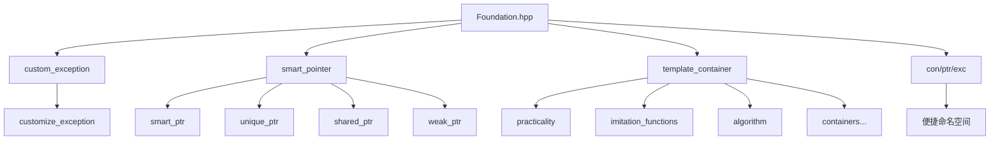

# Foundation 基础库文档

[](https://en.cppreference.com/w/cpp/17)
[](LICENSE)

## 📚 目录

- [📖 文件说明](#-文件说明)
- [🏗️ 命名空间与整体结构](#️-命名空间与整体结构)
- [⚠️ 异常处理](#️-异常处理-custom_exception)
- [🧠 智能指针](#-智能指针-smart_pointer)
- [📦 模板容器](#-模板容器-template_container)
  - [🔧 仿函数](#-仿函数-imitation_functions)
  - [⚙️ 算法](#️-算法-algorithm)
  - [🛠️ 基础工具](#️-基础工具-practicality)
  - [📝 字符数组](#-字符数组-string_container)
  - [📊 动态数组](#-动态数组-vector_container)
  - [🔗 链表容器](#-链表容器-list_container)
  - [📚 栈适配器](#-栈适配器-stack_adapter)
  - [🚶 队列适配器](#-队列适配器-queue_adapter)
  - [🌳 树形容器](#-树形容器-tree_container)
  - [🏛️ 基类容器](#️-基类容器-base_class_container)
  - [🗂️ 关联式容器](#️-关联式容器-map_container-set_container)
  - [🎯 布隆过滤器](#-布隆过滤器-bloom_filter_container)
- [📈 算法细节与性能分析](#-算法细节与性能分析)
- [🆕 新命名空间](#-新命名空间)

---

## 📖 文件说明

本文档基于 `Foundation.hpp` 头文件内容的详细技术文档。每个模块按照以下思路进行说明：

### 📋 文档结构

| 章节 | 内容 | 说明 |
|------|------|------|
| **函数签名与声明** | 直接引用头文件中签名，并标注出处 | 提供准确的API接口 |
| **作用描述** | 从使用者和实现者角度双重解释函数用途 | 帮助理解功能和设计意图 |
| **返回值说明** | 返回类型、语义含义、可能的错误或异常情况 | 确保正确使用API |
| **使用示例** | 提供调用示例，演示典型用法 | 快速上手和参考 |
| **内部原理剖析** | 解析底层数据结构、算法流程、关键步骤 | 深入理解实现细节 |
| **复杂度分析** | 时间复杂度、空间复杂度的详尽分析 | 性能评估和优化参考 |
| **边界条件和错误处理** | 空容器、极限值、异常抛出或安全检查 | 确保代码健壮性 |
| **注意事项** | 多线程安全、异常安全、迭代器失效规则等 | 避免常见陷阱 |

---

## 🏗️ 命名空间与整体结构

`Foundation.hpp` 中，整体内容分布在以下主要命名空间：

### 📊 命名空间概览



### 🔧 核心命名空间

| 命名空间 | 功能 | 主要组件 |
|----------|------|----------|
| `custom_exception` | 自定义异常处理 | `customize_exception` |
| `smart_pointer` | 智能指针管理 | `shared_ptr`, `unique_ptr`, `weak_ptr`, `smart_ptr` |
| `practicality` | 基础工具类型 | `pair`, `make_pair` |
| `imitation_functions` | 仿函数集合 | `less`, `greater`, `hash_imitation_functions` |
| `algorithm` | 基础算法工具 | `copy`, `swap`, `find`, `hash_function` |
| `string_container` | 字符串容器 | `string` |
| `vector_container` | 动态数组 | `vector` |
| `list_container` | 双向链表 | `list` |
| `stack_adapter` | 栈适配器 | `stack` |
| `queue_adapter` | 队列适配器 | `queue`, `priority_queue` |
| `tree_container` | 树形容器 | `binary_search_tree`, `avl_tree` |
| `base_class_container` | 基类容器 | `rb_tree`, `hash_table`, `bit_set` |
| `map_container` | 映射容器 | `tree_map`, `hash_map` |
| `set_container` | 集合容器 | `tree_set`, `hash_set` |
| `bloom_filter_container` | 布隆过滤器 | `bloom_filter` |

### 🎯 便捷命名空间

```cpp
namespace con {
    // 引入所有容器类型，减少命名长度
    using namespace template_container;
}

namespace ptr {
    // 引入所有智能指针类型
    using namespace smart_pointer;
}

namespace exc {
    // 引入异常处理类型
    using namespace custom_exception;
}
```

> 各模块实现互相调用，结构清晰。对于 map 和 set 部分比较复杂，会在相应章节详细介绍。

---

