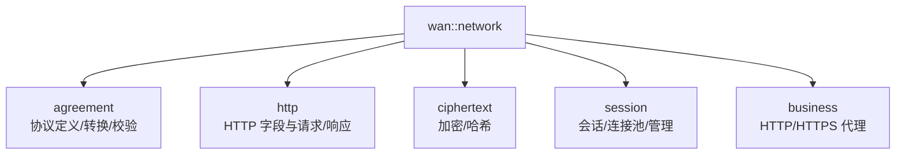

# Network 网络协议与连接池模块文档

[](https://en.cppreference.com/w/cpp/20)
[](LICENSE)

## 📚 目录

- [📖 文件说明](#-文件说明)
- [🏗️ 命名空间与整体结构](#️-命名空间与整体结构)
- [⚙️ 核心枚举与配置](#️-核心枚举与配置)
- [🧱 协议封装](#-协议封装)
- [🔐 加密与摘要](#-加密与摘要)
- [🔌 会话与连接](#-会话与连接)
- [🏦 连接池](#-连接池)
- [🚚 转发器与代理](#-转发器与代理)
- [🧪 使用示例](#-使用示例)
- [⚠️ 注意事项](#️-注意事项)
- [📊 复杂度与性能](#-复杂度与性能)

---

## 📖 文件说明

本文档基于以下头文件的公开接口与实现逻辑进行整理：

- `model/network/agreement/auxiliary.hpp` — 协议枚举与协议头基类
- `model/network/agreement/protocol.hpp` — 协议头、请求/响应模板与序列化
- `model/network/agreement/http.hpp` — HTTP 请求/响应轻量封装（基于 `boost::beast`）
- `model/network/session/fundamental.hpp` — 会话类（TCP/UDP/SSL 客户端/服务端）
- `model/network/session/conversation.hpp` — 会话管理与连接池实现
- `model/network/business/forwarder.hpp` — HTTP/HTTPS 转发器（代理）
- `model/network/network.hpp` — 网络模块聚合头（命名空间导出）

### 📋 文档结构

| 章节 | 内容 | 说明 |
|------|------|------|
| **类型与函数签名** | 引用头文件中定义，标注出处 | 准确的 API 接口 |
| **作用描述** | 使用者与实现者视角双重解释 | 理解功能与设计 |
| **返回值说明** | 返回类型与语义、异常情况 | 正确使用 API |
| **使用示例** | 典型用法演示 | 快速上手 |
| **内部原理剖析** | 数据结构、状态机、关键流程 | 深入理解实现 |
| **复杂度分析** | 算法与资源使用 | 性能评估参考 |
| **边界与错误处理** | 超时、断连、拥塞与异常 | 提升健壮性 |

---

## 🏗️ 命名空间与整体结构

### 命名空间概览



### 模块关系

- `agreement/*`：协议头、请求/响应、JSON 协议与转换工具；供 `session` 进行报文编解码。
- `session/*`：会话抽象（TCP/UDP/SSL）、会话管理与连接池。
- `business/forwarder.hpp`：HTTP/HTTPS 代理与转发器；内部复用 `connection_pool` 与会话。
- `crypt/encryption.hpp`：加密/哈希/签名工具；用于安全传输与验签。
- `network.hpp`：聚合导出 `wan::network::{agreement,http,ciphertext,session,business}`。

---

## ⚙️ 核心枚举与配置

定义位置：`agreement/auxiliary.hpp`, `session/fundamental.hpp`, `agreement/http.hpp`

- `protocol_type`：`JSON_RPC`, `WEBSOCKET`, `CUSTOM_TCP`, `BINARY_STREAM`, `USER_DEFINED`。
- `checksum_type`：`CRC32`, `MD5`, `SHA256`, `CUSTOM`。
- `session_state`：`DISCONNECTED`, `CONNECTING`, `CONNECTED`, `DISCONNECTING`, `ERROR_STATE`。
- `session_type`：`TCP_CLIENT`, `TCP_SERVER`, `UDP_CLIENT`, `UDP_SERVER`, `SSL_CLIENT`, `SSL_SERVER`。
- `http::verb`：采用 `boost::beast::http::verb` 表示方法（如 `get/post/put/delete_`）。

### 配置结构

- `session::endpoint_config`：主机 `host`、端口 `port`、借用与连接超时、健康检查周期、会话配置 `session_cfg`（含 SSL 与缓冲相关设置）。
- `business::connection_pool_defaults`：代理连接池默认配置（`min_connections/max_connections/borrow_timeout/connect_timeout/health_check_interval`）。

---

## 🧱 协议封装

定义位置：`agreement/protocol.hpp`, `agreement/auxiliary.hpp`

- `auxiliary::protocol_header`（基类）：管理协议版本、校验类型、内容长度与头字段；提供 `to_string()/from_string()`、`calculate_checksum()/verify_checksum()` 与 `to_json()/from_json()` 虚函数接口。
- `request_header` / `response_header`：在上述基础上增加 `method/target/user_agent/status_code/status_message/server/timestamp` 等字段；实现 `to_string()/from_string()` 与 JSON 转换。
- `template<class payload> request/response`：封装头与消息体，提供缓存失效、消息操作、序列化与完整性校验、大小与比较。

---

## 🔐 加密与摘要

定义位置：`crypt/encryption.hpp`

- `encryption` 命名空间导出：
  - 加密/解密：`encrypt(...)`, `decrypt(...)`（具体算法以实现为准）。
  - 哈希：`umbrage_hash::MD5(...)`, `umbrage_hash::SHA256(...)` 等。
  - 签名与验签：按需提供（若启用）。

---

## 🔌 会话与连接

定义位置：`session/fundamental.hpp`

- `session<request_t, response_t>`：通用会话管理（支持 `TCP/SSL`，客户端/服务端）。
  - 连接：`async_connect(host, port, callback)`, `connect(host, port)`；也可 `adopt_socket(socket)` 注入已连接套接字（服务端）。
  - 生命周期：`start()` 启动读循环与心跳；`close()` 关闭连接。
  - 传输：`send_bytes(data)`, `async_send_bytes(data, callback)`；`send_request(req)`, `async_send_request(req, callback)`；`send_response(res)`, `async_send_response(res, callback)`。
  - 状态/信息：`get_session_id()`, `get_state()`, `get_type()`, `get_remote_address()`, `get_remote_port()`, `get_statistics()`, `is_connected()`。
  - 读取回调：`set_reception_processing(handler)` 接收原始字节视图，由外部进行协议解析。

---

## 🏦 连接池

定义位置：`session/conversation.hpp`（并在 `wan::network::session` 命名空间导出）

- `connection_pool<request_t, response_t>`：按端点管理 `session`，支持借用/归还与健康检查。
  - 端点管理：`add_endpoint(cfg)`, `remove_endpoint(host, port)`。
  - 借用/归还：`borrow(host, port, timeout)`, `try_borrow(host, port)`, `give_back(session)`。
  - 失效处理：`invalidate(session)`（强制移除并关闭）。
  - 统计：`get_pool_stats(host, port)` 返回 `{remaining_available, in_use, total}`。

---

## 🚚 转发器与代理

定义位置：`business/forwarder.hpp`（并在 `wan::network::business` 命名空间导出）

- `template<class body, class fields> transponder`：HTTP/HTTPS 转发器。
  - 上游管理：`add_upstream(domain, host_or_ip, port, use_https)`, `remove_upstream(domain)`；或 `json_config_file(path)` 批量加载。
  - 转发：`forward_sync(request, request_filter, response_filter)`, `forward_async(request, request_filter, response_filter)`。
  - 执行器：`set_async_executor(thread_pool)`；生命周期控制：`stop()`, `shutdown(timeout)`。
  - SSL 配置：`set_ssl_ca_file(...)`, `set_ssl_cert_file(...)`, `set_ssl_key_file(...)`, `set_ssl_insecure_skip_verify(...)`。

---

## 🧪 使用示例

```cpp
// C++20，采用4空格缩进与大括号换行风格
#include "model/network/network.hpp"
#include <boost/asio.hpp>

int main()
{
    boost::asio::io_context io_context;

    // 1) 配置端点并注册到连接池
    wan::network::session::endpoint_config cfg;
    cfg.host = "example.com";
    cfg.port = 443;
    cfg.session_cfg._enable_ssl = true;                 // 启用 SSL
    cfg.session_cfg._tls_server_name = "example.com";  // SNI 主机名
    // 如需证书校验：提供 CA 文件
    // cfg.session_cfg._ssl_ca_file = "ca.pem";

    wan::network::session::connection_pool<
        wan::network::agreement::request,
        wan::network::agreement::response
    > pool(io_context);
    pool.start();
    pool.add_endpoint(cfg);

    // 2) 借出会话并发送 HTTP 请求
    auto opt = pool.borrow(cfg.host, cfg.port, std::chrono::milliseconds(2000));
    if (!opt)
        return 1;

    auto sp = *opt;
    wan::network::http::request<> req{boost::beast::http::verb::get, 11, "/"};
    req.set(boost::beast::http::field::host, cfg.host);
    req.set(boost::beast::http::field::user_agent, "wan-network/1.0");
    sp->start(); // 启动读循环与心跳
    auto ec = sp->send_request(req);

    // 3) 归还或失效处理
    if (!ec) {
        pool.give_back(sp);
    } else {
        pool.invalidate(sp);
    }

    pool.stop();
    return ec ? 1 : 0;
}
```

> 说明：示例展示基本的 SSL 客户端请求流程。实际生产中应设置证书校验与错误处理，并根据负载调整连接池参数。

---

## ⚠️ 注意事项

- 超时与重试：合理设置 `endpoint_config` 的借用/连接超时与健康检查周期，避免资源耗尽。
- 安全：在 `SSL` 模式下建议启用证书校验与主机名验证；通过 `encryption` 提供的哈希/签名保障报文完整性与可信性。
- 连接池：为高并发场景设置合适的最小/最大连接数；使用 `get_pool_stats()` 观测池状态并按需预热（`add_endpoint` 后自动预热）。
- 协议一致性：`agreement` 的 `request/response` 与 `protocol_header` 的校验需保持一致；谨慎处理 `to_string/from_string` 的编码。

---

## 📊 复杂度与性能

- `session` 发送接口：
  - `send_bytes/send_request/send_response` 取决于网络 IO 与缓冲区大小，常规为 O(n)。
  - 心跳与读取循环为定时与事件驱动，避免长阻塞。
- `connection_pool`：
  - `borrow/give_back` 平均为 O(1)，在连接建立与健康检查阶段存在额外开销；预热可降低首借延迟。
- `business::transponder`：
  - 转发链路为 IO 绑定，内部维护了一个连接池和会话管理来做转发，建议结合线程池与合理的 `max_async_tasks` 控制以提升吞吐与稳定性。