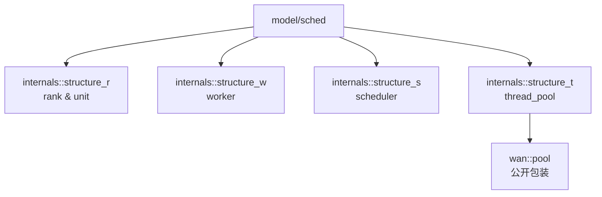

# Sched 调度与线程池模块文档

[](https://en.cppreference.com/w/cpp/20)
[](LICENSE)

## 📚 目录

- [📖 文件说明](#-文件说明)
- [🏗️ 命名空间与整体结构](#️-命名空间与整体结构)
- [⚙️ 核心枚举与配置](#️-核心枚举与配置)
- [🧩 任务单元](#-任务单元)
- [📦 任务队列](#-任务队列)
- [🧵 工作线程](#-工作线程)
- [🗓️ 调度器](#️-调度器)
- [🏊 线程池](#-线程池)
- [📈 监控与统计](#-监控与统计)
- [🧪 使用示例](#-使用示例)
- [⚠️ 注意事项](#️-注意事项)
- [📊 复杂度与性能](#-复杂度与性能)

---

## 📖 文件说明

本文档基于以下头文件的公开接口与实现逻辑进行整理：

- `model/sched/unit.hpp` — 任务单元定义与状态管理
- `model/sched/rank.hpp` — 任务队列与背压策略
- `model/sched/worker.hpp` — 工作线程与执行流程
- `model/sched/scheduling.hpp` — 调度器与扩缩容策略
- `model/sched/thread_pool.hpp` — 线程池对外接口与配置
- `model/sched/integration.hpp` — 公共枚举、配置与统计结构

### 📋 文档结构

| 章节 | 内容 | 说明 |
|------|------|------|
| **函数签名与声明** | 直接引用头文件中签名，并标注出处 | 提供准确的 API 接口 |
| **作用描述** | 从使用者和实现者角度双重解释函数用途 | 理解功能与设计意图 |
| **返回值说明** | 返回类型、语义含义、可能的错误或异常情况 | 确保正确使用 API |
| **使用示例** | 提供调用示例，演示典型用法 | 快速上手与参考 |
| **内部原理剖析** | 解析底层数据结构、算法流程、关键步骤 | 深入理解实现 |
| **复杂度分析** | 时间复杂度、空间复杂度 | 性能评估与优化参考 |
| **边界条件和错误处理** | 空队列、满队列、异常抛出、线程状态 | 确保代码健壮性 |

---

## 🏗️ 命名空间与整体结构

### 📊 命名空间概览



### 🔧 调用关系

- `thread_pool` 负责对外接口与生命周期管理；内部持有 `scheduler_ordinary` 与 `rank_ordinary`。
- `scheduler_ordinary` 创建并管理 `worker_ordinary`/`worker_adaptive`，评估负载并扩缩容。
- `worker_ordinary` 从 `rank_ordinary` 拉取 `unit_ordinary` 及其派生类并执行。
- `rank_ordinary` 根据策略存储与调度任务，支持 `backpressure` 背压处理。

---

## ⚙️ 核心枚举与配置

定义位置：`model/sched/integration.hpp`

- `current_status`：任务当前状态（`pending`, `running`, `completed`, `cancelled`, `timeout`, `failed`）。
- `weight`：任务优先级（从 `lowest` 到 `critical`）。
- `backpressure`：队列满时处理策略（`block`, `drop`, `overwrite`, `exception`）。
- `rank_strategy`：队列策略（`fifo`, `priority`, `delay`, `round_robin`）。
- `worker_state`：工作线程状态（`idle`, `running`, `stopping`, `stopped`, `error`）。
- `scheduling_tactics`：调度策略（`round_robin`, `least_loaded`, `adaptive`, `priority_based`）。
- `expansion_strategy`：扩缩容策略（`conservative`, `aggressive`, `reactive`, `hybrid`）。
- `pool_state`：线程池状态（`stopped`, `starting`, `running`, `pausing`, `paused`, `stopping`, `error`）。

### 配置结构

- `scaling_config`：扩缩容阈值与步长、延迟等。
- `pool_config`：线程池名称、线程数、队列策略与大小、超时、监控与日志开关等。
- `pool_statistics` / `worker_statistics` / `load_metrics`：统计与监控指标集合。

---

## 🧩 任务单元

定义位置：`model/sched/unit.hpp`

- `unit_ordinary`：基础任务单元，包含标识、名称、优先级、提交/开始/结束时间、`current_status` 等；提供：
  - 状态控制：`mark_completed()`, `mark_failed()`, `mark_timeout()`, `cancel()`。
  - 时间与超时：`set_timeout()`, `set_deadline()`, `has_deadline()`, `is_timeout()`。
  - 等待与结果：`wait()`, `wait_for(...)`, `is_result_ready()`。
  - 属性访问：`get_identifier()`, `get_task_name()`, `get_state()`, `get_priority()`, `set_priority(...)`。

- `unit_standard`：扩展 `std::promise`/`std::future`，支持异步结果检索：
  - `get_future()`, `get_result()`，覆盖 `execute()` 写入结果。

- `unit_overtime`：在 `unit_standard` 基础上引入超时回调：
  - `set_timeout_callback(...)`, `handle_timeout()`, `is_timeout_handled()`。

- `unit_reliance`：依赖管理任务，支持添加/检查/等待依赖：
  - `add_dependency(...)`, `are_dependencies_satisfied()`, `wait_for_dependencies(...)`。

> 工厂函数：`make_unit_ordinary`, `make_unit_standard`, `make_unit_overtime`, `make_unit_reliance`。

---

## 📦 任务队列

定义位置：`model/sched/rank.hpp`

### 基类 `rank_ordinary`

- 核心接口：
  - `push(...)`, `push_batch(...)`：支持 `backpressure`；`delay` 策略可传入 `deadline`。
  - `pop()`, `pop_batch(count)`, `try_pop()`, `try_pop_for(timeout)`：阻塞/非阻塞/限时弹出。
  - 查询与控制：`size()`, `empty()`, `clear()`, `close()`, `closed()`。
  - 容量：`set_max_size(max)`, `get_max_size()`。
  - 策略与统计：`strategy()`, `get_sub_queue_count()`, `get_delay_uint_count()`。

### 派生队列

- `rank_standard`（FIFO）：底层 `std::deque`；满载时根据 `backpressure` 执行阻塞、覆盖、抛出或丢弃；提供条件变量唤醒生产者/消费者。
- `rank_priority`（优先级队列）：底层 `std::multiset`，以 `weight` 比较器排序；出队为最高优先级元素。
- `rank_deferred`（延迟队列）：维护到期时间，后台线程轮询最早到期元素，按到期顺序出队。

> 工厂函数：`make_rank_standard`, `make_rank_priority`, `make_rank_deferred`, `make_rank(strategy, max_capacity)`。

---

## 🧵 工作线程

定义位置：`model/sched/worker.hpp`

### `worker_ordinary`

- 线程生命周期：`start()`, `stop()`, `detach()`, `wait_for_stop(timeout)`。
- 状态与信息：`get_worker_name()`, `get_state()`, `get_statistics()`。
- 回调钩子：
  - 任务：`_unit_starts_callback(name, unit)`, `_unit_finish_callback(name, unit)`。
  - 线程：`_worker_starts_callback()`, `_worker_finish_callback()`。
  - 异常：`_abnormal_callback(name, exception)`。
- 核心流程：`interior_run()` 周期性拉取 `get_next_task()`、执行 `execute_task()`，空转时 `handle_no_task()`。

### `worker_adaptive`

- 自适应轮询：根据 `_load_factor` 和 `_consecutive_empty_polls` 动态调整 `_adaptive_sleep_time`。
- 覆盖点：`get_next_task()`（带超时轮询）、`handle_no_task()`（空闲策略）。

> 工厂函数：`make_worker_adaptive(name, rank)`, `make_worker_ordinary(name, rank)`。

---

## 🗓️ 调度器

定义位置：`model/sched/scheduling.hpp`

### `scheduler_ordinary`

- 线程管理：维护 `_workers` 列表，提供创建/停止所有工作线程能力。
- 监控与扩缩容：
  - `monitor_loop` 更新 `load_metrics`（队列长度、活跃线程、任务时间等）。
  - `scaling_loop` 根据 `expansion_strategy` 与 `scaling_config` 的阈值进行 `scale_up/scale_down`。
- 接口与配置：
  - 运行控制：`start()`, `stop()`, `is_running()`。
  - 提交任务：`submit_uint(unit_ptr)`（由 `thread_pool` 调用）。
  - 策略设置：`set_scheduling_policy(...)`, `set_scaling_policy(...)`, `set_scaling_config(...)`。
  - 事件与工厂：`set_event_callback(...)`, `set_worker_factory(...)`。
  - 统计查询：`get_uptime()`, `get_total_tasks_scheduled()`, `get_total_scaling_operations()`。

> 工厂函数：`make_scheduler_ordinary(rank, tactics, strategy)`。

---

## 🏊 线程池

定义位置：`model/sched/thread_pool.hpp`

### 类 `thread_pool`

- 生命周期：`start()`, `stop()`, `pause()`, `resume()`, `restart()`, `shutdown()`, `force_shutdown()`。
- 任务提交：
  - 标准/无返回值：`submit_invalid(func, args...)`（示例名称，实际还有多种 `submit` 重载）。
  - 优先级/延迟/超时：根据构造不同 `unit_*` 并走统一 `submit_unit_internal(...)`。
- 队列与容量：
  - 创建：`_unit_rank = make_rank(_config._queue_policy, _config._max_queue_size)`。
  - 调整：`set_rank_max_size(max)`、`get_rank_capacity()`、`get_rank_size()`、`is_rank_empty()`、`clear_rank()`。
- 事件与监控：`set_event_handler(...)`, `set_statistics_handler(...)`。
- 性能分析：`set_performance_callback(...)`, `set_error_callback(...)`，可启用性能分析线程。

### 工厂与命名空间

公开位置：`wan::pool`

- 工厂方法：`make_thread_pool`, `make_lightweight_pool`, `make_performance_pool`。
- 类型导出：`wan::pool::thread_pool` 直接使用。

---

## 📈 监控与统计

- `pool_statistics`：任务提交/完成/失败/取消计数、队列与线程峰值、吞吐量计算辅助变量、时间戳。
- `worker_statistics`：线程级任务失败/已执行、总空闲与总执行时间、启动与最后任务时间。
- `performance_metrics`：时间戳、吞吐量、队列使用率、活跃/总线程、待处理任务数、累计完成数。
- `load_metrics`：吞吐量、内存/CPU 使用率、平均任务时间、队列长度、活跃线程与最后更新时间。

---

## 🧪 使用示例

```cpp
// C++20，采用4空格缩进与大括号换行风格
#include "model/sched/thread_pool.hpp"
using wan::pool::thread_pool;

int main()
{
    // 配置线程池
    internals::structure_t::pool_config pool_cfg;
    pool_cfg._pool_name = "demo_pool";            // 线程池名称
    pool_cfg._min_threads = 2;                     // 最小线程数
    pool_cfg._max_threads = 8;                     // 最大线程数
    pool_cfg._core_threads = 4;                    // 核心线程数
    pool_cfg._initial_threads = 4;                 // 初始线程数
    pool_cfg._max_queue_size = 1024;               // 队列容量
    pool_cfg._queue_policy = internals::structure_t::rank_strategy::fifo;

    // 创建并启动线程池
    auto pool = wan::pool::make_thread_pool(pool_cfg);
    pool->start();

    // 提交一个简单任务（无返回值）
    auto task_id = pool->submit([]()
    {
        // 中文注释：执行任务逻辑
    });

    // 查询队列与任务状态
    auto current_size = pool->get_rank_size();
    auto capacity = pool->get_rank_capacity();

    // 停止线程池
    pool->stop();
    return 0;
}
```

> 说明：示例展示了基础流程。对于有返回值、优先级、超时与延迟任务，请使用对应 `unit_*` 工厂与 `submit` 重载。

---

## ⚠️ 注意事项

- 队列背压：`block` 会在满载时等待；`overwrite` 替换末尾元素；`exception` 抛出异常；`drop` 丢弃新任务。
- 接口边界：`scheduler_ordinary::submit_uint(...)` 为调度器内部接口，通常由 `thread_pool` 封装调用；外部请使用 `thread_pool::submit[...]` 系列重载提交任务。
- 超时与取消：`unit_overtime` 支持超时回调；`cancel()` 仅对未执行任务有效。
- 线程安全：任务队列与状态管理使用互斥/共享锁与条件变量；外部访问需按接口契约进行。
- 扩缩容策略：在高负载下提升线程数，负载降低时回收；阈值、步长与延迟可在 `scaling_config` 配置。
- 事件回调：建议设置事件/错误/性能回调以便观测与告警；日志开关由 `pool_config` 控制。

---

## 📊 复杂度与性能

- `rank_standard`：
  - `push/pop` 平均 O(1)；批量操作 O(n)。
  - 条件变量唤醒与锁争用在高并发场景下是主要开销。
- `rank_priority`：
  - 插入/删除 O(log n)；批量出队 O(k log n)。
  - 适合优先级差异较大的任务混合场景。
- `rank_deferred`：
  - 插入 O(log n)；到期检查由后台线程触发，`pop` 平均 O(log n)。
- `worker_adaptive`：在无任务时自适应休眠，减少空轮询对 CPU 的占用。

---

## 设计与调用关系说明

- 设计思路：模块基于`分层`与`职责划分`，线程池统一入口，调度器负责工作线程与扩缩容，队列负责策略化存储，任务单元提供统一的状态与结果接口。
- 实现方式：
  - 通过工厂方法创建队列/调度器/工作线程，结构清晰、可替换。
  - 利用条件变量与共享互斥锁确保并发安全；引入自适应轮询减少空转成本。
  - 将扩缩容与监控分离在独立线程中，提高模块化与可维护性。
- 被谁调用：
  - 外部调用者仅与 `wan::pool::thread_pool` 交互；
  - `thread_pool` 内部调用 `scheduler_ordinary` 的提交与扩缩容；
  - `worker_*` 从 `rank_*` 拉取 `unit_*` 执行。