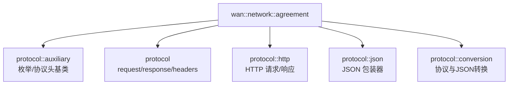

# Agreement 协议定义与转换模块文档

[](https://en.cppreference.com/w/cpp/20)
[](LICENSE)

## 📚 目录

- [📖 文件说明](#-文件说明)
- [🏗️ 命名空间与整体结构](#️-命名空间与整体结构)
- [⚙️ 核心枚举与类型](#️-核心枚举与类型)
- [🧱 协议头与请求/响应](#-协议头与请求响应)
- [🔌 HTTP 封装](#-http-封装)
- [🧩 JSON 与转换](#-json-与转换)
- [🧮 校验与序列化](#-校验与序列化)
- [🧪 使用示例](#-使用示例)
- [⚠️ 注意事项](#️-注意事项)
- [📊 复杂度与性能](#-复杂度与性能)

---

## 📖 文件说明

本模块文档基于以下头文件的公开接口与实现逻辑进行整理：

- `model/network/agreement/auxiliary.hpp` — 协议枚举与协议头基类
- `model/network/agreement/protocol.hpp` — `request_header`/`response_header` 与 `request<>`/`response<>` 封装
- `model/network/agreement/http.hpp` — `HTTP` 请求/响应轻量封装（基于 `boost::beast`）
- `model/network/agreement/json.hpp` — `boost::json` 包装器，提供类型安全的 `get/set`
- `model/network/agreement/conversion.hpp` — 协议对象与 `JSON` 的双向转换工具
- `model/network/agreement/appendix.md` — 附录与详细 `API` 列表（参考）

### 📋 文档结构

| 章节 | 内容 | 说明 |
|------|------|------|
| **类型与函数签名** | 引用头文件中定义，标注出处 | 准确的 `API` 接口 |
| **作用描述** | 使用者与实现者视角双重解释 | 理解功能与设计 |
| **返回值说明** | 返回类型与语义、异常情况 | 正确使用 `API` |
| **使用示例** | 典型用法演示 | 快速上手 |
| **内部原理剖析** | 数据结构、缓存与关键流程 | 深入理解实现 |
| **复杂度分析** | 算法与资源使用 | 性能评估参考 |
| **边界与错误处理** | 超时、断连、拥塞与异常 | 提升健壮性 |

---

## 🏗️ 命名空间与整体结构

### 命名空间概览



### 模块关系

- `auxiliary.hpp`：提供 `protocol_type`/`checksum_type` 与 `protocol_header` 基类，统一头部字段与校验接口。
- `protocol.hpp`：在基类之上定义 `request_header`/`response_header` 与 `request<>`/`response<>` 通用封装及序列化、校验、缓存。
- `http.hpp`：为 `HTTP` 请求/响应提供轻量、可解析/序列化的容器，内部复用 `boost::beast`。
- `json.hpp`：在 `boost::json` 基础上封装简洁接口与字符串缓存。
- `conversion.hpp`：在 `协议对象` 与 `JSON` 之间提供静态模板转换工具。
- `network.hpp`：聚合导出到 `wan::network::{agreement,http}` 名字空间，便于外部使用。

---

## ⚙️ 核心枚举与类型

定义位置：`agreement/auxiliary.hpp`, `agreement/protocol.hpp`

- `protocol::auxiliary::protocol_type`：`JSON_RPC`, `WEBSOCKET`, `CUSTOM_TCP`, `BINARY_STREAM`, `USER_DEFINED`。
- `protocol::auxiliary::checksum_type`：`CRC32`, `MD5`, `SHA256`, `CUSTOM`。
- `protocol::header_constraint`（概念）：约束 `header` 类型需提供 `to_string/from_string/to_json/from_json/calculate_and_set_checksum/verify_integrity` 等成员。
- `协议头字段`：版本 `_version`、校验值 `_checksum_value`、长度 `_content_length`、头部映射 `_headers`、协议/校验类型 `_protocol_type/_checksum_type`。

---

## 🧱 协议头与请求/响应

定义位置：`agreement/auxiliary.hpp`, `agreement/protocol.hpp`

- `protocol::auxiliary::protocol_header`：协议头基类，提供头部管理、序列化/反序列化（字符串与 `JSON`）、完整性校验等基础能力。
- `protocol::request_header`：在基类上扩展 `_method`、`_target`、`_user_agent`、`_timestamp`，适合通用 `TCP` 请求。
- `protocol::response_header`：扩展 `_server`、`_status_code`、`_status_message`、`_timestamp`，适合通用 `TCP` 响应。
- `template<header_constraint header_t = request_header> class request`：封装请求头与消息体、提供 `to_string()/from_string()` 与 `to_json()/from_json()`、完整性校验与缓存。
- `template<header_constraint header_t = response_header> class response`：同上，适配响应语义，并提供快速构造 `create_error/not_found/internal_error`。

---

## 🔌 HTTP 封装

定义位置：`agreement/http.hpp`

- `protocol::http::request<body_t, fields_t>`：对 `boost::beast::http::request<body_t, fields_t>` 的轻量包装；支持 `method/target/version/headers/body` 的读写、`prepare_payload()` 与 `to_string()/from_string()`。
- `protocol::http::response<body_t, fields_t>`：对 `boost::beast::http::response<body_t, fields_t>` 的轻量包装；支持 `result/reason/version/headers/body` 的读写与 `prepare_payload()/to_string()/from_string()`。
- `body_structure_constraint`：约束 `body_t` 必须满足 `boost::beast::http::is_body`。

---

## 🧩 JSON 与转换

定义位置：`agreement/json.hpp`, `agreement/conversion.hpp`

- `protocol::json`：`boost::json::value` 包装器，支持 `from_string()/to_string()`、`get<T>()/set<T>()`、键值管理与字符串缓存。
- `protocol::conversion::protocol_converter`：
  - `request_to_json<header_t>(request<header_t>)`：请求对象转 `JSON`。
  - `json_to_request<header_t>(json)`：`JSON` 转请求（`std::optional`）。
  - `response_to_json<header_t>(response<header_t>)`：响应对象转 `JSON`。
  - `json_to_response<header_t>(json)`：`JSON` 转响应（`std::optional`）。

---

## 🧮 校验与序列化

定义位置：`agreement/auxiliary.hpp`, `agreement/protocol.hpp`

- `calculate_and_set_checksum(content)`：以选定的 `checksum_type`（如 `CRC32/MD5/SHA256`）计算并写入 `_checksum_value`。
- `verify_integrity(content)`：根据头部记录的校验信息验证消息体完整性。
- `to_string()/from_string()`：字符串序列化与解析，内部配合 `_cached_full/_full_cache_valid` 降低重复开销。
- `to_json()/from_json()`：`JSON` 序列化与解析，头部字段以 `header_*` 前缀展开（基类部分）。

---

## 🧪 使用示例


```cpp
/**
 * @brief `TCP` 协议请求/响应基本用法
 * @details 展示 `request_header/response_header` 与 `request/response` 的构造、序列化与校验
 */
#include "model/network/network.hpp"
#include <string>

int main()
{
    using wan::network::agreement::request;
    using wan::network::agreement::response;
    using wan::network::agreement::request_header;
    using wan::network::agreement::response_header;

    /**
     * @brief 构建请求头与请求对象
     */
    request_header req_header;
    req_header.set_method("query");
    req_header.set_target("/v1/items");
    req_header.set_user_agent("agreement-doc/1.0");

    request<> req_obj;
    req_obj.header() = req_header;
    req_obj.set_message("{\"id\":123}");

    // `JSON` 与字符串序列化
    auto req_json = req_obj.to_json();
    auto req_str = req_obj.to_string();

    // 完整性校验（基于 `checksum_type`）
    bool req_ok = req_obj.verify_integrity();

    /**
     * @brief 构建响应头与响应对象
     */
    response_header resp_header;
    resp_header.set_status_code(200);
    resp_header.set_status_message("ok");
    resp_header.set_server("agreement-server/1.0");

    response<> resp_obj;
    resp_obj.header() = resp_header;
    resp_obj.set_message("{\"result\":\"success\"}");

    auto resp_json = resp_obj.to_json();
    auto resp_str = resp_obj.to_string();
    bool resp_ok = resp_obj.verify_integrity();

    return (req_ok && resp_ok) ? 0 : 1;
}
```

```cpp
/**
 * @brief `HTTP` 请求/响应封装用法
 * @details 展示 `protocol::http::request/response` 的构造、头部操作与解析
 */
#include "model/network/network.hpp"
#include <boost/beast/http.hpp>

int main()
{
    // 创建 `HTTP` 请求
    wan::network::http::request<> http_req{boost::beast::http::verb::post, 11, "/api"};
    http_req.set(boost::beast::http::field::host, "example.com");
    http_req.set(boost::beast::http::field::user_agent, "agreement-doc/1.0");
    http_req.body() = std::string("hello");
    http_req.prepare_payload(); // 自动计算 `Content-Length`

    // 序列化为字符串
    auto http_req_str = http_req.to_string();

    // 从字符串解析响应（演示用，实际应从网络读取）
    wan::network::http::response<> http_res;
    bool parsed = http_res.from_string(http_req_str); // 解析失败返回 `false`

    return parsed ? 0 : 1;
}
```

```cpp
/**
 * @brief `JSON` 包装器与协议转换器用法
 * @details 展示 `protocol::json` 的 `get/set` 与 `protocol_converter` 的双向转换
 */
#include "model/network/network.hpp"
#include <optional>

int main()
{
    // `JSON` 包装器
    wan::network::agreement::json json_obj;
    json_obj.set("name", std::string("alice"));
    json_obj.set("age", static_cast<int>(30));

    auto has_name = json_obj.contains("name");
    auto name = json_obj.get<std::string>("name", "");

    // 请求对象转 `JSON`
    wan::network::agreement::request<> req_obj;
    req_obj.set_message("payload");
    auto req_json = wan::network::agreement::protocol_converter::request_to_json(req_obj);

    // `JSON` 转回请求对象
    auto req_opt = wan::network::agreement::protocol_converter::json_to_request<>(req_json);
    if (!req_opt)
        return 1;

    // 响应对象转 `JSON`
    wan::network::agreement::response<> resp_obj;
    resp_obj.set_status_message("ok");
    auto resp_json = wan::network::agreement::protocol_converter::response_to_json(resp_obj);

    // `JSON` 转回响应对象
    auto resp_opt = wan::network::agreement::protocol_converter::json_to_response<>(resp_json);
    return (resp_opt.has_value() && has_name && !name.empty()) ? 0 : 1;
}
```

> 说明：示如需与 `session` 联动，建议结合 `wan::network::session` 的会话发送/接收接口。

---

## ⚠️ 注意事项

- 头部一致性：`content_length` 应与消息体长度一致；在调用 `prepare_payload()`（`HTTP`）后自动设置 `Content-Length`。
- 校验策略：不同 `checksum_type` 会影响 `calculate_and_set_checksum/verify_integrity` 的开销与安全性，生产环境建议启用 `SHA256` 或更强校验。
- 解析健壮性：`from_string()` 使用解析器限制了最大正文大小（默认 `64MB`），必要时调整以避免拒绝服务风险。
- 缓存语义：`request/response` 内置完整字符串缓存，修改头或体后需通过成员接口触发缓存失效（内部已自动处理）。
- 命名空间导出：对外推荐通过 `wan::network::agreement/http` 使用；内部实现命名空间为 `protocol::*`。
- 编码与兼容：统一采用 `UTF-8` 编码；注意 `boost::beast` 与 `boost::json` 的版本兼容性与 `C++20` 要求。

---

## 📊 复杂度与性能

- `序列化/解析`：
  - `to_string()/from_string()` 为 `O(n)`，`n` 为消息体与头部总长度；缓存可显著降低重复序列化成本。
  - `HTTP` 解析使用 `boost::beast` 的 `parser`，吞吐与内存开销受 `body_limit/eager` 参数影响。
- `校验`：
  - `calculate_and_set_checksum/verify_integrity` 复杂度与 `content_length` 成正比；选择更强的校验算法会增加计算成本。
- `JSON`：
  - `to_string()` 含字符串缓存，重复调用趋近 `O(1)`；`from_string()` 为 `O(n)`。
- `转换器`：
  - `protocol_converter` 为轻量静态封装，转换开销主要取决于底层 `to_json/from_json` 的实现。

---

> 本文档遵循 `docs/network.md` 的结构风格。若需在高并发场景中使用 `agreement`，建议通过 `wan::network::session::connection_pool` 进行连接复用与健康检查，并结合 `business::transponder` 完成代理与转发。