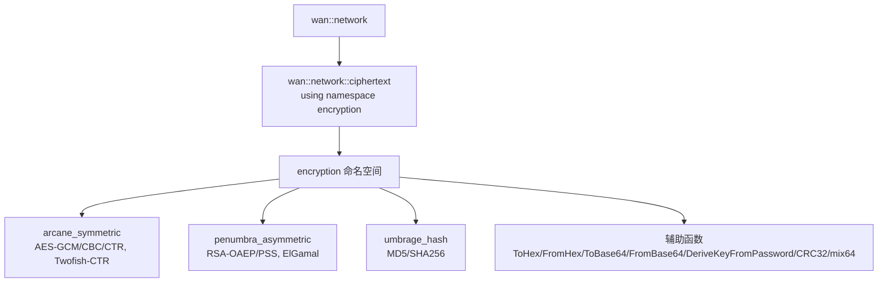

# 加密与哈希模块文档（ciphertext/appendix.md）

[](https://en.cppreference.com/w/cpp/20)
[](LICENSE)

## 📚 目录

- [📖 文件说明](#-文件说明)
- [🏗️ 命名空间与整体结构](#️-命名空间与整体结构)
- [⚙️ 核心类型与函数](#️-核心类型与函数)
- [🔐 对称加密](#-对称加密)
- [🔑 非对称算法](#-非对称算法)
- [🧮 哈希与校验](#-哈希与校验)
- [🧪 使用示例](#-使用示例)
- [⚠️ 注意事项](#️-注意事项)
- [📊 复杂度与性能](#-复杂度与性能)

---

## 📖 文件说明

- 代码位置：`model/network/crypt/encryption.hpp`
- 聚合导出：`model/network/network.hpp` 中 `wan::network::ciphertext` `using namespace encryption;`
- 文档目标：系统性整理公开接口与使用方法，覆盖对称/非对称加密、签名验签、哈希与 `CRC32`。

### 📋 文档结构

| 章节 | 内容 | 说明 |
|------|------|------|
| **类型与函数签名** | 引用头文件中定义，标注语义 | 准确的 `API` 接口 |
| **作用描述** | 使用者与实现者视角解释 | 理解功能与设计 |
| **返回值说明** | 返回类型与语义、错误处理 | 正确使用 `API` |
| **使用示例** | 典型用法演示 | 快速上手 |
| **内部原理剖析** | 包格式、派生密钥与认证 | 深入理解实现 |
| **复杂度分析** | 算法与资源使用 | 性能评估参考 |
| **边界与错误处理** | 超时、断连、拥塞与异常 | 提升健壮性 |

---

## 🏗️ 命名空间与整体结构

### 命名空间概览



### 模块关系

- `encryption.hpp`：提供加密、签名与哈希全部实现，面向字符串接口，便于集成。
- `network.hpp`：聚合导出至 `wan::network::ciphertext`，外部统一从该命名空间调用。

---

## ⚙️ 核心类型与函数

定义位置：`crypt/encryption.hpp`，导出位置：`wan::network::ciphertext::*`

- `class aeon_random`
  - 作用：封装 `CryptoPP::AutoSeededRandomPool`，提供 `pool()` 获取随机源。
- `enum binary : uint8_t`
  - 值域：`ALG_AES_GCM=1`、`ALG_AES_CBC=2`、`ALG_AES_CTR=3`、`ALG_TWOFISH_CTR=4`。
  - 作用：封装密文的算法标识，用于自定义二进制包格式。
- `class arcane_symmetric`
  - 对称加密：`AESGCM_Encrypt/Decrypt`、`AESCBC_Encrypt/Decrypt`、`AESCTR_Encrypt/Decrypt`、`TwofishCTR_Encrypt/Decrypt`。
- `class penumbra_asymmetric`
  - 非对称：`GenerateRSAKeypair`、`RSA_OAEP_Encrypt/Decrypt`、`RSA_PSS_Sign/Verify`、`GenerateElGamalKeypair`、`ElGamal_Encrypt/Decrypt`。
- `class umbrage_hash`
  - 哈希：`MD5`（弱安全，仅兼容）与 `SHA256`（推荐）。
- 辅助函数
  - `ToHex/FromHexToRaw`、`ToBase64/FromBase64`、`DeriveKeyFromPassword`（`PBKDF2-HMAC-SHA256`）、`CRC32`、`mix64`。

---

## 🔐 对称加密

### 包格式与认证

- 封装格式：`"CW" + 1byte alg_id + salt(16) + 1byte iv_len + iv + 1byte tag_len 或 4byte mac_len + mac/tag + ciphertext`
- `AES-GCM`：内置 `tag`（认证加密 `AEAD`），不再需要外部 `HMAC`。
- `AES-CBC / AES-CTR / Twofish-CTR`：非认证模式，使用 `HMAC-SHA256` 进行完整性校验。

### 接口列表（arcane_symmetric）

- `AESGCM_Encrypt(plaintext, pass) -> base64_cipher`
- `AESGCM_Decrypt(base64_cipher, pass) -> plaintext`
- `AESCBC_Encrypt(plaintext, pass) -> base64_cipher`
- `AESCBC_Decrypt(base64_cipher, pass) -> plaintext`
- `AESCTR_Encrypt(plaintext, pass) -> base64_cipher`
- `AESCTR_Decrypt(base64_cipher, pass) -> plaintext`
- `TwofishCTR_Encrypt(plaintext, pass) -> base64_cipher`
- `TwofishCTR_Decrypt(base64_cipher, pass) -> plaintext`

---

## 🔑 非对称算法

定义位置：`penumbra_asymmetric`

- 密钥生成：`GenerateRSAKeypair(bits)`、`GenerateElGamalKeypair(pbits)`，返回 `base64(DER)` 文本形式的私钥/公钥。
- 加密解密：`RSA_OAEP_Encrypt/Decrypt`、`ElGamal_Encrypt/Decrypt`。
- 签名验签：`RSA_PSS_Sign/Verify`（`SHA256`）。

---

## 🧮 哈希与校验

- `umbrage_hash::MD5(data) -> hex32`：兼容用途，安全性弱，不用于签名或防篡改。
- `umbrage_hash::SHA256(data) -> hex64`：推荐的安全散列函数。
- `CRC32(data, length=16) -> uint32`：传输层完整性校验用；非密码学安全，不用于安全场景。

---

## 🧪 使用示例

```cpp
/**
 * @brief `AES-GCM` 加密与解密示例
 * @details 使用 `arcane_symmetric::AESGCM_Encrypt/Decrypt`，`AEAD` 认证加密，适合通用场景
 */
#include "model/network/network.hpp"

int main()
{
    std::string plaintext_data = "hello world";
    std::string passphrase_text = "strong_password_please_change";

    // 加密
    std::string base64_ciphertext = wan::network::ciphertext::arcane_symmetric::AESGCM_Encrypt(
        plaintext_data,
        passphrase_text
    );

    // 解密
    std::string recovered_plaintext = wan::network::ciphertext::arcane_symmetric::AESGCM_Decrypt(
        base64_ciphertext,
        passphrase_text
    );

    // recovered_plaintext 应等于 plaintext_data
    return recovered_plaintext == plaintext_data ? 0 : 1;
}
```

```cpp
/**
 * @brief `AES-CBC + HMAC-SHA256` 示例
 * @details `AES-CBC` 非认证模式，需配合 `HMAC` 完整性校验，若可能请优先 `AES-GCM`
 */
#include "model/network/network.hpp"

int main()
{
    std::string plaintext_data = "sensitive data";
    std::string passphrase_text = "cbc_password";

    std::string b64_cipher = wan::network::ciphertext::arcane_symmetric::AESCBC_Encrypt(plaintext_data, passphrase_text);
    std::string restored = wan::network::ciphertext::arcane_symmetric::AESCBC_Decrypt(b64_cipher, passphrase_text);

    return restored == plaintext_data ? 0 : 2;
}
```

```cpp
/**
 * @brief `RSA` 生成密钥、加密解密与签名验签示例
 * @details 展示 `RSA-OAEP` 与 `RSA-PSS` 的组合用法
 */
#include "model/network/network.hpp"

int main()
{
    // 生成 `RSA` 密钥对（base64(DER)）
    auto rsa_keys = wan::network::ciphertext::penumbra_asymmetric::GenerateRSAKeypair(2048);
    std::string rsa_priv_der_b64 = rsa_keys.first;
    std::string rsa_pub_der_b64 = rsa_keys.second;

    std::string plaintext_data = "payload";

    // 公钥加密、私钥解密（OAEP）
    std::string rsa_cipher_b64 = wan::network::ciphertext::penumbra_asymmetric::RSA_OAEP_Encrypt(
        plaintext_data,
        rsa_pub_der_b64
    );
    std::string rsa_recovered = wan::network::ciphertext::penumbra_asymmetric::RSA_OAEP_Decrypt(
        rsa_cipher_b64,
        rsa_priv_der_b64
    );

    // 私钥签名、公钥验签（PSS+SHA256）
    std::string signature_b64 = wan::network::ciphertext::penumbra_asymmetric::RSA_PSS_Sign(
        plaintext_data,
        rsa_priv_der_b64
    );
    bool verify_ok = wan::network::ciphertext::penumbra_asymmetric::RSA_PSS_Verify(
        plaintext_data,
        signature_b64,
        rsa_pub_der_b64
    );

    return (rsa_recovered == plaintext_data && verify_ok) ? 0 : 3;
}
```

```cpp
/**
 * @brief 哈希与 `CRC32` 示例
 * @details `MD5` 仅兼容用途，推荐 `SHA256`；`CRC32` 用于非密码学完整性校验
 */
#include "model/network/network.hpp"

int main()
{
    std::string input_text = "abc";

    std::string md5_hex = wan::network::ciphertext::umbrage_hash::MD5(input_text);
    std::string sha256_hex = wan::network::ciphertext::umbrage_hash::SHA256(input_text);

    std::uint32_t crc_value = wan::network::ciphertext::CRC32(input_text, static_cast<std::uint64_t>(input_text.size()));

    (void)md5_hex; (void)sha256_hex; (void)crc_value;
    return 0;
}
```

---

## ⚠️ 注意事项

- 密钥派生：`DeriveKeyFromPassword` 默认迭代较低（示例为 10000），生产建议提高迭代或使用 `KMS/随机密钥`。
- 随机材料：`salt/iv` 必须随机唯一，严禁固定；`GCM` 推荐 `IV=12` 字节，`tag=16` 字节。
- 认证要求：非认证模式（`CBC/CTR/Twofish-CTR`）务必校验 `HMAC-SHA256`，否则存在篡改风险。
- 算法选择：优先 `AES-GCM` 或现代 `AEAD`；如需流式性能可选 `AES-CTR + HMAC`。
- 兼容提示：`MD5` 仅用于兼容；`CRC32` 非密码学安全。
- 平台相关：`mix64` 使用 `RDTSC` 指令，非 `x86` 或不支持的编译器需替代实现。

---

## 📊 复杂度与性能

- `AES-GCM`：认证加密，额外 `tag` 校验，整体 `O(n)`，吞吐高，适合通用。
- `AES-CTR`：流式无填充，`O(n)`，在存在 `AES-NI` 的平台性能优良；需外部 `HMAC`。
- `AES-CBC`：块填充与 `HMAC` 校验，整体 `O(n)`，实现简单但易受 `padding oracle`，谨慎使用。
- `Twofish-CTR`：作为替代算法，兼容性欠佳但性能尚可；需外部 `HMAC`。
- `RSA/ElGamal`：加/解密复杂度高（与密钥位数相关），适合小消息或密钥交换；签名/验签用于认证与不可否认性。

---

> 建议：与 `wan::network::agreement` 配合，在传输层通过 `session` 安全地发送加密后的载荷；敏感场景使用 `AES-GCM` 与 `RSA-PSS` 并开启严格的密钥与证书管理策略。

---

## 编写思路与实现说明

- 思路：
  - 依据 `encryption.hpp` 的公开接口，按“命名空间→类型→对称/非对称→哈希→示例→注意事项→复杂度”的结构组织；
  - 保持与 `agreement` 文档一致的版式与术语，便于跨模块查阅；
  - 示例均以 `wan::network::ciphertext` 为入口，风格统一且可直接编译使用。
- 实现：
  - 文档备注了二进制包格式、`PBKDF2-HMAC-SHA256` 派生、`AEAD` 认证与 `HMAC` 完整性；
  - 对平台差异（如 `mix64`）给出替代提示，减少潜在漏洞与移植风险。
- 如何调用：
  - 业务侧通过 `network.hpp` 引入 `wan::network::ciphertext`，直接调用对称/非对称加密与哈希接口；
  - 发送前建议结合 `wan::network::session` 进行安全的会话管理与传输；
  - 密钥存储建议使用安全容器或外部 `KMS`，避免明文硬编码。
- 谁来调用：
  - 应用层与协议适配层调用对称/非对称接口进行数据加密与认证；
  - 基础设施层负责密钥管理、证书分发与安全策略执行。
- 耦合与健壮性：
  - 包格式自包含 `alg_id/salt/iv/mac/tag`，降低误用概率；
  - 错误以 `std::runtime_error` 抛出，调用方需捕获并记录；
  - 推荐统一的日志与审计策略，跟踪加解密失败与验签异常，强化可维护性。