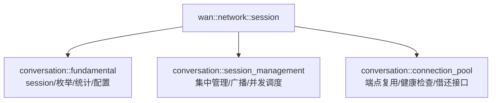

# Session 会话管理与连接复用模块文档

[](https://en.cppreference.com/w/cpp/20)
[](LICENSE)

## 📚 目录

- [📖 文件说明](#-文件说明)
- [🏗️ 命名空间与整体结构](#️-命名空间与整体结构)
- [⚙️ 核心枚举与类型](#️-核心枚举与类型)
- [🔧 会话类与配置](#-会话类与配置)
- [🗂️ 会话管理器](#️-会话管理器)
- [♻️ 连接池](#-连接池)
- [🧪 使用示例](#-使用示例)
- [⚠️ 注意事项](#️-注意事项)
- [📊 复杂度与性能](#-复杂度与性能)

---

## 📖 文件说明

本模块文档基于以下头文件的公开接口与实现逻辑进行整理：

- `model/network/session/fundamental.hpp` — 会话类与枚举、统计、配置，`TCP/SSL` 支持、读写与心跳
- `model/network/session/conversation.hpp` — 会话管理器与连接池、线程池调度、健康检查与借还接口
- `model/network/network.hpp` — 聚合导出到 `wan::network::session` 名字空间，便于外部使用

### 📋 文档结构

| 章节 | 内容 | 说明 |
|------|------|------|
| **类型与函数签名** | 引用头文件中定义，标注出处 | 准确的 `API` 接口 |
| **作用描述** | 使用者与实现者视角双重解释 | 理解功能与设计 |
| **返回值说明** | 返回类型与语义、异常情况 | 正确使用 `API` |
| **使用示例** | 典型用法演示 | 快速上手 |
| **内部原理剖析** | 状态机、线程池与健康检查 | 深入理解实现 |
| **复杂度分析** | 算法与资源使用 | 性能评估参考 |
| **边界与错误处理** | 超时、断连、拥塞与异常 | 提升健壮性 |

---

## 🏗️ 命名空间与整体结构

### 命名空间概览



### 模块关系

- `fundamental.hpp`：提供 `session` 会话类、`session_state/session_type/session_event` 枚举、`session_statistics` 与 `session_config`。
- `conversation.hpp`：提供 `session_management` 管理器（集中持有、广播、并发任务）与 `connection_pool` 连接池（预热、健康检查、借还/失效）。
- `network.hpp`：聚合导出到 `wan::network::session`，对外统一入口。

---

## ⚙️ 核心枚举与类型

定义位置：`session/fundamental.hpp`

- `session_state`：`DISCONNECTED`、`CONNECTING`、`CONNECTED`、`DISCONNECTING`、`ERROR_STATE`。
- `session_type`：`TCP_CLIENT`、`TCP_SERVER`、`UDP_CLIENT`、`UDP_SERVER`、`SSL_CLIENT`、`SSL_SERVER`。
- `session_event`：`CONNECTED`、`DISCONNECTED`、`DATA_RECEIVED`、`DATA_SENT`、`ERROR_OCCURRED`、`TIMEOUT`。
- `session_statistics`：
  - 统计字段：`_bytes_sent/_bytes_received/_messages_sent/_messages_received/_created_time/_last_activity`。
  - 常用方法：`renewal_activity()`、`get_duration()`、`get_idle_time()`。

---

## 🔧 会话类与配置

定义位置：`session/fundamental.hpp`

### `session_config`

- 超时：`_read_timeout/_write_timeout/_connect_timeout`。
- 心跳：`_heartbeat_interval/_enable_heartbeat`。
- 异步：`_enable_async_processing`（影响内部异步读写）。
- `SSL/TLS`：`_enable_ssl/_ssl_cert_file/_ssl_key_file/_ssl_ca_file/_tls_server_name/_ssl_insecure_skip_verify`。
- 缓冲：`_max_buffer_size`、消息：`_max_message_size`。

### `session<request_t, response_t>`

- 构造：
  - 客户端：`session(io, session_type::TCP_CLIENT, cfg)` 或带 `host/port`。
  - 服务端接管：`session(std::move(socket), session_type::TCP_SERVER, cfg)`。
- 连接：`async_connect(host, port, cb)`、`connect(host, port)`、`adopt_socket(socket, type)`。
- 生命周期：`start()`（仅 `CONNECTED` 有效）与 `close()`。
- 发送：`async_send_bytes/send_bytes`、`async_send_request/send_request`、`async_send_response/send_response`。
- 接收：`set_reception_processing(handler)`（提供字节视图给外部解析）。
- 查询：`get_session_id/get_state/get_type/get_remote_address/get_remote_port/get_statistics/is_connected`。
- `SSL` 握手：客户端同步握手；服务端在 `start()` 中异步握手（失败返回错误）。

---

## 🗂️ 会话管理器

定义位置：`session/conversation.hpp`

- 生命周期：`start/stop/force_cleanup_all_sessions`（含定期清理与线程池启动停止）。
- 创建/注册：`create_session/create_server_session/add_session/add_session_with_id/add_sessions`。
- 获取/移除：`get_session/remove_session/remove_session_if_disconnected`。
- 统计：`get_session_count/get_connected_session_count/get_disconnected_session_count/get_session_ids/get_thread_pool_statistics`。
- 遍历/广播：`for_each_session/broadcast_bytes/broadcast_request/broadcast_response`（线程池并发调度）。
- 配置：`session_management_config`（`thread_size/thread_max_size`）。

---

## ♻️ 连接池

定义位置：`session/conversation.hpp`

### `endpoint_config`

- 端点：`host/port`，连接阈值：`min_connections/max_connections`。
- 超时与健康：`borrow_timeout/connect_timeout/health_check_interval`。
- 会话配置：`session_cfg`（复用 `session_config`）。

### `connection_pool`

- 生命周期：`start/stop/add_endpoint/remove_endpoint`。
- 借用：`borrow(host, port, timeout)`（阻塞等待或超时）、`try_borrow(host, port)`（即时尝试）。
- 归还/失效：`give_back(session_ptr)`（归还到池）、`invalidate(session_ptr)`（主动关闭并补足）。
- 统计：`get_pool_stats(host, port)`（`remaining_available/in_use/total`）。

---

## 🧪 使用示例


```cpp
/**
 * @brief `TCP` 客户端异步连接与发送
 * @details 展示 `async_connect` 与 `async_send_request` 的基本流程
 */
#include "model/network/network.hpp"

int main()
{
    boost::asio::io_context io_context;

    wan::network::session::session_config sess_cfg{};
    sess_cfg._enable_ssl = false;

    using request_t = wan::network::agreement::request;
    using response_t = wan::network::agreement::response;

    auto sess = std::make_shared<wan::network::session::session<request_t, response_t>>(
        io_context,
        wan::network::session::session_type::TCP_CLIENT,
        sess_cfg
    );

    sess->set_reception_processing(
        [](std::shared_ptr<wan::network::session::session<request_t, response_t>> self,
           std::string_view bytes)
        {
            // 在此解析 `bytes` 并按需处理
        }
    );

    sess->async_connect(
        "127.0.0.1",
        static_cast<std::uint16_t>(8080),
        [sess](const boost::system::error_code &ec)
        {
            if (ec) return;
            wan::network::agreement::request req;
            sess->async_send_request(req);
        }
    );

    io_context.run();
    return 0;
}
```

```cpp
/**
 * @brief 服务端接管 `socket` 并启动会话
 * @details 展示 `adopt_socket + start` 的典型用法
 */
#include "model/network/network.hpp"

int main()
{
    boost::asio::io_context io_context;
    boost::asio::ip::tcp::acceptor acceptor(
        io_context,
        boost::asio::ip::tcp::endpoint(boost::asio::ip::tcp::v4(), 8080)
    );

    wan::network::session::session_config sess_cfg{};

    for (;;)
    {
        boost::asio::ip::tcp::socket socket(io_context);
        acceptor.accept(socket);

        using request_t = wan::network::agreement::request;
        using response_t = wan::network::agreement::response;

        auto sess = std::make_shared<wan::network::session::session<request_t, response_t>>(
            io_context,
            wan::network::session::session_type::TCP_SERVER,
            sess_cfg
        );

        if (sess->adopt_socket(std::move(socket), wan::network::session::session_type::TCP_SERVER))
        {
            sess->set_reception_processing(
                [](std::shared_ptr<wan::network::session::session<request_t, response_t>> self,
                   std::string_view bytes)
                {
                    wan::network::agreement::response resp;
                    self->async_send_response(resp);
                }
            );
            sess->start();
        }
    }
    return 0;
}
```

```cpp
/**
 * @brief 连接池借用/归还与统计
 * @details 展示 `borrow/give_back/invalidate/get_pool_stats` 的用法
 */
#include "model/network/network.hpp"

int main()
{
    boost::asio::io_context io_context;
    wan::network::session::connection_pool<> pool(io_context);

    wan::network::session::endpoint_config ep_cfg{};
    ep_cfg.host = "example.com";
    ep_cfg.port = static_cast<std::uint16_t>(443);
    ep_cfg.min_connections = 2;
    ep_cfg.max_connections = 8;
    ep_cfg.session_cfg._enable_ssl = true;
    ep_cfg.session_cfg._tls_server_name = "example.com";

    pool.add_endpoint(ep_cfg);
    pool.start();

    if (auto sp_opt = pool.borrow(ep_cfg.host, ep_cfg.port, std::chrono::milliseconds(1000)))
    {
        auto sp = *sp_opt;
        wan::network::agreement::request req;
        if (sp->is_connected())
        {
            auto ec = sp->send_request(req);
            if (!ec) pool.give_back(sp); else pool.invalidate(sp);
        }
    }

    auto stats = pool.get_pool_stats(ep_cfg.host, ep_cfg.port);
    // `stats.remaining_available / stats.in_use / stats.total`

    pool.stop();
    return 0;
}
```

---

## ⚠️ 注意事项

- 生命周期：在 `CONNECTED` 前不要调用发送；`start()` 仅在已连接状态有效。
- `SSL/TLS`：客户端 `'_tls_server_name'` 启用 `SNI/主机名验证`；`'_ssl_insecure_skip_verify'` 仅用于开发测试。
- 证书加载：客户端仅从配置的 `'_ssl_ca_file'` 路径加载，避免隐式环境变量影响。
- 缓冲与限流：合理设定 `'_max_buffer_size'` 与 `'_max_message_size'`，避免过大消息耗尽内存。
- 连接池一致性：借用会话需 `give_back` 归还；异常使用 `invalidate` 主动关闭并触发补足。
- 并发调度：管理器内部线程池执行；`for_each/broadcast` 回调应无阻塞并做好异常防护。

---

## 📊 复杂度与性能

- 连接池预热：依据 `min_connections/max_connections` 补足；健康检查按 `health_check_interval` 周期执行。
- 管理器广播：线性遍历会话集合；结合线程池优先级调度降低尾延迟。
- `SSL` 握手：客户端同步、服务端在 `start()` 异步；失败在连接阶段返回错误。

---

> 建议：与 `wan::network::agreement` 联用，通过 `session` 发送/接收自定义协议或 `HTTP/JSON` 载荷；高并发场景下优先使用 `connection_pool` 进行连接复用与健康维护。